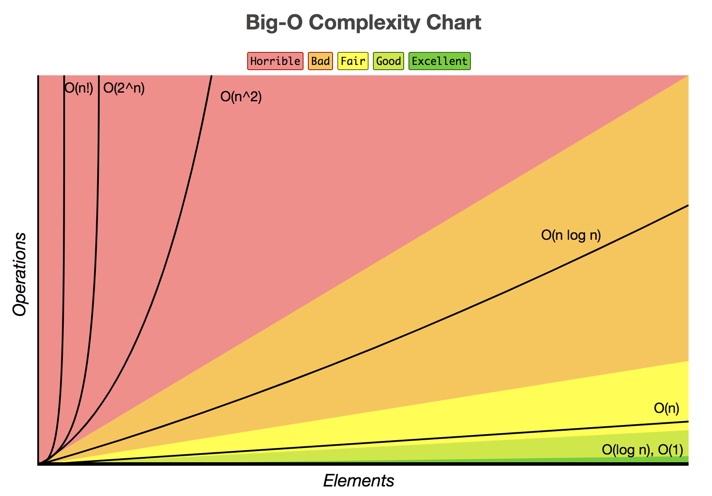
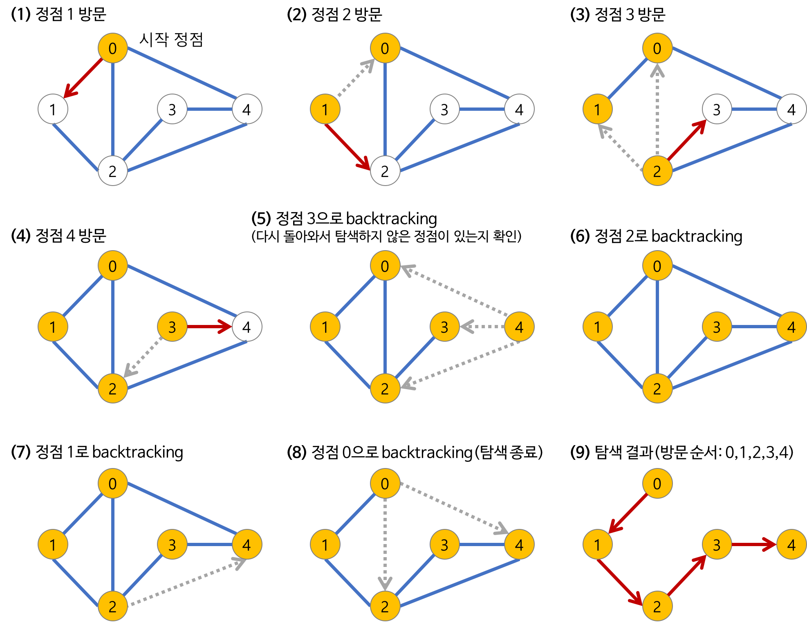
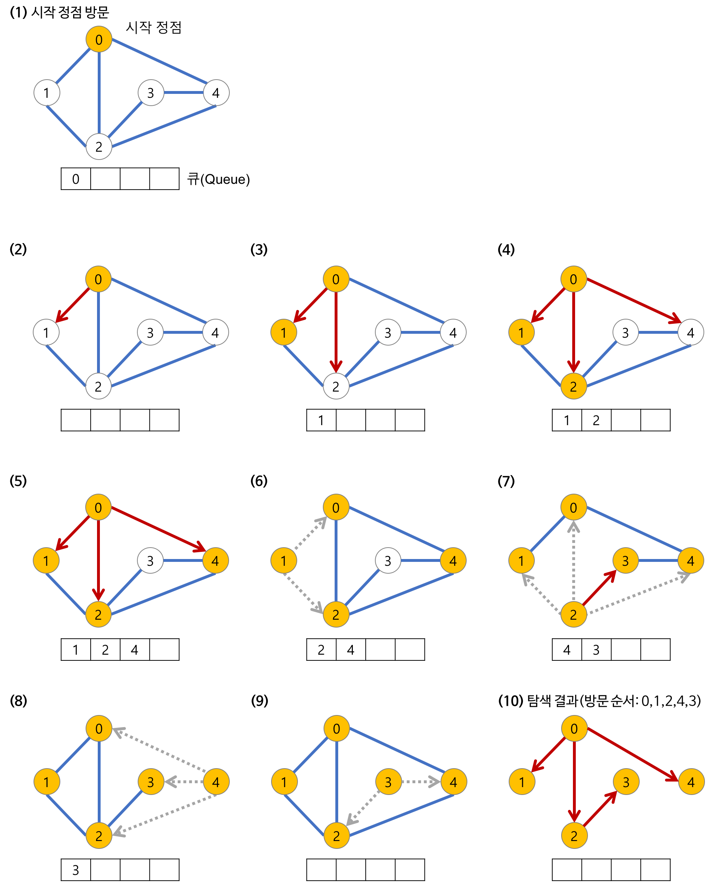

# 6. Algorithm
**:book: Contents**
* [BigO](#bigo)
* [DFS와 BFS의 차이](#dfs와-bfs의-차이)
* [Fibonacci에서의 세 가지(Recursion, Dynamic Programming, 반복) 방식에 대한 시간복잡도와 공간복잡도 차이](#fibonacci에서의-재귀-동적프로그래밍-반복의-세-가지-방식에-대한-시간복잡도와-공간복잡도)
* [정렬 알고리즘의 종류와 개념](#정렬-알고리즘의-종류와-개념)
* [Greedy 알고리즘](#greedy-알고리즘)
* [최소 신장 트리(MST, Minimum Spanning Tree)란](#mst란)
* [Kruskal MST 알고리즘](#kruskal-mst-알고리즘)
* [Prim MST 알고리즘](#prim-mst-알고리즘)
---

### BigO
* BigO의 개념
* BigO의 복잡성 차트 보기
  * 
  * -> [http://bigocheatsheet.com/](http://bigocheatsheet.com/)

> :arrow_double_up:[Top](#6-algorithm)    :leftwards_arrow_with_hook:[Back](https://github.com/WeareSoft/tech-interview#6-algorithm)    :information_source:[Home](https://github.com/WeareSoft/tech-interview#tech-interview)
> - []()

### DFS와 BFS의 차이


* 깊이 우선 탐색(DFS, Depth-First Search)
  * DFS의 개념: 루트 노드(혹은 다른 임의의 노드)에서 시작해서 다음 분기(branch)로 넘어가기 전에 해당 분기를 완벽하게 탐색하는 방법
    * 미로를 탐색할 때 한 방향으로 갈 수 있을 때까지 계속 가다가 더 이상 갈 수 없게 되면 다시 가장 가까운 갈림길로 돌아와서 이곳으로부터 다른 방향으로 다시 탐색을 진행하는 방법과 유사하다.
    * 즉, 넓게(wide) 탐색하기 전에 깊게(deep) 탐색하는 것이다.
    * 사용하는 경우: **모든 노드를 방문** 하고자 하는 경우에 이 방법을 선택한다.
    * 깊이 우선 탐색(DFS)이 너비 우선 탐색(BFS)보다 좀 더 간단하다.
    * 단순 검색 속도 자체는 너비 우선 탐색(BFS)에 비해서 느리다.
  * DFS의 특징
    * 자기 자신을 호출하는 **순환 알고리즘의 형태** 를 가지고 있다.
    * 전위 순회(Pre-Order Traversals)를 포함한 다른 형태의 트리 순회는 모두 DFS의 한 종류이다.
    * 이 알고리즘을 구현할 때 가장 큰 차이점은, 그래프 탐색의 경우 **어떤 노드를 방문했었는지 여부를 반드시 검사** 해야 한다는 것이다.
      * 이를 검사하지 않을 경우 무한루프에 빠질 위험이 있다.
  * DFS의 과정
    * 
  * DFS의 구현 방법 2가지
    * **1. 순환 호출 이용**
      <!-- * 해당 글에서는 이 방법으로 구현한다. -->
    * **2. 명시적인 스택 사용**
      * 명시적인 스택을 사용하여 방문한 정점들을 스택에 저장하였다가 다시 꺼내어 작업한다.
    * 순환 호출을 이용한 DFS 의사코드(pseudocode)
```java
void search(Node root) {
  if (root == null) return;

  // 1. root 노드 방문
  visit(root);
  root.visited = true; // 1-1. 방문한 노드를 표시

  // 2. root 노드와 인접한 정점을 모두 방문
  for each (Node n in root.adjacent) {
    if (n.visited == false) { // 4. 방문하지 않은 정점을 찾는다.
      search(n); // 3. root 노드와 인접한 정점 정점을 시작 정점으로 DFS를 시작
    }
  }
}
```
* 너비 우선 탐색(BFS, Breadth-First Search)
  * BFS의 개념: 루트 노드(혹은 다른 임의의 노드)에서 시작해서 인접한 노드를 먼저 탐색하는 방법
    * 시작 정점으로부터 가까운 정점을 먼저 방문하고 멀리 떨어져 있는 정점을 나중에 방문하는 순회 방법이다.
    * 즉, 깊게(deep) 탐색하기 전에 넓게(wide) 탐색하는 것이다.
    * 사용하는 경우: **두 노드 사이의 최단 경로** 혹은 **임의의 경로를 찾고 싶을 때** 이 방법을 선택한다.
      * Ex) 지구상에 존재하는 모든 친구 관계를 그래프로 표현한 후 Ash와 Vanessa 사이에 존재하는 경로를 찾는 경우
      * 깊이 우선 탐색의 경우 - 모든 친구 관계를 다 살펴봐야 할지도 모른다.
      * 너비 우선 탐색의 경우 - Ash와 가까운 관계부터 탐색
    * 너비 우선 탐색(BFS)이 깊이 우선 탐색(DFS)보다 좀 더 복잡하다.
  * BFS의 특징
    * 직관적이지 않은 면이 있다.
      * BFS는 시작 노드에서 시작해서 거리에 따라 단계별로 탐색한다고 볼 수 있다.
    * BFS는 **재귀적으로 동작하지 않는다.**
    * 이 알고리즘을 구현할 때 가장 큰 차이점은, 그래프 탐색의 경우 **어떤 노드를 방문했었는지 여부를 반드시 검사** 해야 한다는 것이다.
      * 이를 검사하지 않을 경우 무한루프에 빠질 위험이 있다.
    * BFS는 방문한 노드들을 차례로 저장한 후 꺼낼 수 있는 자료 구조인 **큐(Queue)를 사용한다.**
      * 즉, **선입선출(FIFO)** 원칙으로 탐색
      * 일반적으로 큐를 이용해서 반복적 형태로 구현하는 것이 가장 잘 동작한다.
    * 'Prim', 'Dijkstra' 알고리즘과 유사하다.
  * BFS의 과정
    * 깊이가 1인 모든 노드를 방문하고 나서 그 다음에는 깊이가 2인 모든 노드를, 그 다음에는 깊이가 3인 모든 노드를 방문하는 식으로 계속 방문하다가 더 이상 방문할 곳이 없으면 탐색을 마친다.
    * 
  * BFS의 구현 방법
    * 자료 구조 **큐(Queue)를 이용**
    * 큐(Queue)를 이용한 BFS 의사코드(pseudocode)
```java
void search(Node root) {
  Queue queue = new Queue();
  root.marked = true; // (방문한 노드 체크)
  queue.enqueue(root); // 1-1. 큐의 끝에 추가

  // 3. 큐가 소진될 때까지 계속한다.
  while (!queue.isEmpty()) {
    Node r = queue.dequeue(); // 큐의 앞에서 노드 추출
    visit(r); // 2-1. 큐에서 추출한 노드 방문
    // 2-2. 큐에서 꺼낸 노드와 인접한 노드들을 모두 차례로 방문한다.
    foreach (Node n in r.adjacent) {
      if (n.marked == false) {
        n.marked = true; // (방문한 노드 체크)
        queue.enqueue(n); // 2-3. 큐의 끝에 추가
      }
    }
  }
}
```

> :arrow_double_up:[Top](#6-algorithm)    :leftwards_arrow_with_hook:[Back](https://github.com/WeareSoft/tech-interview#6-algorithm)    :information_source:[Home](https://github.com/WeareSoft/tech-interview#tech-interview)
> - [https://gmlwjd9405.github.io/2018/08/14/algorithm-dfs.html](https://gmlwjd9405.github.io/2018/08/14/algorithm-dfs.html)
> - [https://gmlwjd9405.github.io/2018/08/15/algorithm-bfs.html](https://gmlwjd9405.github.io/2018/08/15/algorithm-bfs.html)

### Fibonacci에서의 재귀 동적프로그래밍 반복의 세 가지 방식에 대한 시간복잡도와 공간복잡도
1. 재귀 
2. 동적 프로그래밍 
3. 반복

> :arrow_double_up:[Top](#6-algorithm)    :leftwards_arrow_with_hook:[Back](https://github.com/WeareSoft/tech-interview#6-algorithm)    :information_source:[Home](https://github.com/WeareSoft/tech-interview#tech-interview)
> - []()

### 정렬 알고리즘의 종류와 개념
* [버블 정렬(Bubble Sort)](https://gmlwjd9405.github.io/2018/05/06/algorithm-bubble-sort.html)
* [삽입 정렬(insertion sort)](https://gmlwjd9405.github.io/2018/05/06/algorithm-insertion-sort.html)
* [선택 정렬(selection sort)](https://gmlwjd9405.github.io/2018/05/06/algorithm-selection-sort.html)
* [합병 정렬(merge sort)](https://gmlwjd9405.github.io/2018/05/08/algorithm-merge-sort.html)
* [퀵 정렬(quick sort)](https://gmlwjd9405.github.io/2018/05/10/algorithm-quick-sort.html)
* [힙 정렬(heap sort)](https://gmlwjd9405.github.io/2018/05/10/algorithm-heap-sort.html)
* [셸 정렬(shell sort)](https://gmlwjd9405.github.io/2018/05/08/algorithm-shell-sort.html)
* 정렬 알고리즘의 애니메이션 보기
  * -> [https://www.toptal.com/developers/sorting-algorithms](https://www.toptal.com/developers/sorting-algorithms)

> :arrow_double_up:[Top](#6-algorithm)    :leftwards_arrow_with_hook:[Back](https://github.com/WeareSoft/tech-interview#6-algorithm)    :information_source:[Home](https://github.com/WeareSoft/tech-interview#tech-interview)

### Greedy 알고리즘
- 탐욕법
- 문제 해결 과정에서 순간순간마다 최적이라고 판단한 방식으로 진행하여 답에 도달
- 문제의 성질이 동일하게 보존되고, 같은 전략을 반복적으로 사용 가능할 때 적용
  - 앞의 선택이 이후의 선택의 영향을 주지 않는 조건
  - 문제 최종 해결 방법이 부분 문제에 대한 해결 방법과 동일한 조건
- 장점
  - 다른 최적해 계산 알고리즘에 비해 적은 비용 (빠른 속도)
- 단점
  - 당장 그 순간의 최적 값을 찾기 때문에 항상 최적 해를 찾는 것은 불가능
- 대표적인 그리디 알고리즘 문제
  - 주어진 각 동전을 가장 적게 사용해 N원을 만드는 문제
    - 일반적으로 동전은 보다 작은 금액 동전의 배수이기 때문에 작은 금액 동전을 무조건 큰 금액 동전으로 교체하는 것이 이득
    - 60원 동전이 생긴다면? 규칙이 깨지기 때문에 그리디 알고리즘 더이상 사용 불가
  - [도시락 문제](https://algospot.com/judge/problem/read/LUNCHBOX)
    - N개의 도시락을 단 한 대의 전자렌지에서 한 번에 하나만 데우기 가능하며, 각 도시락은 조리 시간과 먹는 시간이 다르게 정해져 있을 때 모든 도시락을 먹는데 걸리는 최소 시간
    - 먹는데 시간이 오래 걸리는 도시락부터 순서대로 데우면 가능
  - 이 외 첫번째 Reference 링크에서 추천 문제 참고

> :arrow_double_up:[Top](#6-algorithm)    :leftwards_arrow_with_hook:[Back](https://github.com/WeareSoft/tech-interview#6-algorithm)    :information_source:[Home](https://github.com/WeareSoft/tech-interview#tech-interview)
> - [탐욕적 기법(Greedy Algorithm) (수정: 2019-11-23)](https://blog.naver.com/kks227/220775134486)
> - [동적 계획법(Dynamic Programming)과 탐욕법(Greedy Algorithm)](https://velog.io/@cyranocoding/%EB%8F%99%EC%A0%81-%EA%B3%84%ED%9A%8D%EB%B2%95Dynamic-Programming%EA%B3%BC-%ED%83%90%EC%9A%95%EB%B2%95Greedy-Algorithm-3yjyoohia5)

### MST란
* Spanning Tree란
  * 그래프 내의 모든 정점을 포함하는 트리, **Spanning Tree = 신장 트리 = 스패닝 트리**
  * Spanning Tree는 그래프의 **최소 연결 부분 그래프** 이다.
    * 최소 연결 = 간선의 수가 가장 적다.
    * n개의 정점을 가지는 그래프의 최소 간선의 수는 (n-1)개이고, (n-1)개의 간선으로 연결되어 있으면 필연적으로 트리 형태가 되고 이것이 바로 Spanning Tree가 된다.
  * 즉, 그래프에서 일부 간선을 선택해서 만든 트리
* Spanning Tree의 사용 사례
  * 통신 네트워크 구축
    * 예를 들어, 회사 내의 모든 전화기를 가장 적은 수의 케이블을 사용하여 연결하고자 하는 경우
    * n개의 위치를 연결하는 통신 네트워크를 최소의 링크(간선)를 이용하여 구축하고자 하는 경우, 최소 링크의 수는 (n-1)개가 되고, 따라서 Spanning Tree가 가능해진다.
* MST(Minimum Spanning Tree, 최소 신장 트리)란
  * Spanning Tree 중에서 사용된 간선들의 가중치 합이 최소인 트리, **MST = Minimum Spanning Tree = 최소 신장 트리**
    * 각 간선의 가중치가 동일하지 않을 때 단순히 가장 적은 간선을 사용한다고 해서 최소 비용이 얻어지는 것은 아니다.
    * MST는 간선에 가중치를 고려하여 최소 비용의 Spanning Tree를 선택하는 것을 말한다.
    * 즉, 네트워크(가중치를 간선에 할당한 그래프)에 있는 모든 정점들을 가장 적은 수의 간선과 비용으로 연결하는 것이다.
* MST의 특징
  1. 간선의 가중치의 합이 최소여야 한다.
  2. n개의 정점을 가지는 그래프에 대해 반드시 (n-1)개의 간선만을 사용해야 한다.
  3. 사이클이 포함되어서는 안된다.
* MST의 사용 사례
  * 통신망, 도로망, 유통망에서 길이, 구축 비용, 전송 시간 등을 최소로 구축하려는 경우
    * 도로 건설: 도시들을 모두 연결하면서 도로의 길이가 최소가 되도록 하는 문제
    * 전기 회로: 단자들을 모두 연결하면서 전선의 길이가 가장 최소가 되도록 하는 문제
    * 통신: 전화선의 길이가 최소가 되도록 전화 케이블 망을 구성하는 문제
    * 배관: 파이프를 모두 연결하면서 파이프의 총 길이가 최소가 되도록 연결하는 문제

> :arrow_double_up:[Top](#6-algorithm)    :leftwards_arrow_with_hook:[Back](https://github.com/WeareSoft/tech-interview#6-algorithm)    :information_source:[Home](https://github.com/WeareSoft/tech-interview#tech-interview)
> - [https://gmlwjd9405.github.io/2018/08/28/algorithm-mst.html](https://gmlwjd9405.github.io/2018/08/28/algorithm-mst.html)

### Kruskal MST 알고리즘
* Kruskal MST 알고리즘이란
  * **탐욕적인 방법(greedy method)** 을 이용하여 네트워크(가중치를 간선에 할당한 그래프)의 모든 정점을 최소 비용으로 연결하는 최적 해답을 구하는 것
    * MST(최소 비용 신장 트리) 가 *1) 최소 비용의 간선으로 구성됨 2) 사이클을 포함하지 않음* 의 조건에 근거하여 **각 단계에서 사이클을 이루지 않는 최소 비용 간선을 선택** 한다.
    * 간선 선택을 기반으로 하는 알고리즘이다.
    * 이전 단계에서 만들어진 신장 트리와는 상관없이 무조건 최소 간선만을 선택하는 방법이다.
* 과정 
  1. 그래프의 간선들을 가중치의 오름차순으로 정렬한다.
  2. 정렬된 간선 리스트에서 순서대로 사이클을 형성하지 않는 간선을 선택한다.
      * 즉, 가장 낮은 가중치를 먼저 선택한다.
      * 사이클을 형성하는 간선을 제외한다.
  3. 해당 간선을 현재의 MST(최소 비용 신장 트리)의 집합에 추가한다.

> :arrow_double_up:[Top](#6-algorithm)    :leftwards_arrow_with_hook:[Back](https://github.com/WeareSoft/tech-interview#6-algorithm)    :information_source:[Home](https://github.com/WeareSoft/tech-interview#tech-interview)
> - [https://gmlwjd9405.github.io/2018/08/29/algorithm-kruskal-mst.html](https://gmlwjd9405.github.io/2018/08/29/algorithm-kruskal-mst.html)

### Prim MST 알고리즘
* Prim MST 알고리즘이란
  * 시작 정점에서부터 출발하여 신장트리 집합을 **단계적으로 확장** 해나가는 방법
    * 정점 선택을 기반으로 하는 알고리즘이다.
    * 이전 단계에서 만들어진 신장 트리를 확장하는 방법이다.
* 과정
  1. 시작 단계에서는 시작 정점만이 MST(최소 비용 신장 트리) 집합에 포함된다.
  2. 앞 단계에서 만들어진 MST 집합에 인접한 정점들 중에서 최소 간선으로 연결된 정점을 선택하여 트리를 확장한다.
      * 즉, 가장 낮은 가중치를 먼저 선택한다.
  3. 위의 과정을 트리가 (N-1)개의 간선을 가질 때까지 반복한다.

> :arrow_double_up:[Top](#6-algorithm)    :leftwards_arrow_with_hook:[Back](https://github.com/WeareSoft/tech-interview#6-algorithm)    :information_source:[Home](https://github.com/WeareSoft/tech-interview#tech-interview)
> - [https://gmlwjd9405.github.io/2018/08/30/algorithm-prim-mst.html](https://gmlwjd9405.github.io/2018/08/30/algorithm-prim-mst.html)


## Reference
> - [https://github.com/tayllan/awesome-algorithms](https://github.com/tayllan/awesome-algorithms)
> - [https://www.cs.usfca.edu/~galles/visualization/Algorithms.html](https://www.cs.usfca.edu/~galles/visualization/Algorithms.html)


## :house: [Home](https://github.com/WeareSoft/tech-interview)
