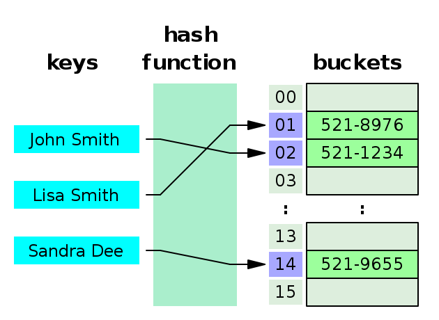
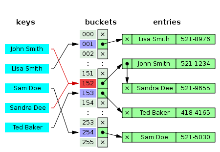
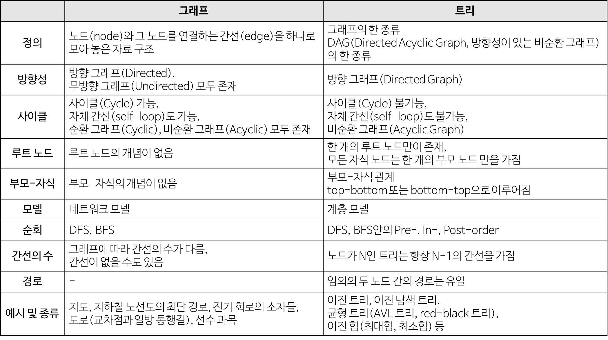

# 1. Data Structure
**:book: Contents**
* [Array](#array)
* [LinkedList](#linkedlist)
* [HashTable](#hashtable)
* [Stack](#stack)
* [Queue](#queue)
* [Graph](#graph)
* [Tree](#tree)
* [그래프(Graph)와 트리(Tree)의 차이점](#그래프와-트리의-차이점)
* [Binary Heap](#binary-heap)
* [Red-Black Tree](#red-black-tree)
* [B+ Tree](#B+-Tree)

---

### Array

> :arrow_double_up:[Top](#1-data-structure)    :leftwards_arrow_with_hook:[Back](https://github.com/WeareSoft/tech-interview#1-data-structure)    :information_source:[Home](https://github.com/WeareSoft/tech-interview#tech-interview)
> - 

### LinkedList

> :arrow_double_up:[Top](#1-data-structure)    :leftwards_arrow_with_hook:[Back](https://github.com/WeareSoft/tech-interview#1-data-structure)    :information_source:[Home](https://github.com/WeareSoft/tech-interview#tech-interview)
> - 

### HashTable

* HashTable 개념
  * Key와 Value를 1:1로 연관지어 저장하는 자료구조 (연관배열 구조)
  * Key를 이용하여 Value 도출

* HashTable 기능
  * 연관배열 구조와 동일한 기능 지원
  * Key, Value가 주어졌을 때, 두 값을 저장
  * Key가 주어졌을 때, 해당 Key에 연관된 Value 조회
  * 기존 Key에 새로운 Value가 주어졌을 때, 기존 Value를 새로운 Value로 대체
  * Key가 주어졌을 때, 해당 Key에 연관된 Value 제거

* HashTable 구조

  
  * Key, Hash Function, Hash, Value, 저장소(Bucket, Slot)로 구성
  * Key
    * 고유한 값
    * 저장 공간의 효율성을 위해 Hash Function에 입력하여 Hash로 변경 후 저장
      * Key는 길이가 다양하기 때문에 그대로 저장하면 다양한 길이만큼 저장소 구성이 필요
  * Hash Function
    * Key를 Hash로 바꿔주는 역할
    * 해시 충돌(서로 다른 Key가 같은 Hash가 되는 경우)이 발생할 확률을 최대한 줄이는 함수를 만드는 것이 중요
  * Hash
    * Hash Function의 결과
    * 저장소에서 Value와 매칭되어 저장
  * Value
    * 저장소에 최종적으로 저장되는 값
    * 키와 매칭되어 저장, 삭제, 검색, 접근 가능

* HashTable 동작 과정
  1. Key -> Hash Function -> Hash Function 결과 = Hash
  2. Hash를 배열의 Index로 사용
  3. 해당 Index에 Value 저장
  * HashTable 크기가 10이라면 A라는 Key의 Value를 찾을 때 hashFunction("A") % 10 연산을 통해 인덱스 값 계산하여 Value 조회

* Hash 충돌
  * 서로 다른 Key가 Hash Function에서 중복 Hash로 나오는 경우
  * 충돌이 많아질수록 탐색의 시간 복잡도가 O(1)에서 O(n)으로 증가

* Hash 충돌 해결 방법
  1. Separating Chaining
      * JDK 내부에서 사용하는 충돌 처리 방식
      * Linked List(데이터 6개 이하) 또는 Red-Black Tree(데이터 8개 이상) 사용
        
      * Linked List 사용 시 충돌이 발생하면 충돌 발생한 인덱스가 가리키고 있는 Linked List에 노드 추가하여 Value 삽입
      * Key에 대한 Value 탐색 시에는 인덱스가 가리키고 있는 Linked List를 선형 검색하여 Value 반환 (삭제도 마찬가지)
      * Linked List 구조를 사용하기 때문에 추가 데이터 수 제약이 적은편
  2. Open addressing
      * 추가 메모리 공간을 사용하지 않고, HashTable 배열의 빈 공간을 사용하는 방법
      * Separating Chaining 방식에 비해 적은 메모리 사용
      * 방법은 Linear Probing, Quadratic Probing, Double Hashing
  3. Resizing
      * 저장 공간이 일정 수준 채워지면 Separating Chaining의 경우 성능 향을 위해, Open addressing의 경우 배열 크기 확장을 위해 Resizing
      * 보통 두배로 확장
      * 확장 임계점은 현재 데이터 개수가 Hash Bucket 개수의 75%가 될 때

* HashTable 장점
  * 적은 리소스로 많은 데이터를 효율적으로 관리 가능
    * ex. HDD. Cloud에 있는 많은 데이터를 Hash로 매핑하여 작은 크기의 시 메모리로 프로세스 관리 가능
  * 배열의 인덱스를 사용하기 때문에 빠른 검색, 삽입, 삭제 (O(1))
    * HashTable의 경우 인덱스는 데이터의 고유 위치이기 때문에 삽입 삭제 시 다른 데이터를 이동할 필요가 없어 삽입, 삭제도 빠른 속도 가능
  * Key와 Hash에 연관성이 없어 보안 유리
  * 데이터 캐싱에 많이 사용
    * get, put 기능에 캐시 로직 추가 시 자주 hit하는 데이터 바로 검색 가능
  * 중복 제거 유용

* HashTable 단점
  * 충돌 발생 가능성
  * 공간 복잡도 증가
  * 순서 무시
  * 해시 함수에 의존

* HashTable vs HashMap
  * Key-Value 구조 및 Key에 대한 Hash로 Value 관리하는 것은 동일
  * HashTable
    * 동기
    * Key-Value 값으로 null 미허용 (Key가 hashcode(), equals()를 사용하기 때문)
    * 보조 Hash Function과 separating Chaining을 사용해서 비교적 충돌 덜 발생 (Key의 Hash 변형)
  * HashMap
    * 비동기 (멀티 스레드 환경에서 주의)
    * Key-Value 값으로 null 허용

* HashTable 성능

    | |평균|최악|
    |----|----|----|
    |탐색|O(1)|O(N)|
    |삽입|O(1)|O(N)|
    |삭제|O(1)|O(N)|

> :arrow_double_up:[Top](#1-data-structure)    :leftwards_arrow_with_hook:[Back](https://github.com/WeareSoft/tech-interview#1-data-structure)    :information_source:[Home](https://github.com/WeareSoft/tech-interview#tech-interview)
> - [Hash, Hashing, Hash Table(해시, 해싱 해시테이블) 자료구조의 이해](https://velog.io/@cyranocoding/Hash-Hashing-Hash-Table%ED%95%B4%EC%8B%9C-%ED%95%B4%EC%8B%B1-%ED%95%B4%EC%8B%9C%ED%85%8C%EC%9D%B4%EB%B8%94-%EC%9E%90%EB%A3%8C%EA%B5%AC%EC%A1%B0%EC%9D%98-%EC%9D%B4%ED%95%B4-6ijyonph6o)
> - [[자료구조] Hash/HashTable/HashMap](https://hee96-story.tistory.com/48)

### Stack
* 스택(Stack)의 개념
    * 한 쪽 끝에서만 자료를 넣고 뺄 수 있는 LIFO(Last In First Out) 형식의 자료 구조
* 스택(Stack)의 연산
  * 스택(Stack)는 LIFO(Last In First Out) 를 따른다. 즉, 가장 최근에 스택에 추가한 항목이 가장 먼저 제거될 항목이다.
    * pop(): 스택에서 가장 위에 있는 항목을 제거한다.
    * push(item): item 하나를 스택의 가장 윗 부분에 추가한다.
    * peek(): 스택의 가장 위에 있는 항목을 반환한다.
    * isEmpty(): 스택이 비어 있을 때에 true를 반환한다.
* 스택(Stack)의 사용 사례
  * 재귀 알고리즘을 사용하는 경우 스택이 유용하다.
    * 재귀 알고리즘
      * 재귀적으로 함수를 호출해야 하는 경우에 임시 데이터를 스택에 넣어준다.
      * 재귀함수를 빠져 나와 퇴각 검색(backtrack)을 할 때는 스택에 넣어 두었던 임시 데이터를 빼 줘야 한다.
      * 스택은 이런 일련의 행위를 직관적으로 가능하게 해 준다.
      * 또한 스택은 재귀 알고리즘을 반복적 형태(iterative)를 통해서 구현할 수 있게 해준다.
    * 웹 브라우저 방문기록 (뒤로가기)
    * 실행 취소 (undo)
    * 역순 문자열 만들기
    * 수식의 괄호 검사 (연산자 우선순위 표현을 위한 괄호 검사)
      * Ex) 올바른 괄호 문자열(VPS, Valid Parenthesis String) 판단하기
    * 후위 표기법 계산

> :arrow_double_up:[Top](#1-data-structure)    :leftwards_arrow_with_hook:[Back](https://github.com/WeareSoft/tech-interview#1-data-structure)    :information_source:[Home](https://github.com/WeareSoft/tech-interview#tech-interview)
> - [https://gmlwjd9405.github.io/2018/08/03/data-structure-stack.html](https://gmlwjd9405.github.io/2018/08/03/data-structure-stack.html)

### Queue
* 큐(Queue)의 개념
  * 컴퓨터의 기본적인 자료 구조의 한가지로, 먼저 집어 넣은 데이터가 먼저 나오는 FIFO(First In First Out)구조로 저장하는 형식
* 큐(Queue)의 연산
  * 큐(Queue)는 FIFO(First-In-First-Out) 를 따른다.
    * add(item): item을 리스트의 끝부분에 추가한다.
    * remove(): 리스트의 첫 번째 항목을 제거한다.
    * peek(): 큐에서 가장 위에 있는 항목을 반환한다.
    * isEmpty(): 큐가 비어 있을 때에 true를 반환한다.
* 큐(Queue)의 사용 사례
  * 데이터가 입력된 시간 순서대로 처리해야 할 필요가 있는 상황에 이용한다.
    * 너비 우선 탐색(BFS, Breadth-First Search) 구현
      * 처리해야 할 노드의 리스트를 저장하는 용도로 큐(Queue)를 사용한다.
      * 노드를 하나 처리할 때마다 해당 노드와 인접한 노드들을 큐에 다시 저장한다.
      * 노드를 접근한 순서대로 처리할 수 있다.
    * 캐시(Cache) 구현
    * 우선순위가 같은 작업 예약 (인쇄 대기열)
    * 선입선출이 필요한 대기열 (티켓 카운터)
    * 콜센터 고객 대기시간
    * 프린터의 출력 처리
    * 윈도우 시스템의 메시지 처리기
    * 프로세스 관리

> :arrow_double_up:[Top](#1-data-structure)    :leftwards_arrow_with_hook:[Back](https://github.com/WeareSoft/tech-interview#1-data-structure)    :information_source:[Home](https://github.com/WeareSoft/tech-interview#tech-interview)
> - [https://gmlwjd9405.github.io/2018/08/02/data-structure-queue.html](https://gmlwjd9405.github.io/2018/08/02/data-structure-queue.html)

### Graph
* 그래프(Graph)의 개념
  * 단순히 노드(N, node)와 그 노드를 연결하는 간선(E, edge)을 하나로 모아 놓은 자료 구조
    * 즉, 연결되어 있는 객체 간의 관계를 표현할 수 있는 자료 구조이다.
    * Ex) 지도, 지하철 노선도의 최단 경로, 전기 회로의 소자들, 도로(교차점과 일방 통행길), 선수 과목 등
    * 그래프는 여러 개의 고립된 부분 그래프(Isolated Subgraphs)로 구성될 수 있다.
* 그래프(Graph)의 특징
  * 그래프는 네트워크 모델 이다.
  * 2개 이상의 경로가 가능하다.
    * 즉, 노드들 사이에 무방향/방향에서 양방향 경로를 가질 수 있다.
  * self-loop 뿐 아니라 loop/circuit 모두 가능하다.
  * 루트 노드라는 개념이 없다.
  * 부모-자식 관계라는 개념이 없다.
  * 순회는 DFS나 BFS로 이루어진다.
  * 그래프는 순환(Cyclic) 혹은 비순환(Acyclic)이다.
  * 그래프는 크게 방향 그래프와 무방향 그래프가 있다.
  * 간선의 유무는 그래프에 따라 다르다.

> :arrow_double_up:[Top](#1-data-structure)    :leftwards_arrow_with_hook:[Back](https://github.com/WeareSoft/tech-interview#1-data-structure)    :information_source:[Home](https://github.com/WeareSoft/tech-interview#tech-interview)
> - [https://gmlwjd9405.github.io/2018/08/13/data-structure-graph.html](https://gmlwjd9405.github.io/2018/08/13/data-structure-graph.html)

### Tree
* 트리(Tree)의 개념
  * 트리는 노드로 이루어진 자료 구조
    1. 트리는 하나의 루트 노드를 갖는다.
    2. 루트 노드는 0개 이상의 자식 노드를 갖고 있다.
    3. 그 자식 노드 또한 0개 이상의 자식 노드를 갖고 있고, 이는 반복적으로 정의된다.
  * 노드(node)들과 노드들을 연결하는 간선(edge)들로 구성되어 있다.
    * 트리에는 사이클(cycle)이 존재할 수 없다.
    * 노드들은 특정 순서로 나열될 수도 있고 그럴 수 없을 수도 있다.
    * 각 노드는 부모 노드로의 연결이 있을 수도 있고 없을 수도 있다.
    * 각 노드는 어떤 자료형으로도 표현 가능하다.
  * 비선형 자료구조로 계층적 관계를 표현한다. Ex) 디렉터리 구조, 조직도
  * 그래프의 한 종류
    * 사이클(cycle)이 없는 하나의 연결 그래프(Connected Graph)
    * 또는 DAG(Directed Acyclic Graph, 방향성이 있는 비순환 그래프)의 한 종류 이다.
~~~java
class Node {
  public String name;
  public Node[] children;
}
~~~
* 트리(Tree)의 특징
  * 그래프의 한 종류이다. ‘최소 연결 트리’ 라고도 불린다.
  * 트리는 계층 모델 이다.
  * 트리는 DAG(Directed Acyclic Graphs, 방향성이 있는 비순환 그래프)의 한 종류이다.
    * loop나 circuit이 없다. 당연히 self-loop도 없다.
    * 즉, 사이클이 없다.
  * 노드가 N개인 트리는 항상 N-1개의 간선(edge)을 가진다.
    * 즉, 간선은 항상 (정점의 개수 - 1) 만큼을 가진다.
  * 루트에서 어떤 노드로 가는 경로는 유일하다.
    * 임의의 두 노드 간의 경로도 유일하다. 즉, 두 개의 정점 사이에 반드시 1개의 경로만을 가진다.
  * 한 개의 루트 노드만이 존재하며 모든 자식 노드는 한 개의 부모 노드만을 가진다.
    * 부모-자식 관계이므로 흐름은 top-bottom 아니면 bottom-top으로 이루어진다.
  * 순회는 Pre-order, In-order 아니면 Post-order로 이루어진다. 이 3가지 모두 DFS/BFS 안에 있다.
  * 트리는 이진 트리, 이진 탐색 트리, 균형 트리(AVL 트리, red-black 트리), 이진 힙(최대힙, 최소힙) 등이 있다.

> :arrow_double_up:[Top](#1-data-structure)    :leftwards_arrow_with_hook:[Back](https://github.com/WeareSoft/tech-interview#1-data-structure)    :information_source:[Home](https://github.com/WeareSoft/tech-interview#tech-interview)
> - [https://gmlwjd9405.github.io/2018/08/12/data-structure-tree.html](https://gmlwjd9405.github.io/2018/08/12/data-structure-tree.html)

### 그래프와 트리의 차이점

> :arrow_double_up:[Top](#1-data-structure)    :leftwards_arrow_with_hook:[Back](https://github.com/WeareSoft/tech-interview#1-data-structure)    :information_source:[Home](https://github.com/WeareSoft/tech-interview#tech-interview)

### Binary Heap

> :arrow_double_up:[Top](#1-data-structure)    :leftwards_arrow_with_hook:[Back](https://github.com/WeareSoft/tech-interview#1-data-structure)    :information_source:[Home](https://github.com/WeareSoft/tech-interview#tech-interview)
> - [https://gmlwjd9405.github.io/2018/05/10/data-structure-heap.html](https://gmlwjd9405.github.io/2018/05/10/data-structure-heap.html)

### Red-Black Tree

> :arrow_double_up:[Top](#1-data-structure)    :leftwards_arrow_with_hook:[Back](https://github.com/WeareSoft/tech-interview#1-data-structure)    :information_source:[Home](https://github.com/WeareSoft/tech-interview#tech-interview)
> - [01. Red-Black Tree 개요](https://github.com/namjunemy/TIL/blob/master/Algorithm/red_black_tree_01.md)
> - [02. Red-Black Tree insert fix-up](https://github.com/namjunemy/TIL/blob/master/Algorithm/red_black_tree_02.md)
> - [03. Red-Black Tree delete, fix-up](https://github.com/namjunemy/TIL/blob/master/Algorithm/red_black_tree_03.md)

### B+ Tree

> :arrow_double_up:[Top](#1-data-structure)    :leftwards_arrow_with_hook:[Back](https://github.com/WeareSoft/tech-interview#1-data-structure)    :information_source:[Home](https://github.com/WeareSoft/tech-interview#tech-interview)
> - 

---

## Reference
> - 

## :house: [Home](https://github.com/WeareSoft/tech-interview)
