# 4. Database
**:book: Contents**
- [4. Database](#4-database)
    - [데이터베이스 풀](#데이터베이스-풀)
    - [정규화 1차 2차 3차 BCNF](#정규화-1차-2차-3차-bcnf)
    - [트랜잭션이란](#트랜잭션이란)
    - [트랜잭션 격리 수준](#트랜잭션-격리-수준)
    - [Join](#join)
    - [SQL Injection](#sql-injection)
    - [Index란](#index란)
      - [사용 이유](#사용-이유)
      - [동작](#동작)
      - [B+tree 알고리즘](#btree-알고리즘)
      - [주의할 점](#주의할-점)
    - [Statement와 PrepareStatement](#statement와-preparestatement)
    - [RDBMS와 NoSQL](#rdbms와-nosql)
    - [효과적인 쿼리 저장](#효과적인-쿼리-저장)
    - [옵티마이저란](#옵티마이저란)
    - [Replication](#replication)
    - [파티셔닝](#파티셔닝)
    - [샤딩](#샤딩)
    - [ORM이란](#orm이란)
      - [영속성(Persistence)](#영속성persistence)
      - [Persistence layer](#persistence-layer)
      - [Persistence framework](#persistence-framework)
      - [예시 (JDBC vs JPA)](#예시-jdbc-vs-jpa)
      - [장점 - 왜 사용하는가?](#장점---왜-사용하는가)
      - [단점](#단점)
    - [JDBC](#jdbc)
      - [JDBC란?](#jdbc란)
      - [JDBC를 이용한 DB접근](#jdbc를-이용한-db접근)
      - [1. **JDBC driver 로딩**](#1-jdbc-driver-로딩)
      - [2. **Connection 맺기**](#2-connection-맺기)
      - [3. **SQL 실행**](#3-sql-실행)
      - [(참고) JDBC의 DB접근 플로우](#참고-jdbc의-db접근-플로우)
      - [(참고) JDBC 컴포넌트의 상호작용](#참고-jdbc-컴포넌트의-상호작용)
      - [Plain JDBC API의 문제점](#plain-jdbc-api의-문제점)
      - [JDBC Template](#jdbc-template)
  - [:house: Home](#house-home)

---

### 데이터베이스 풀
- **Connection Pool**
    - 클라이언트의 요청에 따라 각 어플리케이션의 스레드에서 데이터베이스에 접근하기 위해서는 Connection이 필요하다.
    - Connection pool은 이런 Connection을 여러 개 생성해 두어 저장해 놓은 **공간(캐시)**, 또는 이 공간의 Connection을 필요할 때 꺼내 쓰고 반환하는 **기법**을 말한다.  
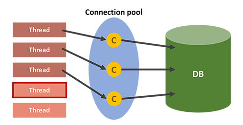
- **DB에 접근하는 단계**
    1. 웹 컨테이너가 실행되면서 DB와 연결된 Connection 객체들을 미리 생성하여 pool에 저장한다.
    2. DB에 요청 시, pool에서 Connection 객체를 가져와 DB에 접근한다.
    3. 처리가 끝나면 다시 pool에 반환한다.  
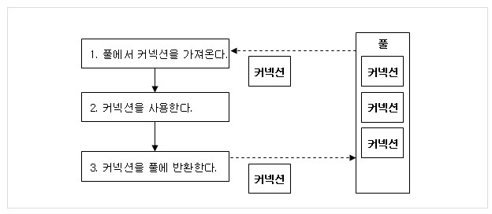
- **Connction이 부족하면?**
    - 모든 요청이 DB에 접근하고 있고 남은 Conncetion이 없다면, 해당 클라이언트는 대기 상태로 전환시키고 Pool에 Connection이 반환되면 대기 상태에 있는 클라이언트에게 순차적으로 제공된다.
- **왜 사용할까?**
    - 매 연결마다 Connection 객체를 생성하고 소멸시키는 비용을 줄일 수 있다.
    - 미리 생성된 Connection 객체를 사용하기 때문에, DB 접근 시간이 단축된다.
    - DB에 접근하는 Connection의 수를 제한하여, 메모리와 DB에 걸리는 부하를 조정할 수 있다.
- **Thread Pool**
    - 비슷한 맥락으로 Thread pool이라는 개념도 있다.
    - 이 역시 매 요청마다 요청을 처리할 Thread를 만드는것이 아닌, 미리 생성한 pool 내의 Thread를 소멸시키지 않고 재사용하여 효율적으로 자원을 활용하는 기법.
- **Thread Pool과 Connection pool**
    - WAS에서 Thread pool과 Connection pool내의 Thread와 Connection의 수는 직접적으로 메모리와 관련이 있기 때문에, 많이 사용하면 할 수록 메모리를 많이 점유하게 된다. 그렇다고 반대로 메모리를 위해 적게 지정한다면, 서버에서는 많은 요청을 처리하지 못하고 대기 할 수 밖에 없다.
    - 보통 WAS의 Thread의 수가 Conncetion의 수보다 많은 것이 좋은데, 그 이유는 모든 요청이 DB에 접근하는 작업이 아니기 때문이다.

> :arrow_double_up:[Top](#4-database)    :leftwards_arrow_with_hook:[Back](https://github.com/WeareSoft/tech-interview#4-database)    :information_source:[Home](https://github.com/WeareSoft/tech-interview#tech-interview)
> - https://delf-lee.github.io/post/connection-pool/

### 정규화 1차 2차 3차 BCNF
> :arrow_double_up:[Top](#4-database)    :leftwards_arrow_with_hook:[Back](https://github.com/WeareSoft/tech-interview#4-database)    :information_source:[Home](https://github.com/WeareSoft/tech-interview#tech-interview)
> - []()

### 트랜잭션이란
* 트랜잭션(Transaction) 이란
    * 데이터베이스의 상태를 변환시키는 하나의 논리적인 작업 단위를 구성하는 연산들의 집합이다.
        * 예를들어, A계좌에서 B계좌로 일정 금액을 이체한다고 가정하자.
          1. A계좌의 잔액을 확인한다.
          2. A계좌의 금액에서 이체할 금액을 빼고 다시 저장한다.
          3. B계좌의 잔액을 확인한다.
          4. B계좌의 금액에서 이체할 금액을 더하고 다시 저장한다.
        * 이러한 과정들이 모두 합쳐져 계좌이체라는 하나의 작업단위를 구성한다.
    * 하나의 트랜잭션은 Commit 되거나 Rollback 된다.
        * Commit 연산
            * 한개의 논리적 단위(트랜잭션)에 대한 작업이 성공적으로 끝나 데이터베이스가 다시 일관된 상태에 있을 때, 이 트랜잭션이 행한 갱신 연산이 완료된 것을 트랜잭션 관리자에게 알려주는 연산이다.
        * Rollback 연산
            * 하나의 트랜잭션 처리가 비정상적으로 종료되어 데이터베이스의 일관성을 깨뜨렸을 때, 이 트랜잭션의 일부가 정상적으로 처리되었더라도 트랜잭션의 원자성을 구현하기 위해 이 트랜잭션이 행한 모든 연산을 취소(Undo)하는 연산이다.
            * Rollback 시에는 해당 트랜잭션을 재시작하거나 폐기한다.
    * 데이터베이스 응용 프로그램은 트랜잭션들의 집합으로 정의 할 수 있다.
* 트랜잭션의 성질(ACID)
    * 원자성(Atomicity), All or nothing
        * 트랜잭션의 모든 연산들은 정상적으로 수행 완료되거나 아니면 전혀 어떠한 연산도 수행되지 않은 상태를 보장해야 한다.
    * 일관성(Consistency)
        * 트랜잭션 완료 후에도 데이터베이스가 일관된 상태로 유지되어야 한다.
    * 독립성(Isolation)
        * 하나의 트랜잭션이 실행하는 도중에 변경한 데이터는 이 트랜잭션이 완료될 때까지 다른 트랜잭션이 참조하지 못한다.
    * 지속성(Durability)
        * 성공적으로 수행된 트랜잭션은 영원히 반영되어야 한다.
* 트랜잭션의 필요성
    * 현금 인출기를 작동하는 도중에 기계오류나 정전 등과 같은 예기치 않은 상황이 발생하여 카드가 나오지 않거나 기계가 멈추는 경우
    * 각각 다른 지점의 은행에서 동시에 인출할 때, 하나의 지점이 다른 지점에서 저장한 잔액을 덮어 쓰는 경우
    * 위와 같은 상황이 발생되지 않도록 방지하기 위해, 즉, 트랜잭션의 성질인 ACID를 제공받기위해 트랜잭션을 사용한다.
* 트랜잭션의 상태  
    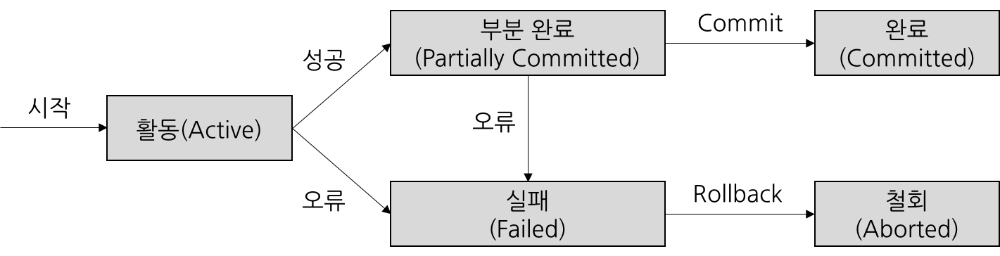
    * 활동(Active)
        * 트랜잭션이 실행 중에 있는 상태, 연산들이 정상적으로 실행 중인 상태
    * 장애(Failed)
        * 트랜잭션이 실행에 오류가 발생하여 중단된 상태
    * 철회(Aborted)
        * 트랜잭션이 비정상적으로 종료되어 Rollback 연산을 수행한 상태
    * 부분 완료(Partially Committed)
        * 트랜잭션이 마지막 연산까지 실행했지만, Commit 연산이 실행되기 직전의 상태
    * 완료(Committed)
        * 트랜잭션이 성공적으로 종료되어 Commit 연산을 실행한 후의 상태

> :arrow_double_up:[Top](#4-database)    :leftwards_arrow_with_hook:[Back](https://github.com/WeareSoft/tech-interview#4-database)    :information_source:[Home](https://github.com/WeareSoft/tech-interview#tech-interview)
> - [http://limkydev.tistory.com/100](http://limkydev.tistory.com/100)
> - [http://coding-factory.tistory.com/226](http://coding-factory.tistory.com/226)
> - [http://yimoyimo.tk/transaction_DI/](http://yimoyimo.tk/transaction_DI/)
> - [https://d2.naver.com/helloworld/407507](https://d2.naver.com/helloworld/407507)

### 트랜잭션 격리 수준
* Isolation Level 이란?
    * 트랜잭션에서 일관성이 없는 데이터를 허용하도록 하는 수준
* Isolation Level 의 필요성
    * 데이터베이스는 ACID 같이 트랜잭션이 원자적이면서도 독립적인 수행을 하도록 한다.
    * 그래서 Locking 이라는 개념이 등장한다.
        * 트랜잭션이 DB를 다루는 동안 다른 트랜잭션이 관여하지 못하게 막는 것
    * 하지만 무조건적인 Locking으로 동시에 수행되는 많은 트랜잭션들을 순서대로 처리하는 방식으로 구현되면 DB의 성능은 떨어지게 된다.
    * 반대로 응답성을 높이기 위해 Locking 범위를 줄인다면 잘못된 값이 처리 될 여지가 있다.
    * 그래서 최대한 효율적인 Locking 방법이 필요하다.
* Isolation Level 의 종류
    1. Read Uncommitted (레벨 0)
        * SELECT 문장이 수행되는 동안 해당 데이터에 Shared Lock이 걸리지 않는 Level
        * 트랜잭션에 처리중인 혹은 아직 커밋되지 않은 데이터를 다른 트랜잭션이 읽는 것을 허용한다.
        * 따라서, 어떤 사용자가 A라는 데이터를 B라는 데이터로 변경하는 동안 다른 사용자는 아직 완료되지 않은(Uncommitted 혹은 Dirty) 트랜잭션이지만 변경된 데이터인 B를 읽을 수 있다.
        * 데이터베이스의 일관성을 유지할 수 없다.
    2. Read Committed (레벨 1)
        * SELECT 문장이 수행되는 동안 해당 데이터에 Shared Lock이 걸리는 Level
        * 트랜잭션이 수행되는 동안 다른 트랜잭션이 접근할 수 없어 대기하게 된다.
        * Commit이 이루어진 트랜잭션만 조회할 수 있다.
        * 따라서, 어떤 사용자가 A라는 데이터를 B라는 데이터로 변경하는 동안 다른 사용자는 해당 데이터에 접근할 수 없다.
        * SQL Server가 Default로 사용하는 Isolation Level
    3. Repeatable Read (레벨 2)
        * 트랜잭션이 완료될 때까지 SELECT 문장이 사용하는 모든 데이터에 Shared Lock이 걸리는 Level
        * 트랜잭션이 범위 내에서 조회한 데이터의 내용이 항상 동일함을 보장한다.
        * 따라서, 다른 사용자는 그 영역에 해당되는 데이터에 대한 수정이 불가능하다.
    4. Serializable (레벨 3)
        * 트랜잭션이 완료될 때까지 SELECT 문장이 사용하는 모든 데이터에 Shared Lock이 걸리는 Level
        * 완벽한 읽기 일관성 모드를 제공한다.
        * 따라서, 다른 사용자는 그 영역에 해당되는 데이터에 대한 수정 및 입력이 불가능하다.
    * Isolation level 조정은 동시성이 증가되는데 반해 데이터 무결성에 문제가 발생할 수 있고, 데이터의 무결성을 유지하는 데 반해 동시성이 떨어질 수 있다.
    * 레벨이 높아질수록 비용이 높아진다.
* 낮은 단계의 Isolation Level 이용시 발생하는 현상  
    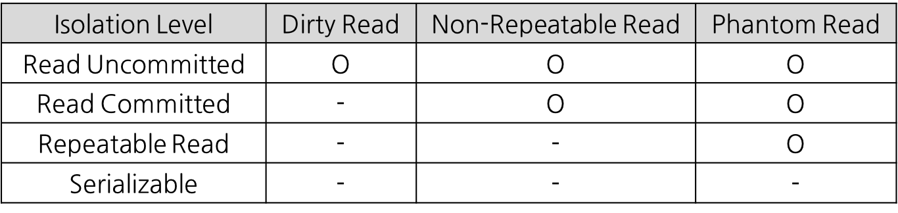
    * Dirty Read
        * 커밋되지 않은 수정 중인 데이터를 다른 트랜잭션에서 읽을 수 있도록 허용할 때 발생하는 현상
        * 어떤 트랜잭션에서 아직 실행이 끝난지 않은 다른 트랜잭션에 의한 변경 사항을 보게 되는 되는 경우
    * Non-Repeatable Read
        * 한 트랜잭션에서 같은 쿼리를 두 번 수행할 때 그 사이에 다른 트랜잭션이 값을 수정 또는 삭제함으로써 두 쿼리의 결과가 상이하게 나타나는 비 일관성 현상
    * Phantom Read
        * 한 트랜잭션 안에서 일정 범위의 레코드를 두 번 이상 읽을 때, 첫 번째 쿼리에서 없던 레코드가 두 번째 쿼리에서 나타나는 현상
        * 이는 트랜잭션 도중 새로운 레코드가 삽입되는 것을 허용하기 때문에 나타난다.

> :arrow_double_up:[Top](#4-database)    :leftwards_arrow_with_hook:[Back](https://github.com/WeareSoft/tech-interview#4-database)    :information_source:[Home](https://github.com/WeareSoft/tech-interview#tech-interview)
> - [http://hundredin.net/2012/07/26/isolation-level/](http://hundredin.net/2012/07/26/isolation-level/)
> - [http://egloos.zum.com/ljlave/v/1530887](http://egloos.zum.com/ljlave/v/1530887)

### Join
* 조인이란
    * **한 데이터베이스 내의 여러 테이블의 레코드를 조합하여 하나의 열로 표현한 것**이다.
    * 따라서 조인은 테이블로서 저장되거나, 그 자체로 이용할 수 있는 결과 셋을 만들어 낸다.
* 조인의 필요성
    * 관계형 데이터베이스의 구조적 특징으로 정규화를 수행하면 의미 있는 데이터의 집합으로 테이블이 구성되고, 각 테이블끼리는 관계(Relationship)를 갖게 된다. 
    * 이와 같은 특징으로 관계형 데이터베이스는 저장 공간의 효율성과 확장성이 향상되게 된다.
    * 다른 한편으로는 서로 관계있는 데이터가 여러 테이블로 나뉘어 저장되므로, 각 테이블에 저장된 데이터를 효과적으로 검색하기 위해 조인이 필요하다.

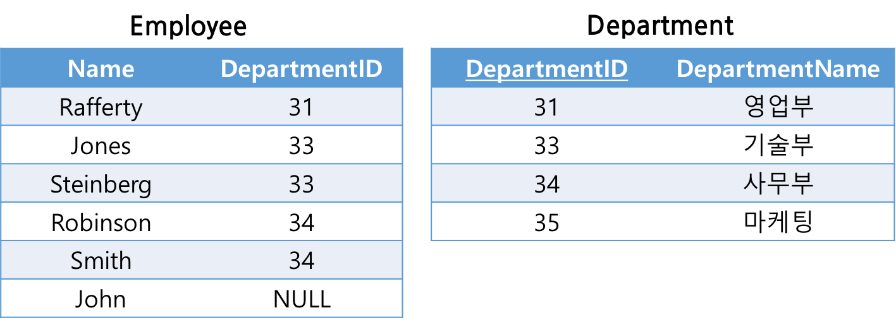

* 조인의 종류
    1. **내부 조인(INNER JOIN)**
        * 여러 애플리케이션에서 사용되는 가장 흔한 결합 방식이며, 기본 조인 형식으로 간주된다.
        * 내부 조인은 조인 구문에 기반한 2개의 테이블(A, B)의 컬럼 값을 결합함으로써 새로운 결과 테이블을 생성한다.
        * **명시적 조인 표현**(explicit)과 **암시적 조인 표현**(implicit) 2개의 다른 조인식 구문이 있다.
        * 명시적 조인 표현
            * 테이블에 조인을 하라는 것을 지정하기 위해 JOIN 키워드를 사용하며, 그리고 나서 다음의 예제와 같이 ON 키워드를 조인에 대한 구문을 지정하는데 사용한다.
                ```sql
                SELECT *
                FROM employee INNER JOIN department
                ON employee.DepartmentID = department.DepartmentID;
                ```
        * 암시적 조인 표현
            * SELECT 구문의 FROM 절에서 그것들을 분리하는 컴마를 사용해서 단순히 조인을 위한 여러 테이블을 나열하기만 한다.
                ```sql
                SELECT *
                FROM employee, department
                WHERE employee.DepartmentID = department.DepartmentID;
                ```
        * 결과  
            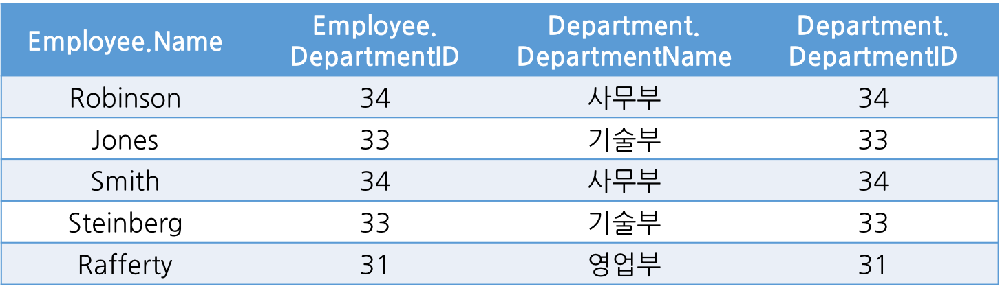
        1. **동등 조인(EQUI JOIN)**
            * 비교자 기반의 조인이며, 조인 구문에서 **동등비교만을 사용**한다.
            * 다른 비교 연산자(<와 같은)를 사용하는 것은 동등 조인으로서의 조인의 자격을 박탈하는 것이다.
        2. **자연 조인(NATURAL JOIN)**
            * 동등 조인의 한 유형으로 조인 구문이 조인된 테이블에서 동일한 컬럼명을 가진 2개의 테이블에서 모든 컬럼들을 비교함으로써, 암시적으로 일어나는 구문이다.
            * 결과적으로 나온 조인된 테이블은 동일한 이름을 가진 컬럼의 각 쌍에 대한 단 하나의 컬럼만 포함하고 있다.
            * SQL
                ```sql
                SELECT * FROM employee NATURAL JOIN department;
                ```
            * 결과  
                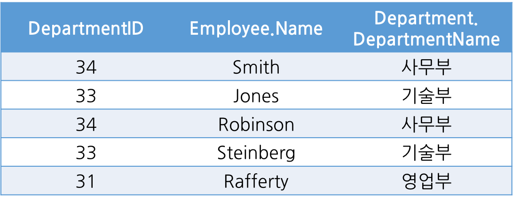
        3. **교차 조인(CROSS JOIN)**
            * 조인되는 두 테이블에서 곱집합을 반환한다. 
            * 즉, 두 번째 테이블로부터 각 행과 첫 번째 테이블에서 각 행이 한번씩 결합된 열을 만들 것이다.
            * 예를 들어 m행을 가진 테이블과 n행을 가진 테이블이 교차 조인되면 m*n 개의 행을 생성한다
            * 명시적 조인 표현
                ```sql
                SELECT * FROM employee CROSS JOIN department;
                ```
            * 암시적 조인 표현
                ```sql
                SELECT * FROM employee, department;
                ```
            * 결과  
                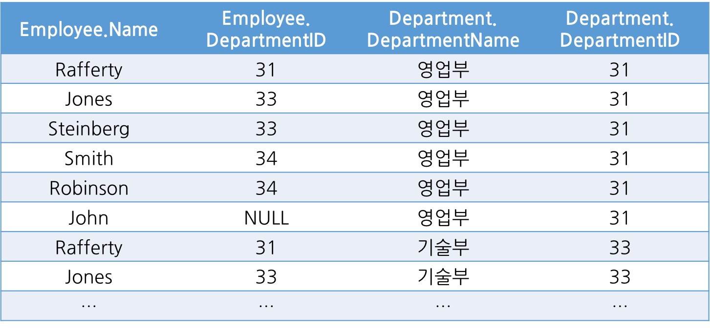
    2. **외부 조인(OUTER JOIN)**
        * 조인 대상 테이블에서 특정 테이블의 데이터가 모두 필요한 상황에서 외부 조인을 활용하여 효과적으로 결과 집합을 생성할 수 있다.
        1. **왼쪽 외부 조인(LEFT OUTER JOIN)**
            * 우측 테이블에 조인할 컬럼의 값이 없는 경우 사용한다.
            * 즉, 좌측 테이블의 모든 데이터를 포함하는 결과 집합을 생성한다.
            * SQL
                ```sql
                SELECT *
                FROM employee LEFT OUTER JOIN department
                ON employee.DepartmentID = department.DepartmentID;
                ```
            * 결과  
                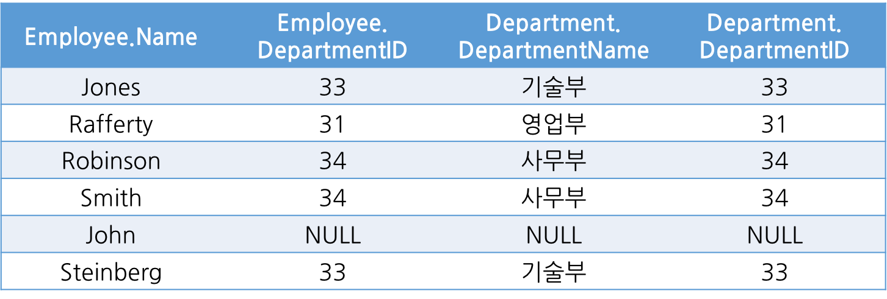
        2. **오른쪽 외부 조인(RIGHT OUTER JOIN)**
            * 좌측 테이블에 조인할 컬럼의 값이 없는 경우 사용한다.
            * 즉, 우측 테이블의 모든 데이터를 포함하는 결과 집합을 생성한다.
            * SQL
                ```sql
                SELECT *
                FROM employee RIGHT OUTER JOIN department
                ON employee.DepartmentID = department.DepartmentID;
                ```
            * 결과  
                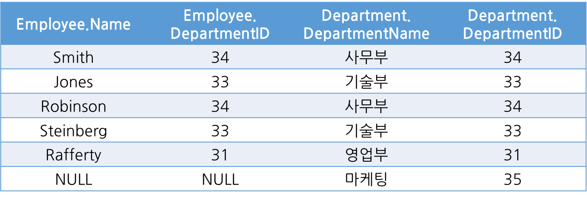
        3. **완전 외부 조인(FULL OUTER JOIN)**
            * 양쪽 테이블 모두 OUTER JOIN이 필요할 때 사용한다.
            * SQL
                ```sql
                SELECT *
                FROM employee FULL OUTER JOIN department
                ON employee.DepartmentID = department.DepartmentID;
                ```
            * 결과  
                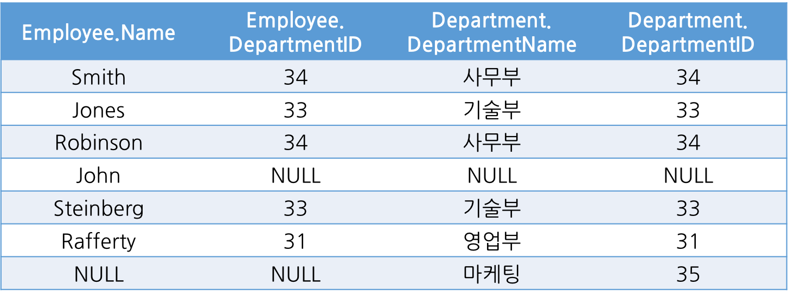
    3. **셀프 조인(SELF JOIN)**
        * 한 테이블에서 자기 자신에 조인을 시키는 것이다.
* 조인을 사용할 때 주의사항
    * SQL 문장의 의미를 제대로 파악
        * SQL을 어떻게 작성하느냐에 따라 성능이 크게 좌우된다. 어떤 질의를 수행할 것인지를 명확하게 정의한 후, 비효율을 제거하여 최적의 SQL을 작성해야 한다.
    * 명확한 조인 조건 제공
        * 조인 조건을 명확하게 제공하지 않을 경우, 의도치 않게 CROSS JOIN(Cartesian Product)이 수행될 수 있다.
* 조인을 사용할 때 고려사항
    * 조인할 대상의 집합을 최소화
        * 집합을 최소화할 방법이 있으면, 조건을 먼저 적용하여 관계를 맺을 집합을 최소화한 후, 조인을 맺는 것이 효율적이다.
    * 효과적인 인덱스의 활용
        * 인덱스를 활용하면, 조인 연산의 비용을 극적으로 낮출 수 있다.

> :arrow_double_up:[Top](#4-database)    :leftwards_arrow_with_hook:[Back](https://github.com/WeareSoft/tech-interview#4-database)    :information_source:[Home](https://github.com/WeareSoft/tech-interview#tech-interview)
> - [https://doooyeon.github.io/2018/11/11/database-join.html](https://doooyeon.github.io/2018/11/11/database-join.html)

### SQL Injection
> :arrow_double_up:[Top](#4-database)    :leftwards_arrow_with_hook:[Back](https://github.com/WeareSoft/tech-interview#4-database)    :information_source:[Home](https://github.com/WeareSoft/tech-interview#tech-interview)
> - []()

### Index란
인덱스(index)의 원래 뜻은 색인. 데이터베이스에서 조회 및 검색을 더 빠르게 할 수 있는 방법/기술, 혹은 이에 쓰이는 자료구조 자체를 의미하기도 한다.

#### 사용 이유
`select`문을 사용하여 원하는 조건의 데이터를 검색할 때, 저장된 데이터의 양이 엄청나게 많다면 검색을 위한 순회에 많은 자원과 시간이 소모될 것이다. 이때 도움이 되는게 인덱스이다. 

자주 조회되는 Column 에 대한 Index Table을 따로 만들어 SELECT 문이 들어왔을 때 Index 테이블에 있는 값들로 결과 값을 조회해 온다. 그래서 Index를 잘 사용한다면 "검색" 연산을 실행했을 때 성능을 올릴 수 있게 된다.

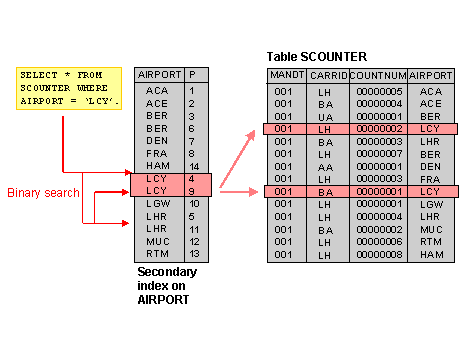


#### 동작

- Index Table에서 `where`에 포함된 값을 검색
- 해당 값의 table_id PK를 획득
- 가져온 table_id PK값으로 원본 테이블에서 값을 조회

DBMS는 인덱스를 다양한 알고리즘으로 관리를 하고 있는데 일반적으로 사용되는 알고리즘은 B+ Tree 알고리즘이다.

#### B+tree 알고리즘

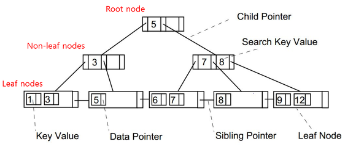

- 실제 데이터가 저장된 리프노드(Leaf nodes)
- 리프노드까지의 경로 역할을 하는 논리프노드(Non-leaf nodes)
- 경로의 출발점이 되는 루트 노드(Root node)

B+tree는 리프노드에 이르기까지에 대한 자식 노드에 포인터가 저장되어 있다. 즉, B+트리의 검색은 루트노드에서 어떤 리프 노드에 이르는 한 개의 경로만 검색하면 되므로 매우 효율적이다. 

##### B+tree 사용 이유
- **왜 index 생성 시 b-tree를 사용하는지? hash table이 더 효율적이지 않은지?**
    - SELECT 질의 조건에는 부등호 연산(<>)도 포함
    - hash table은 동등 연산에 특화된 자료구조이기 때문에 부등호 연산 사용 시 문제 발생

#### 주의할 점

- 인덱스는 따로 테이블의 형태로 관리가 된다. 자원을 소모한다는 의미. 때문에 무분별한 인덱스의 사용은 성능에 부정적인 영향을 미칠 수 있다.

- 또한 인덱스는 이진트리를 사용하기 때문에 기본적으로 정렬되어 있다. 이로인해 검색과 조회의 속도를 향상시킬 수 있지만 잦은 데이터의 변경(삽입, 수정 삭제)가 된다면 인덱스 데이블을 변경과 정렬에 드는 오버헤드 때문에 오히려 성능 저하가 일어날 수 있다.
  - INSERT : 테이블에는 입력 순서대로 저장되지만, 인덱스 테이블에는 정렬하여 저장하기 때문에 성능 저하 발생
  - DELETE : 테이블에서만 삭제되고 인덱스 테이블에는 남아있어 쿼리 수행 속도 저하
  - UPDATE : 인덱스에는 UPDATE가 없기 때문에 DELETE, INSERT 두 작업 수행하여 부하 발생
  
- 데이터의 중복이 높은 컬럼(카디널리티가 낮은 컬럼)은 인덱스로 만들어도 무용지물 (예: 성별)
- 다중 컬럼 인덱싱할 때 카디널리티가 높은 컬럼->낮은 컬럼 순으로 인덱싱해야 효율적

> :arrow_double_up:[Top](#4-database)    :leftwards_arrow_with_hook:[Back](https://github.com/WeareSoft/tech-interview#4-database)    :information_source:[Home](https://github.com/WeareSoft/tech-interview#tech-interview)
> - [victolee - [DB이론] 인덱스(Index)](https://victorydntmd.tistory.com/319)
> - [Nathan - DB 성능을 위한 Index](https://brunch.co.kr/@skeks463/25)
> - [인덱스 기본 원리](http://wiki.gurubee.net/pages/viewpage.action?pageId=26745270)

### Statement와 PrepareStatement
> :arrow_double_up:[Top](#4-database)    :leftwards_arrow_with_hook:[Back](https://github.com/WeareSoft/tech-interview#4-database)    :information_source:[Home](https://github.com/WeareSoft/tech-interview#tech-interview)
> - []()

### RDBMS와 NoSQL
> :arrow_double_up:[Top](#4-database)    :leftwards_arrow_with_hook:[Back](https://github.com/WeareSoft/tech-interview#4-database)    :information_source:[Home](https://github.com/WeareSoft/tech-interview#tech-interview)
> - []()

### 효과적인 쿼리 저장
> :arrow_double_up:[Top](#4-database)    :leftwards_arrow_with_hook:[Back](https://github.com/WeareSoft/tech-interview#4-database)    :information_source:[Home](https://github.com/WeareSoft/tech-interview#tech-interview)
> - []()

### 옵티마이저란
> :arrow_double_up:[Top](#4-database)    :leftwards_arrow_with_hook:[Back](https://github.com/WeareSoft/tech-interview#4-database)    :information_source:[Home](https://github.com/WeareSoft/tech-interview#tech-interview)
> - []()

### Replication
> :arrow_double_up:[Top](#4-database)    :leftwards_arrow_with_hook:[Back](https://github.com/WeareSoft/tech-interview#4-database)    :information_source:[Home](https://github.com/WeareSoft/tech-interview#tech-interview)
> - []()

### 파티셔닝
* 배경
  * 서비스의 크기가 점점 커지고 DB에 저장하는 데이터의 규모 또한 대용량화 되면서, 기존에 사용하는 DB 시스템의 **용량(storage)의 한계와 성능(performance)의 저하** 를 가져오게 되었다.
  * 즉, VLDB(Very Large DBMS)와 같이 하나의 DBMS에 너무 큰 table이 들어가면서 용량과 성능 측면에서 많은 이슈가 발생하게 되었고, 이런 이슈를 해결하기 위한 방법으로 table을 '파티션(partition)'이라는 작은 단위로 나누어 관리하는 **'파티셔닝(Partitioning)'기법** 이 나타나게 되었다.
* 파티셔닝의 개념
  * **큰 table이나 index를, 관리하기 쉬운 partition이라는 작은 단위로 물리적으로 분할하는 것을 의미한다.**
    * 물리적인 데이터 분할이 있더라도, DB에 접근하는 application의 입장에서는 이를 인식하지 못한다.
  * '파티셔닝(Partitioning)'기법을 통해 소프트웨어적으로 데이터베이스를 분산 처리하여 성능이 저하되는 것을 방지하고 관리를 보다 수월하게 할 수 있게 되었다.
* 파티셔닝의 목적
  1. 성능(Performance)
      * 특정 DML과 Query의 성능을 향상시킨다.
      * 주로 대용량 Data WRITE 환경에서 효율적이다.
      * 특히, Full Scan에서 데이터 Access의 범위를 줄여 성능 향상을 가져온다.
      * 많은 INSERT가 있는 OLTP 시스템에서 INSERT 작업을 작은 단위인 partition들로 분산시켜 경합을 줄인다.
  2. 가용성(Availability)
      * 물리적인 파티셔닝으로 인해 전체 데이터의 훼손 가능성이 줄어들고 데이터 가용성이 향상된다.
      * 각 분할 영역(partition별로)을 독립적으로 백업하고 복구할 수 있다.
      * table의 partition 단위로 Disk I/O을 분산하여 경합을 줄이기 때문에 UPDATE 성능을 향상시킨다.
  3. 관리용이성(Manageability)
      * 큰 table들을 제거하여 관리를 쉽게 해준다.
* 파티셔닝의 장점
  * 관리적 측면 : partition 단위 백업, 추가, 삭제, 변경
    * 전체 데이터를 손실할 가능성이 줄어들어 데이터 가용성이 향상된다.
    * partition별로 백업 및 복구가 가능하다.
    * partition 단위로 I/O 분산이 가능하여 UPDATE 성능을 향상시킨다.
  * 성능적 측면 : partition 단위 조회 및 DML수행
    * 데이터 전체 검색 시 필요한 부분만 탐색해 성능이 증가한다.
    * 즉, Full Scan에서 데이터 Access의 범위를 줄여 성능 향상을 가져온다.
    * 필요한 데이터만 빠르게 조회할 수 있기 때문에 쿼리 자체가 가볍다.
* 파티셔닝의 단점
  * table간 JOIN에 대한 비용이 증가한다.
  * table과 index를 별도로 파티셔닝할 수 없다.
    * table과 index를 같이 파티셔닝해야 한다.
* 파티셔닝의 종류
  1. 수평(horizontal) 파티셔닝
      * **샤딩(Sharding)** 과 동일한 개념
  2. 수직(vertical) 파티셔닝
  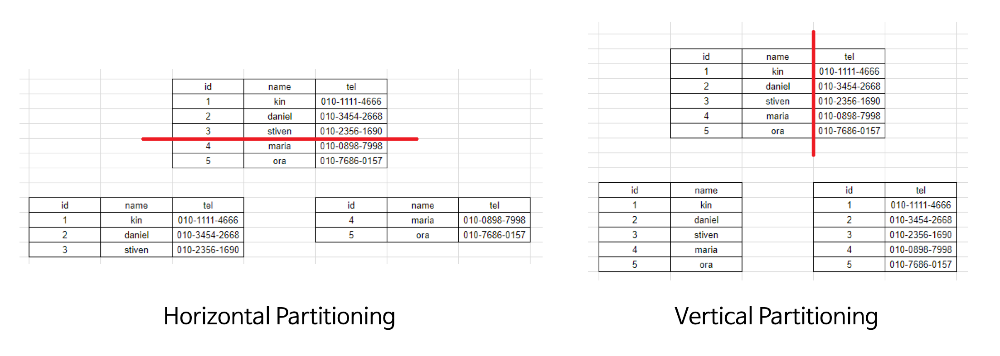
* 파티셔닝의 분할 기준
  1. 범위 분할 (range partitioning)
  2. 목록 분할 (list partitioning)
  3. 해시 분할 (hash partitioning)
  4. 합성 분할 (composite partitioning)
  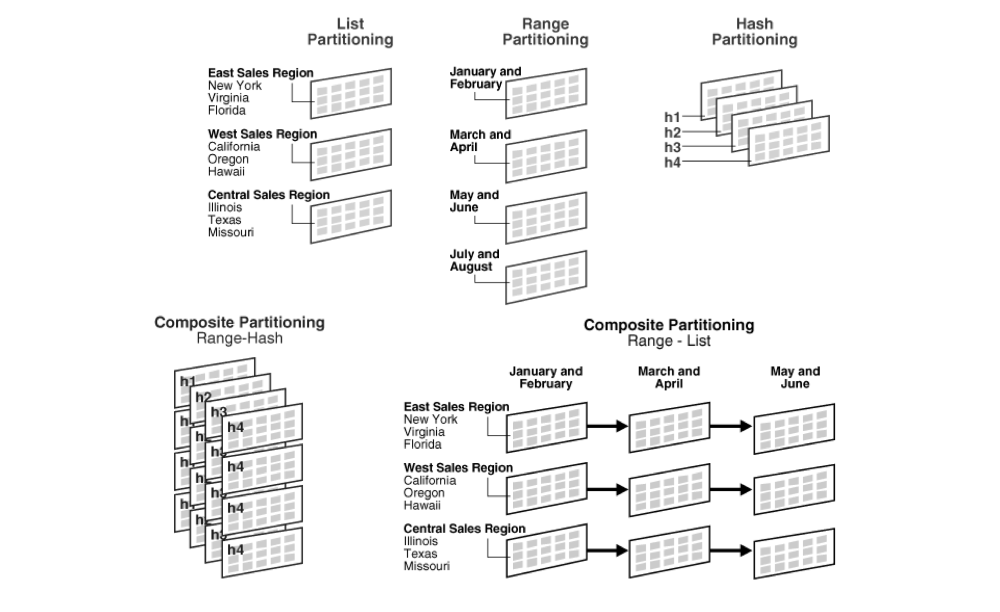

> :arrow_double_up:[Top](#4-database)    :leftwards_arrow_with_hook:[Back](https://github.com/WeareSoft/tech-interview#4-database)    :information_source:[Home](https://github.com/WeareSoft/tech-interview#tech-interview)
> - [https://gmlwjd9405.github.io/2018/09/24/db-partitioning.html](https://gmlwjd9405.github.io/2018/09/24/db-partitioning.html)
> - [https://nesoy.github.io/articles/2018-02/Database-Partitioning](https://nesoy.github.io/articles/2018-02/Database-Partitioning)

### 샤딩
  <!-- * 샤딩은 물리적으로 다른 데이터베이스에 데이터를 수평 분할 방식으로 분산 저장하고 조회하는 방법을 말한다.
샤딩은 주로 키값(해쉬값 또는 특정 컬럼값)을 이용하여 테이블들의 데이터 자체를 나눠서 분산저장하거나, 특정 분류기준을 가지고(저장 데이터 종류-유저, 일반데이터 등) 테이블을 분류하여 저장하는 것
샤딩은 수평 파티션과 동일한 개념이다.
sharding == horizontal partitioning

'주민' 테이블이 여러 DB에 있을 때, 서현동 주민에 대한 정보는 A DB에, 정자동 주민에 대한 정보는 B DB에 저장되도록 하는 방식을 말한다. 여러 데이터베이스를 대상으로 작업해야 하기 때문에 경우에 따라서는 기능에 제약이 있을 수 있고(JOIN 연산 등) 일관성(consistency)과 복제(replication) 등에서 불리한 점이 많다. 예전의 샤딩은 애플리케이션 서버 레벨에서 구현하는 경우가 많았다. 최근에는 이를 플랫폼 차원에서 제공하려는 시도가 많다. 크게 분류하면 Hibernate Shards와 같이 애플리케이션 서버에서 동작하는 형태, CUBRID SHARD, Spock Proxy, Gizzard와 같이 미들티어(middle tier)로 동작하는 형태, nStore나 MongoDB와 같이 데이터베이스 자체에서 샤딩 기능을 제공하는 형태로 나누어볼 수 있다. -->

> :arrow_double_up:[Top](#4-database)    :leftwards_arrow_with_hook:[Back](https://github.com/WeareSoft/tech-interview#4-database)    :information_source:[Home](https://github.com/WeareSoft/tech-interview#tech-interview)
> - [http://mongodb.citsoft.net/?page_id=225#comment-91922](http://mongodb.citsoft.net/?page_id=225#comment-91922)
> - [https://d2.naver.com/helloworld/14822](https://d2.naver.com/helloworld/14822)
> - [http://tech.kakao.com/2016/07/01/adt-mysql-shard-rebalancing/](http://tech.kakao.com/2016/07/01/adt-mysql-shard-rebalancing/)

### ORM이란
> **O**bject-**R**elational **M**apping 객체-관계 매핑
- 객체와 관계형 데이터베이스의 데이터를 자동으로 매핑(연결)해주는 것을 말한다.
#### 영속성(Persistence)
- 데이터를 생성한 프로그램의 실행이 종료되더라도 사라지지 않는 데이터의 특성.
- 영속성을 갖지 않는 데이터는 단지 메모리에서만 존재하기 때문에 프로그램을 종료하면 모두 잃어버리게 된다. 때문에 파일 시스템, 관계형 테이터베이스 혹은 객체 데이터베이스 등을 활용하여 데이터를 영구하게 저장하여 영속성 부여한다.
#### Persistence layer
프로그램의 아키텍처에서, 데이터에 영속성을 부여해주는 계층. JDBC를 이용하여 직접 구현할 수 있지만 Persistence framework를 이용한 개발이 많이 이루어진다.

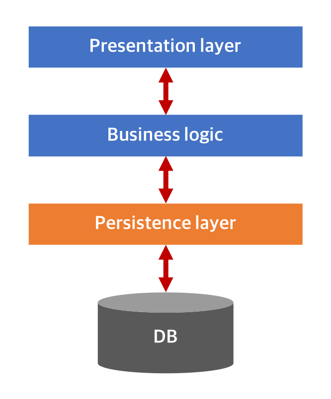

#### [Persistence framework](https://ko.wikipedia.org/wiki/퍼시스턴스_프레임워크)
JDBC 프로그래밍의 복잡함이나 번거로움 없이 간단한 작업만으로 데이터베이스와 연동되는 시스템을 빠르게 개발할 수 있으며 안정적인 구동을 보장한다.  
- 종류
  - SQL 문장으로 직접 데이터베이스 데이터를 다루는 *SQL 맵퍼*
    - Mybatis 등
  - **객체를 통해 간접적으로 데이터베이스 데이터를 다루는 *객체 관계 맵퍼(ORM)***
    - Hibernate 등
#### 예시 (JDBC vs JPA)
- JDBC example
``` java
public String getPersonName(long personId) throws SQLException {
    PreparedStatement st = null;
    try {
        st = connection.prepareStatement (
            "SELECT name FROM people WHERE id = ?");
            st.setLong(1, personId);
            ResultSet rs = st.excuteQuery();
            if (ts.next()) {
                String result = rs.getString("name");
                assert !rs.next();
                return result;
            } else {
                return null;
            }
    } finally {
        if (st != null) {
            st.close();
        }
    }
}
```
- JPA example
``` java
public String getPersonName(long personId) {
    Person p = em.find(Person.class, personId);
    return p.getName();
}
```

#### 장점 - 왜 사용하는가?
- **객체 지향적인 코드로 인해 더 직관적이고 비즈니스 로직에 더 집중할 수 있게 도와준다.**
  - 선언문, 할당, 종료 같은 부수적인 코드가 없거나 급격히 줄어든다.
  - 각종 객체에 대한 코드를 별도로 작성하기 때문에 코드의 가독성을 올려준다.
  - SQL의 절차적이고 순차적인 접근이 아닌 객체 지향적인 접근으로 인해 생산성이 증가한다.
- **재사용 및 유지보수의 편리성이 증가한다.**
  - ORM은 독립적으로 작성되어있고, 해당 객체들을 재활용 할 수 있다.
  - 때문에 모델에서 가공된 데이터를 컨트롤러에 의해 뷰와 합쳐지는 형태로 디자인 패턴을 견고하게 다지는데 유리하다.
  - 매핑정보가 명확하여, ERD를 보는 것에 대한 의존도를 낮출 수 있다.
- **DBMS에 대한 종속성이 줄어든다.**
  - 대부분 ORM 솔루션은 DB에 종속적이지 않다.
  - 종속적이지 않다는것은 구현 방법 뿐만아니라 많은 솔루션에서 자료형 타입까지 유효하다.
  - 프로그래머는 Object에 집중함으로 극단적으로 DBMS를 교체하는 거대한 작업에도 비교적 적은 리스크와 시간이 소요된다.
  - 또한 자바에서 가공할경우 equals, hashCode의 오버라이드 같은 자바의 기능을 이용할 수 있고, 간결하고 빠른 가공이 가능하다.

#### 단점
- **완벽한 ORM 으로만 서비스를 구현하기가 어렵다.**
  - 사용하기는 편하지만 설계는 매우 신중하게 해야한다.
  - 프로젝트의 복잡성이 커질경우 난이도 또한 올라갈 수 있다.
  - 잘못 구현된 경우에 속도 저하 및 심각할 경우 일관성이 무너지는 문제점이 생길 수 있다.
  - 일부 자주 사용되는 대형 쿼리는 속도를 위해 SP를 쓰는등 별도의 튜닝이 필요한 경우가 있다.
  - DBMS의 고유 기능을 이용하기 어렵다. (하지만 이건 단점으로만 볼 수 없다 : 특정 DBMS의 고유기능을 이용하면 이식성이 저하된다.)
- **프로시저가 많은 시스템에선 ORM의 객체 지향적인 장점을 활용하기 어렵다.**
  - 이미 프로시저가 많은 시스템에선 다시 객체로 바꿔야하며, 그 과정에서 생산성 저하나 리스크가 많이 발생할 수 있다.

> :arrow_double_up:[Top](#4-database)    :leftwards_arrow_with_hook:[Back](https://github.com/WeareSoft/tech-interview#4-database)    :information_source:[Home](https://github.com/WeareSoft/tech-interview#tech-interview)
> - [[Slide Share] ORM을 활용할 경우의 설계, 개발 과정 - Javajigi](https://www.slideshare.net/javajigi/orm-27141159)
> - [[SlidePlayer] Data Persistence Layer - 思 旁](https://slideplayer.com/slide/11663617/)
> - [ORM - 人CoDOM](http://www.incodom.kr/ORM#h_702209f3f35878a32ee91352ddc6bbe7)

### JDBC
#### JDBC란?
> JDBC(Java Database Connectivity)는 DB에 접근할 수 있도록 Java에서 제공하는 API이다. 

- JDBC는 관계형 데이터베이스에 사용되는 SQL문을 실행하기 위해 자바로 작성된 클래스와 인터페이스로 구성되어 있다.
- 특정 데이터베이스나 특정 데이터베이스 메커니즘에 구애 받지않는 독립적인 인터페이스를 통해 다양한 데이터베이스에 접근하는 코드를 구현할 수 있도록 제공하는 자바 클래스의 표준 집합이다.
- JDBC 클래스는 자바 패키지 `java.sql`과 `javax.sql`에 포함되어 있다.

데이터베이스 벤더들이 이러한 라이브러리를 각자 만든다면, 자바 프로그래머는 각 벤더가 만든 라이브러리 사용법을 익혀야 할것이다.


#### JDBC를 이용한 DB접근
- 다음과 같은 순서로 이루어진다.
  1. JDBC driver 로딩
  2. Connection 맺기
  3. SQL 실행
  4. 자원 반환

#### 1. **JDBC driver 로딩**
- 예)
    ``` java
    Class.forName("com.mysql.jdbc.Driver"); // mysql 드리이버 로딩
    ```
- Driver란?
  - JDBC Driver는 자바 프로그램의 요청을 DBMS가 이해할 수 있는 프로토콜로 변환해주는 클라이언트 사이드 어댑터
#### 2. **Connection 맺기**
- 예) 
    ``` java
    Connection conn = null;
    conn = DriverManager.getConnection(URL, USERNAME, PASSWORD);
    ```
- `DriverManager`는 이름 그대로 데이터베이스 벤더들이 JDBC API를 구현한 드라이버를 관리한다. `DriverManager.getConnection()` 메서드는 인자로 들어오는 값에 따라서 특정 데이터베이스 벤더가 구현한 `Connection` 타입의 객체를 반환한다. `Connection` 객체가 생성은 데이터베이스와 연결이 확립되었음을 의미한다.

#### 3. **SQL 실행**
- 쿼리 준비
    ``` java
    Statement stmt = conn.createStatement();
    ```
- 쿼리 실행(쓰기 작업의 경우 - `insert`, `update`, `delete`)
    ``` java
    rs = stmt.executeQuery(SQL_QUERY_STRING);
    ```
- 쿼리 실행(읽기 작업의 경우 - `select`)  
  - 결과 값을 받아오는 작업이라면
  ``` java
  ResultSet rs = psmt.executeQuery();
  ```
- SQL문이 `select`문이었다면 `ResultSet`을 이용한 처리
  - 값 추출
   ``` java
   while(rs.next()){
       String result1 = resultSet.getString(1) // 컬럼 인덱스
       String result2 = resultSet.getString("NAME") // 컬럼명
   }
    ```
    이렇게 추출한 값들은 보통 DTO객체로 변환하여 사용한다.
#### 4. 자원 반환
``` java
rs.close(); // ResultSet를 닫는다.
stmt.close(); // Statement를 닫는다.
conn.close(); // Connection를 닫는다.
```
#### (참고) JDBC의 DB접근 플로우
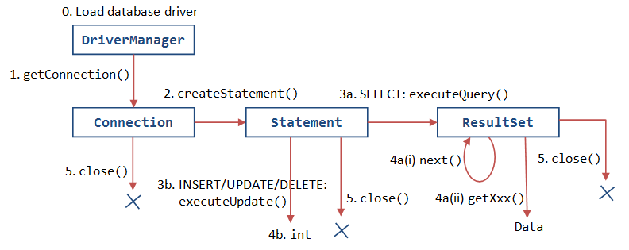

#### (참고) JDBC 컴포넌트의 상호작용
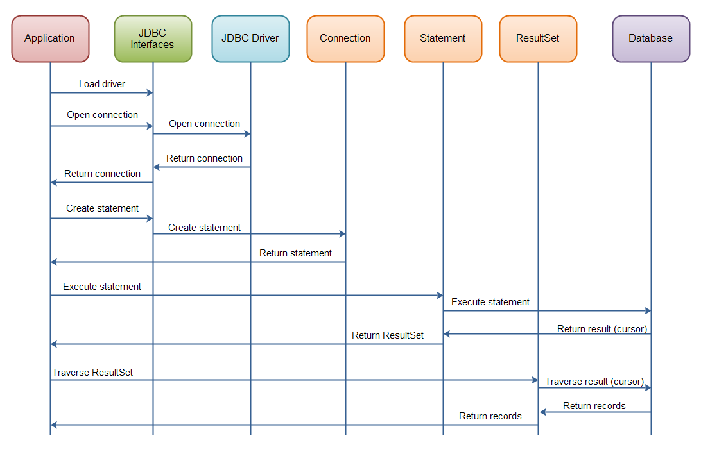

#### Plain JDBC API의 문제점
- 쿼리를 실행하기 전과 후에 많은 코드를 작성해야한다. EX) 연결 생성, 명령문, ResultSet 닫기, 연결 등
- 데이터베이스 로직에서 예외 처리 코드를 수행해야 한다.
- 트랜잭션을 처리해야 한다.
- 이러한 모든 코드를 반복하는 것으로, 시간이 낭비된다.

#### JDBC Template
JDBC Template은 Spring JDBC 접근 방법 중 하나로, 내부적으로 Plain JDBC API를 사용하지만 위와 같은 문제점들을 제거한 형태의 Spring에서 제공하는 class이다.

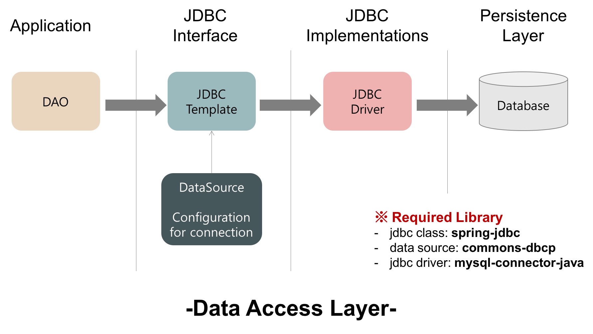
- **Spring JDBC가 하는 일**
  - 자원의 생성과 반환(Connection, Statement, ResultSet 등)
  - Statement 실행
  - ResultSet Loop 처리
  - Exception 처리와 반환
  - Transaction 처리
- **Spring JDBC에서 개발자가 할 일**
  - 핵심적으로 해야될 작업만 해주면 나머지는 Framwork가 알아서 처리해준다.
    - datasource 설정
    - sql문 작성
    - 결과 처리

> :arrow_double_up:[Top](#4-database)    :leftwards_arrow_with_hook:[Back](https://github.com/WeareSoft/tech-interview#4-database)    :information_source:[Home](https://github.com/WeareSoft/tech-interview#tech-interview)
>- https://gmlwjd9405.github.io/2018/05/15/setting-for-db-programming.html
>- http://www.java-school.net/jdbc/Guide-to-using-JDBC
>- http://ooz.co.kr/272
>- https://ko.wikipedia.org/wiki/JDBC#JDBC_드라이버
>- https://blog.outsider.ne.kr/6

## :house: [Home](https://github.com/WeareSoft/tech-interview)
