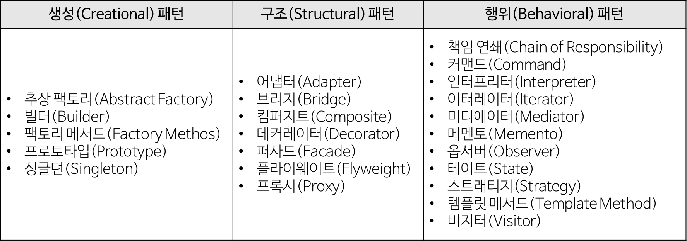
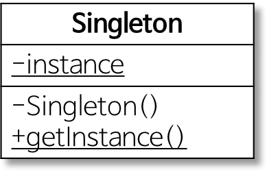
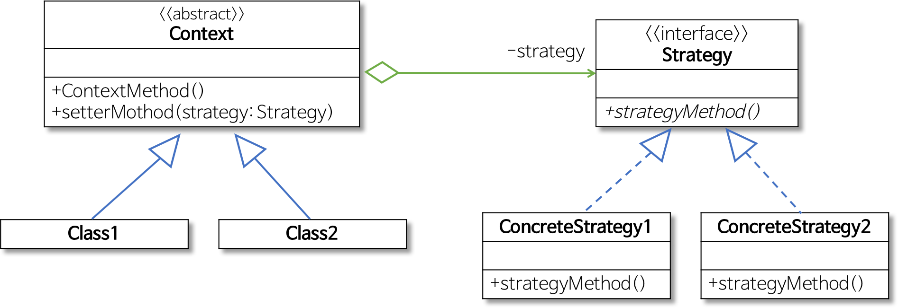
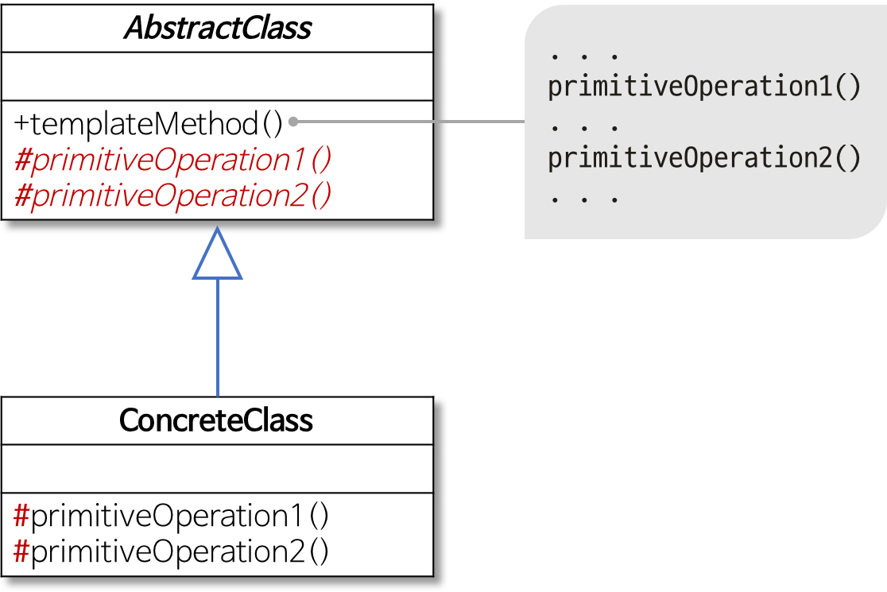
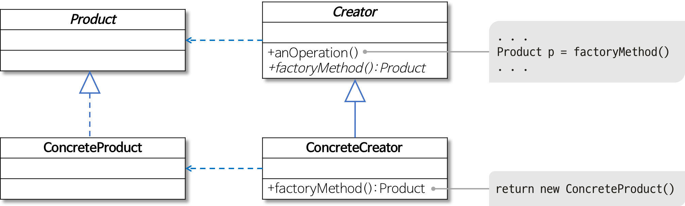

# 5. Design Pattern
**:book: Contents**
* [디자인 패턴의 개념과 종류](#디자인-패턴의-개념과-종류)
* [Singleton 패턴](#singleton-패턴)
* [Strategy 패턴](#strategy-패턴)
* [Template Method 패턴](#template-method-패턴)
* [Factory Method 패턴](#factory-method-패턴)
* [MVC1 패턴과 MVC2 패턴](#mvc1-패턴과-mvc2-패턴)

---

### 디자인 패턴의 개념과 종류
디자인 패턴이란
* 소프트웨어를 설계할 때 특정 맥락에서 자주 발생하는 고질적인 문제들이 또 발생했을 때 재사용할 할 수있는 훌륭한 해결책
* "바퀴를 다시 발명하지 마라(Don't reinvent the wheel)"
* 이미 만들어져서 잘 되는 것을 처음부터 다시 만들 필요가 없다는 의미이다.
* 패턴이란
  * 각기 다른 소프트웨어 모듈이나 기능을 가진 다양한 응용 소프트웨어 시스템들을 개발할 때도 서로 간에 공통되는 설계 문제가 존재하며 이를 처리하는 해결책 사이에도 공통점이 있다. 이러한 유사점을 패턴이라 한다.
  * 패턴은 공통의 언어를 만들어주며 팀원 사이의 의사 소통을 원활하게 해주는 아주 중요한 역할을 한다.  

디자인 패턴의 종류
* GoF 디자인 패턴
  * GoF(Gang of Four)라 불리는 사람들
    * 에리히 감마(Erich Gamma), 리차드 헬름(Richard Helm), 랄프 존슨(Ralph Johnson), 존 블리시디스(John Vissides)
    * 소프트웨어 개발 영역에서 디자인 패턴을 구체화하고 체계화한 사람들
    * 23가지의 디자인 패턴을 정리하고 각각의 디자인 패턴을 생성(Creational), 구조(Structural), 행위(Behavioral) 3가지로 분류했다.

GoF 디자인 패턴의 분류
* 

1. 생성(Creational) 패턴
    * 객체 생성에 관련된 패턴
    * 객체의 생성과 조합을 캡슐화해 특정 객체가 생성되거나 변경되어도 프로그램 구조에 영향을 크게 받지 않도록 유연성을 제공한다.
2. 구조(Structural) 패턴
    * 클래스나 객체를 조합해 더 큰 구조를 만드는 패턴
    * 예를 들어 서로 다른 인터페이스를 지닌 2개의 객체를 묶어 단일 인터페이스를 제공하거나 객체들을 서로 묶어 새로운 기능을 제공하는 패턴이다.
3. 행위(Behavioral)
    * 객체나 클래스 사이의 알고리즘이나 책임 분배에 관련된 패턴
    * 한 객체가 혼자 수행할 수 없는 작업을 여러 개의 객체로 어떻게 분배하는지, 또 그렇게 하면서도 객체 사이의 결합도를 최소화하는 것에 중점을 둔다.

> :arrow_double_up:[Top](#5-design-pattern)    :leftwards_arrow_with_hook:[Back](https://github.com/WeareSoft/tech-interview#5-design-pattern)    :information_source:[Home](https://github.com/WeareSoft/tech-interview#tech-interview)
> - [https://gmlwjd9405.github.io/2018/07/06/design-pattern.html](https://gmlwjd9405.github.io/2018/07/06/design-pattern.html)

### Singleton 패턴
* 개념
  * 전역 변수를 사용하지 않고 **객체를 하나만 생성** 하도록 하며, 생성된 객체를 **어디에서든지 참조할 수 있도록** 하는 패턴
  * '생성(Creational) 패턴'의 하나
* 
* 역할이 수행하는 작업
  * Singleton
    * 하나의 인스턴스만을 생성하는 책임이 있으며 getInstance 메서드를 통해 모든 클라이언트에게 동일한 인스턴스를 반환하는 작업을 수행한다.
* 예시
  * 프린터 관리자 만들기

> :arrow_double_up:[Top](#5-design-pattern)    :leftwards_arrow_with_hook:[Back](https://github.com/WeareSoft/tech-interview#5-design-pattern)    :information_source:[Home](https://github.com/WeareSoft/tech-interview#tech-interview)
> - [https://gmlwjd9405.github.io/2018/07/06/singleton-pattern.html](https://gmlwjd9405.github.io/2018/07/06/singleton-pattern.html)

### Strategy 패턴
* 개념
  * **행위를 클래스로 캡슐화해** 동적으로 행위를 자유롭게 바꿀 수 있게 해주는 패턴
    * 같은 문제를 해결하는 여러 알고리즘이 클래스별로 캡슐화되어 있고 이들이 필요할 때 교체할 수 있도록 함으로써 동일한 문제를 다른 알고리즘으로 해결할 수 있게 하는 디자인 패턴
  * '행위(Behavioral) 패턴'의 하나
  * 즉, **전략을 쉽게 바꿀 수 있도록** 해주는 디자인 패턴이다.
    * 전략이란
      * 어떤 목적을 달성하기 위해 일을 수행하는 방식, 비즈니스 규칙, 문제를 해결하는 알고리즘 등
  * 특히 게임 프로그래밍에서 게임 캐릭터가 자신이 처한 상황에 따라 공격이나 행동하는 방식을 바꾸고 싶을 때 스트래티지 패턴은 매우 유용하다.
* 
* 역할이 수행하는 작업
  * Strategy
    * 인터페이스나 추상 클래스로 외부에서 동일한 방식으로 알고리즘을 호출하는 방법을 명시
  * ConcreteStrategy
    * 스트래티지 패턴에서 명시한 알고리즘을 실제로 구현한 클래스
  * Context
    * 스트래티지 패턴을 이용하는 역할을 수행한다.
    * 필요에 따라 동적으로 구체적인 전략을 바꿀 수 있도록 setter 메서드('집약 관계')를 제공한다.
* 예시
  * 로봇 만들기

> :arrow_double_up:[Top](#5-design-pattern)    :leftwards_arrow_with_hook:[Back](https://github.com/WeareSoft/tech-interview#5-design-pattern)    :information_source:[Home](https://github.com/WeareSoft/tech-interview#tech-interview)
> - [https://gmlwjd9405.github.io/2018/07/06/strategy-pattern.html](https://gmlwjd9405.github.io/2018/07/06/strategy-pattern.html)

### Template Method 패턴
* 개념
  * 어떤 작업을 처리하는 일부분을 **서브 클래스로 캡슐화해** 전체 일을 수행하는 구조는 바꾸지 않으면서 특정 단계에서 수행하는 내역을 바꾸는 패턴
    * 즉, **전체적으로는 동일하면서 부분적으로는 다른 구문으로 구성된 메서드의 코드 중복을 최소화** 할 때 유용하다.
    * 다른 관점에서 보면 동일한 기능을 상위 클래스에서 정의하면서 확장/변화가 필요한 부분만 서브 클래스에서 구현할 수 있도록 한다.
    * 예를 들어, 전체적인 알고리즘은 상위 클래스에서 구현하면서 다른 부분은 하위 클래스에서 구현할 수 있도록 함으로써 전체적인 알고리즘 코드를 재사용하는 데 유용하도록 한다.
  * '행위(Behavioral) 패턴'의 하나
* 
* 역할이 수행하는 작업
  * AbstractClass
    * 템플릿 메서드를 정의하는 클래스
    * 하위 클래스에 공통 알고리즘을 정의하고 하위 클래스에서 구현될 기능을 primitive 메서드 또는 hook 메서드로 정의하는 클래스
  * ConcreteClass
    * 물려받은 primitive 메서드 또는 hook 메서드를 구현하는 클래스
    * 상위 클래스에 구현된 템플릿 메서드의 일반적인 알고리즘에서 하위 클래스에 적합하게 primitive 메서드나 hook 메서드를 오버라이드하는 클래스
* 예시
  * 여러 회사의 모터 지원하기

> :arrow_double_up:[Top](#5-design-pattern)    :leftwards_arrow_with_hook:[Back](https://github.com/WeareSoft/tech-interview#5-design-pattern)    :information_source:[Home](https://github.com/WeareSoft/tech-interview#tech-interview)
> - [https://gmlwjd9405.github.io/2018/07/13/template-method-pattern.html](https://gmlwjd9405.github.io/2018/07/13/template-method-pattern.html)

### Factory Method 패턴
* 개념
  * **객체 생성 처리를 서브 클래스로 분리** 해 처리하도록 캡슐화하는 패턴
    * 즉, 객체의 생성 코드를 별도의 클래스/메서드로 분리함으로써 객체 생성의 변화에 대비하는 데 유용하다.
    * 특정 기능의 구현은 개별 클래스를 통해 제공되는 것이 바람직한 설계다.
      * 기능의 변경이나 상황에 따른 기능의 선택은 해당 객체를 생성하는 코드의 변경을 초래한다.
      * 상황에 따라 적절한 객체를 생성하는 코드는 자주 중복될 수 있다.
      * 객체 생성 방식의 변화는 해당되는 모든 코드 부분을 변경해야 하는 문제가 발생한다.
    * [스트래티지 패턴](https://gmlwjd9405.github.io/2018/07/06/strategy-pattern.html), [싱글턴 패턴](https://gmlwjd9405.github.io/2018/07/06/singleton-pattern.html), [템플릿 메서드 패턴](https://gmlwjd9405.github.io/2018/07/13/template-method-pattern.html)을 사용한다.
  * '생성(Creational) 패턴'의 하나
* 
* 역할이 수행하는 작업
  * Product
    * 팩토리 메서드로 생성될 객체의 공통 인터페이스
  * ConcreteProduct
    * 구체적으로 객체가 생성되는 클래스
  * Creator
    * 팩토리 메서드를 갖는 클래스
  * ConcreteCreator
    * 팩토리 메서드를 구현하는 클래스로 ConcreteProduct 객체를 생성
* 팩토리 메서드 패턴의 개념과 적용 방법
  1. 객체 생성을 전담하는 별도의 **Factory 클래스 이용**
      * 스트래티지 패턴과 싱글턴 패턴을 이용한다.
      * 해당 Post에서는 이 방법을 기준으로 팩토리 메서드 패턴을 적용한다.
  2. **상속 이용**: 하위 클래스에서 적합한 클래스의 객체를 생성
      * 스트래티지 패턴, 싱글턴 패턴과 템플릿 메서드 패턴을 이용한다.
      * 해당 Post의 맨 하단에 '다른 방법으로 팩토리 메서드 패턴 적용하기'를 확인한다.
* 예시
  * 여러 가지 방식의 엘리베이터 스케줄링 방법 지원하기

> :arrow_double_up:[Top](#5-design-pattern)    :leftwards_arrow_with_hook:[Back](https://github.com/WeareSoft/tech-interview#5-design-pattern)    :information_source:[Home](https://github.com/WeareSoft/tech-interview#tech-interview)
> - [https://gmlwjd9405.github.io/2018/08/07/factory-method-pattern.html](https://gmlwjd9405.github.io/2018/08/07/factory-method-pattern.html)

### MVC1 패턴과 MVC2 패턴

> :arrow_double_up:[Top](#5-design-pattern)    :leftwards_arrow_with_hook:[Back](https://github.com/WeareSoft/tech-interview#5-design-pattern)    :information_source:[Home](https://github.com/WeareSoft/tech-interview#tech-interview)
> - 

---

## Reference
> - [JAVA 객체지향 디자인 패턴, 한빛미디어](http://www.kyobobook.co.kr/product/detailViewKor.laf?mallGb=KOR&ejkGb=KOR&barcode=9788968480911&orderClick=JAj)

## :house: [Home](https://github.com/WeareSoft/tech-interview)
