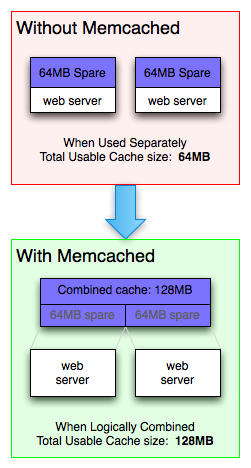
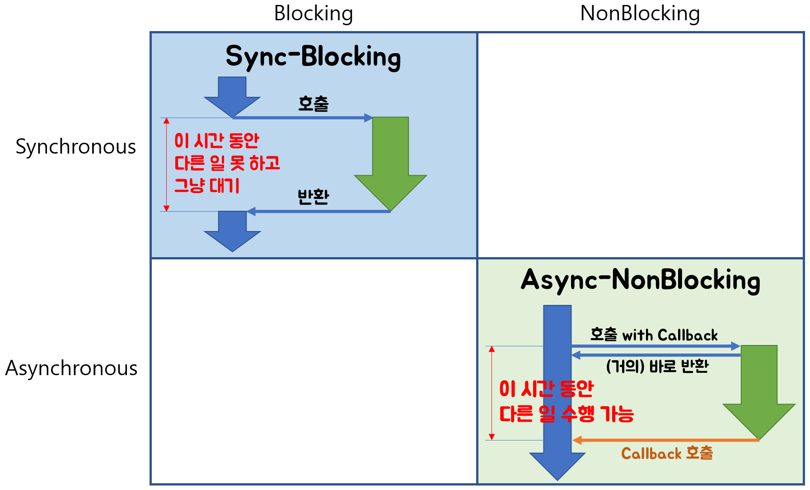
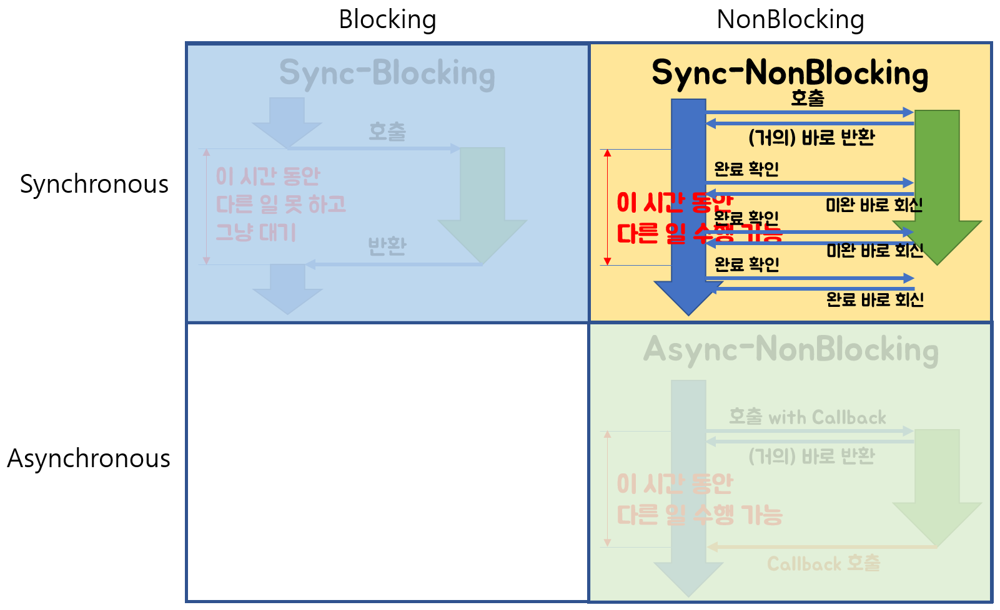
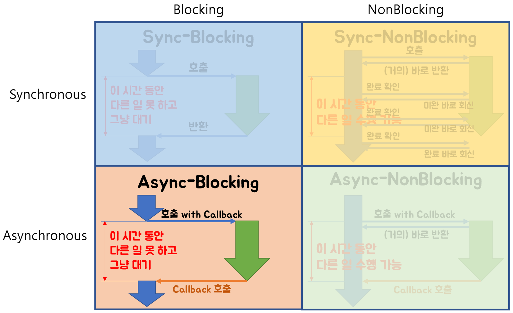

# 11. ETC
**:book: Contents**
* [TDD란](#tdd란)
* [웹 브라우저에서 서버로 어떤 페이지를 요청하면 일어나는 일련의 과정을 설명](#웹-브라우저에서-서버로-어떤-페이지를-요청하면-일어나는-일련의-과정을-설명)
* [컴파일러와 인터프리터](#컴파일러와-인터프리터)
* [분산락](#분산락)
* [프레임워크와 라이브러리의 차이](#프레임워크와-라이브러리의-차이)
* [64bit CPU와 32bit CPU 차이](#64bit-cpu와-32bit-cpu-차이)
* [CVS, SVN, Git](#cvs-svn-git)
* [Git Branch 종류(5가지)](#git-branch-종류)
* [웹 서버(Web Server)와 웹 어플리케이션 서버(WAS)의 차이](#web-server와-was의-차이)
* [애자일 방법론이란](#애자일-방법론이란)
* [Servlet과 JSP](#servlet과-jsp)
* [Redis와 Memcached의 차이](#redis와-memcached의-차이)
* [Maven과 Gradle의 차이](#maven과-gradle의-차이)
* [Blocking과 Non-Blocking](#blocking과-non-blocking)
* [함수형 프로그래밍이란](#함수형-프로그래밍이란)
* [이벤트 기반 프로그래밍이란](#이벤트-기반-프로그래밍이란)
* [Mock이란](#Mock이란)

---

### TDD란
* Test Driven Development
  * 테스트 주도 개발: 테스트가 개발을 이끌어 나간다.
* 구체적인 행동 레벨에서의 TDD의 개념
  * 테스트를 먼저 만들고 테스트를 통과하기 위한 것을 짜는 것 
  * 즉, 만드는 과정에서 우선 테스트를 작성하고 그걸 통과하는 코드를 만들고를 반복하면서 제대로 동작하는지에 대한 피드백을 적극적으로 받는 것이다.
* 추상적인 레벨에서의 TDD의 핵심 개념(중요)
  * 결정과 피드백 사이의 갭에 대한 인식, 더 나아가 결정과 피드백 사이의 갭을 조절하기 위한 테크닉이라고도 할 수 있다.

> :arrow_double_up:[Top](#11-etc)    :leftwards_arrow_with_hook:[Back](https://github.com/WeareSoft/tech-interview#11-etc)    :information_source:[Home](https://github.com/WeareSoft/tech-interview#tech-interview)
> - [https://gmlwjd9405.github.io/2018/06/03/agile-tdd.html](https://gmlwjd9405.github.io/2018/06/03/agile-tdd.html)

### 웹 브라우저에서 서버로 어떤 페이지를 요청하면 일어나는 일련의 과정을 설명
* Ex. url에 'www.naver.com' 을 입력했다. 일어나는 현상에 대해 아는대로 설명하라.
  * 관련 링크: [http://owlgwang.tistory.com/1](http://owlgwang.tistory.com/1)

> :arrow_double_up:[Top](#11-etc)    :leftwards_arrow_with_hook:[Back](https://github.com/WeareSoft/tech-interview#11-etc)    :information_source:[Home](https://github.com/WeareSoft/tech-interview#tech-interview)
> - []()

### 컴파일러와 인터프리터
> :arrow_double_up:[Top](#11-etc)    :leftwards_arrow_with_hook:[Back](https://github.com/WeareSoft/tech-interview#11-etc)     :information_source:[Home](https://github.com/WeareSoft/tech-interview#tech-interview)
> - []()

### 분산락
> :arrow_double_up:[Top](#11-etc)    :leftwards_arrow_with_hook:[Back](https://github.com/WeareSoft/tech-interview#11-etc)     :information_source:[Home](https://github.com/WeareSoft/tech-interview#tech-interview)
> - []()

### 프레임워크와 라이브러리의 차이
* 프레임워크(Framework)란
    * 소프트웨어의 구체적인 부분에 해당하는 설계와 구현을 재사용이 가능하게끔 일련의 협업화된 형태로 클래스들을 제공하는 것
    * Ex) 자동차의 프레임, 즉 기본적으로 구성하고 있는 뼈대
* 라이브러리(Library)란 
    * 자주 사용되는 로직을 재사용하기 편리하도록 잘 정리한 일련의 코드들의 집합
    * Ex) 자동차의 기능을 하는 부품
> :arrow_double_up:[Top](#11-etc)    :leftwards_arrow_with_hook:[Back](https://github.com/WeareSoft/tech-interview#11-etc)     :information_source:[Home](https://github.com/WeareSoft/tech-interview#tech-interview)
> - [http://moolgogiheart.tistory.com/87](http://moolgogiheart.tistory.com/87)

### 64bit CPU와 32bit CPU 차이
> :arrow_double_up:[Top](#11-etc)    :leftwards_arrow_with_hook:[Back](https://github.com/WeareSoft/tech-interview#11-etc)    :information_source:[Home](https://github.com/WeareSoft/tech-interview#tech-interview)
> - []()

### CVS, SVN, Git
* 형상관리 툴
* 소스의 변화를 끊임없이 관리하는 툴
* 소스를 버전별로 관리할 수 있고, 실수할 경우 원복 가능하게 하는 툴

#### CVS
* 개념
  * Concurrent Versions System
  * GNU 라이센스
  * 중앙에 위치한 Repository에 파일을 저장하고, 모든 사용자가 접근 가능하도록 설계
  * checkout으로 파일 복사, commit으로 변경사항 저장
  * 최종 버전의 소스만 관리
  * 먼저 반영한 소스가 먼저 처리되는 시스템
* 장점
  * 오랫동안 사용이 되었으며 안정적
  * 파일 전체를 저장하지 않고 변경사항만 저장하여 적은 용량 사용
* 단점
  * 파일 이동이나 이름 변경은 버전 변경 미발생(파일 지우고 다시 추가)
  * 버전 분기가 힘들고, 장기간 분기된 버전 운영에 대해 미설계
  * commit 실패 시 롤백 불가능
  * 상대적으로 느린 속도
* 혼자 개발할 경우 최종버전만 관리하는 CVS 툴 사용이 편리

#### SVN
* 개념
  * Apache Subversion
  * CVS와 높은 호환성을 유지하며 약간의 버그를 수정한 대체 시스템으로 개발
  * 중앙 관리
  * 최초 1회에 한해 파일 원본 저장, 이후에는 원본과 차이점을 저장
  * 버전 분기가 쉽고, 대규모의 분기된 프로젝트에 도움
* 장점
  * 원자적 commit으로 다른 사용자의 commit과 엉키지 않으며 commit 실패 시 롤백 지원
    * 원자적 commit : 파일 단위가 아닌 change set이 commit 단위
  * 효율적인 버전 분기, 언제든지 원하는 버전으로 복구 가능
  * 이진파일도 효율적으로 저장 가능
* 단점
  * 파일과 디렉토리 변경 관련 버그
  * 불충분한 저장소 관리 명령어
  * CVS에 비해 상대적으로 불안정
  * **Local Repository가 없기** 때문에 자신만의 version history 관리 불가능
  * commit에 실수가 있을 시 다른 개발자에게 바로 영향 가능성

#### Git
* 개념
  * CVS를 개선하고, 보다 빠른 분산 버전 제어 시스템
  * **서버 저장소와 개발자 저장소가 독립적**
  * 사용자 기록 탐색 가능
* 장점
  * 빠른 속도
  * 분기 버전의 효율적인 운영
  * 오프라인에서도 전체 이력 이용 가능
  * 분산된 P2P 모델
  * commit에 실수가 있어도 서버에 바로 영향 없음
* 단점
  * SVN보다 많은 기능을 지원하는 만큼 높은 진입장벽
  * 개인 개발자에게 부적절
* 팀 개발을 위한 분산 환경 코딩에 최적화

> :arrow_double_up:[Top](#11-etc)    :leftwards_arrow_with_hook:[Back](https://github.com/WeareSoft/tech-interview#11-etc)    :information_source:[Home](https://github.com/WeareSoft/tech-interview#tech-interview)
> - [[IT/트랜드] [금융IT]형상관리 툴 CVS, SVN, 그리고 Git비교](https://daitso.kbhub.co.kr/50240/)
> - [[웹개발 기초] 형상관리툴이란? (SVN GIT 간단비교)](https://goddaehee.tistory.com/158)
> - [형상관리툴 특징 (Perforce, Git, SVN, CVS)](https://haayany.tistory.com/entry/%ED%98%95%EC%83%81%EA%B4%80%EB%A6%AC%ED%88%B4-%ED%8A%B9%EC%A7%95-Perforce-Git-SVN-CVS)
> - [형상 관리 툴 비교 Git, SVN, CVS](https://digital-play.tistory.com/60)

### Git Branch 종류
1. Master Branch
    * **제품으로 출시될 수 있는 브랜치**
    * 배포(Release) 이력을 관리하기 위해 사용. 즉, 배포 가능한 상태만을 관리한다.
2. Develop Branch
    * **다음 출시 버전을 개발하는 브랜치**
    * 기능 개발을 위한 브랜치들을 병합하기 위해 사용. 즉, 모든 기능이 추가되고 버그가 수정되어 배포 가능한 안정적인 상태라면 develop 브랜치를 ‘master’ 브랜치에 병합(merge)한다. 
    * 평소에는 이 브랜치를 기반으로 개발을 진행한다.
3. Feature branch
    * **기능을 개발하는 브랜치** 
    * feature 브랜치는 새로운 기능 개발 및 버그 수정이 필요할 때마다 ‘develop’ 브랜치로부터 분기한다. feature 브랜치에서의 작업은 기본적으로 공유할 필요가 없기 때문에, 자신의 로컬 저장소에서 관리한다. 
    * 개발이 완료되면 ‘develop’ 브랜치로 병합(merge)하여 다른 사람들과 공유한다.
4. Release Branch
    * **이번 출시 버전을 준비하는 브랜치** 
    * 배포를 위한 전용 브랜치를 사용함으로써 한 팀이 해당 배포를 준비하는 동안 다른 팀은 다음 배포를 위한 기능 개발을 계속할 수 있다. 즉, 딱딱 끊어지는 개발 단계를 정의하기에 아주 좋다. 
    * 예를 들어, ‘이번 주에 버전 1.3 배포를 목표로 한다!’라고 팀 구성원들과 쉽게 소통하고 합의할 수 있다는 말이다.
5. Hotfix Branch
    * **출시 버전에서 발생한 버그를 수정 하는 브랜치** 
    * 배포한 버전에 긴급하게 수정을 해야 할 필요가 있을 경우, ‘master’ 브랜치에서 분기하는 브랜치이다. ‘develop’ 브랜치에서 문제가 되는 부분을 수정하여 배포 가능한 버전을 만들기에는 시간도 많이 소요되고 안정성을 보장하기도 어려우므로 바로 배포가 가능한 ‘master’ 브랜치에서 직접 브랜치를 만들어 필요한 부분만을 수정한 후 다시 ‘master’브랜치에 병합하여 이를 배포해야 하는 것이다. 

> :arrow_double_up:[Top](#11-etc)    :leftwards_arrow_with_hook:[Back](https://github.com/WeareSoft/tech-interview#11-etc)      :information_source:[Home](https://github.com/WeareSoft/tech-interview#tech-interview)
> - [https://gmlwjd9405.github.io/2018/05/11/types-of-git-branch.html](https://gmlwjd9405.github.io/2018/05/11/types-of-git-branch.html)


### Web Server와 WAS의 차이
* Web Server
    * Web Server의 개념
        * 소프트웨어와 하드웨어로 구분된다.
        * 1) 하드웨어
            * Web 서버가 설치되어 있는 컴퓨터
        * 2) 소프트웨어
            * 웹 브라우저 클라이언트로부터 HTTP 요청을 받아 **정적인 컨텐츠(.html .jpeg .css 등)**를 제공하는 컴퓨터 프로그램
    * Web Server의 기능
        * **HTTP 프로토콜을 기반으로 하여 웹 브라우저의 요청을 서비스 하는 기능**을 담당한다.
        * 요청에 따라 아래의 두 가지 기능 중 적절하게 선택하여 수행한다.
        * 기능 1)
            * 정적인 컨텐츠 제공
            * WAS를 거치지 않고 바로 자원을 제공한다.
        * 기능 2)
            * 동적인 컨텐츠 제공을 위한 요청 전달
            * 클라이언트의 요청(Request)을 WAS에 보내고, WAS가 처리한 결과를 클라이언트에게 전달(응답, Response)한다.
    * Web Server의 예
        * Ex) Apache Server, Nginx, IIS(Windows 전용 Web 서버) 등
* WAS(Web Application Server)
    * WAS의 개념
        * DB 조회나 다양한 로직 처리를 요구하는 **동적인 컨텐츠**를 제공하기 위해 만들어진 Application Server
        * HTTP를 통해 컴퓨터나 장치에 애플리케이션을 수행해주는 미들웨어(소프트웨어 엔진)이다.
        * **"웹 컨테이너(Web Container)" 혹은 "서블릿 컨테이너(Servlet Container)"**라고도 불린다.
            * Container란 JSP, Servlet을 실행시킬 수 있는 소프트웨어를 말한다.
            * 즉, WAS는 JSP, Servlet 구동 환경을 제공한다.
    * WAS의 기능
        * **WAS = Web Server + Web Container**
        * Web Server 기능들을 구조적으로 분리하여 처리하고자하는 목적으로 제시되었다.
            * 분산 트랜잭션, 보안, 메시징, 쓰레드 처리 등의 기능을 처리하는 분산 환경에서 사용된다.
            * 주로 DB 서버와 같이 수행된다. 
    * WAS의 예
        * Ex) Tomcat, JBoss, Jeus, Web Sphere 등

> :arrow_double_up:[Top](#11-etc)    :leftwards_arrow_with_hook:[Back](https://github.com/WeareSoft/tech-interview#11-etc)    :information_source:[Home](https://github.com/WeareSoft/tech-interview#tech-interview)
> - [https://gmlwjd9405.github.io/2018/10/27/webserver-vs-was.html](https://gmlwjd9405.github.io/2018/10/27/webserver-vs-was.html)

### 애자일 방법론이란
> :arrow_double_up:[Top](#11-etc)    :leftwards_arrow_with_hook:[Back](https://github.com/WeareSoft/tech-interview#11-etc)    :information_source:[Home](https://github.com/WeareSoft/tech-interview#tech-interview)
> - [https://gmlwjd9405.github.io/2018/05/26/what-is-agile.html](https://gmlwjd9405.github.io/2018/05/26/what-is-agile.html)

### Servlet과 JSP
* 기능의 차이는 없고 역할의 차이만 있다. (하는 일은 동일)
* Servlet이란
    * 웹 기반의 요청에 대한 동적인 처리가 가능한 Server Side에서 돌아가는 Java Program 
    * ***Java 코드*** 안에 HTML 코드 (하나의 클래스)
    * 웹 개발을 위해 만든 표준
    * **data processing(Controller)** 에 좋다.
    * 즉 DB와의 통신, Business Logic 호출, 데이터를 읽고 확인하는 작업 등에 유용하다.
    * Servlet이 수정된 경우 Java 코드를 컴파일(.class 파일 생성)한 후 동적인 페이지를 처리하기 때문에 전체 코드를 업데이트하고 다시 컴파일한 후 재배포하는 작업이 필요하다. **(개발 생산성 저하)**
    * 구체적인 내용은 [https://gmlwjd9405.github.io/2018/10/28/servlet.html](https://gmlwjd9405.github.io/2018/10/28/servlet.html) 참고
* JSP란
    * Java 언어를 기반으로 하는 Server Side 스크립트 언어
    * ***HTML 코드*** 안에 Java 코드 
    * Servlet를 보완하고 기술을 확장한 스크립트 방식 표준
        * Servlet의 모든 기능 + 추가적인 기능
        * 
    * **presentation(View)** 에 좋다. 
    * 즉 요청 결과를 나타내는 HTML 작성하는데 유용하다.
    * JSP가 수정된 경우 재배포할 필요가 없이 WAS가 알아서 처리한다. **(쉬운 배포)**
    * 구체적인 내용은 [https://gmlwjd9405.github.io/2018/11/03/jsp.html](https://gmlwjd9405.github.io/2018/11/03/jsp.html) 참고

> :arrow_double_up:[Top](#11-etc)    :leftwards_arrow_with_hook:[Back](https://github.com/WeareSoft/tech-interview#11-etc)     :information_source:[Home](https://github.com/WeareSoft/tech-interview#tech-interview)
> - [https://gmlwjd9405.github.io/2018/11/04/servlet-vs-jsp.html](https://gmlwjd9405.github.io/2018/11/04/servlet-vs-jsp.html)

### Redis와 Memcached의 차이

#### Redis and Memcached
* 분산 메모리 캐싱 시스템(인메모리 데이터 저장소)
* 데이터를 Key-Value 형태로 메모리에 저장하는 방식(NoSql)
* 데이터베이스 부하를 줄여 동적 웹 애플리케이션의 속도 개선을 위해 사용
* 데이터 파티셔닝을 통해 많은 데이터를 효과적으로 처리 가능

##### Memcached 메모리 구조

  
* Memcached 미사용 시(위)
  * 각 웹 서버는 할당된 메모리만큼만 캐시 사용 가능
  * 웹 서버가 사용 가능한 전체 용량의 일부분만 사용하기 때문에 낭비 발생
* Memcached 사용 시(아래)
  * 각 웹 서버는 메모리 공간이 논리적으로 통합된 가상 풀을 바라보고 있기 때문에 전체 메모리 크기만큼의 캐시 사용 가능
  * 효율성 있는 메모리 운용 가능
  * 특정 항목이 주어졌을 때 전체 웹 클러스터에서 항상 동일한 위치에 저장 및 검색 가능
  * 서버 증설 시, 정기적으로 접근되는 데이터의 캐싱을 통해 DB나 API 호출 횟수 감소

#### Redis vs Memcached

| |**Redis**|**Memcached**|
|----|----|----|
|데이터 타입|String, Set, Sorted Set, Hash, List|String|
|데이터 저장|Memory, Disk|Memory|
|메모리 재사용|X<br/>명시적으로만 데이터 제거 가능|메모리 부족 시 LRU 알고리즘으로 데이터 삭제 후 재사용|
|스레드|단일 스레드|멀티 스레드|
|캐싱 용량|Key, Value 모두 512MB|Key 250byte, Value 1MB|

##### Redis만의 장점
* 다양한 자료구조 지원
* 데이터 복구 가능 및 데이터 영속성
  * Snapshots 방식 : 특정 시점에 데이터를 디스크에 저장하여 파일 보관
  * AOF 방식 : 이벤트를 로그에 남겨서 로그 기반 복구
* 마스터 슬레이브 구조로 여러개의 복제본 생성 가능
* 다양한 데이터 Eviction 정책 지원
  * Eviction : 캐시가 데이터 공간 확보를 위해 사용하지 않는 데이터를 지우는 것
* PUB/SUB 기능 제공
  * 게시자/구독자의 메시지 패러다임을 구현
  * 게시된 메시지는 구독자가 누구인지는 모르고 채널로 구분
  * 구독자는 하나 이상의 채널에 관심을 갖고(구독), 게시자는 누구인지 알 필요 없이 관심있는 메시지만 수신
* 트랜잭션 지원
* 위치기반 데이터 타입 지원

##### Redis 단점
* Copy-on-Write 방식으로 사용할 메모리의 두 배 필요
  * 리눅스는 부모 프로세스와 자식 프로세스 간 메모리를 공유하는데, 공유 할 수 없는 상황에 대비해 복사한 다음 수정하는 특징
  * 실제 사용하는 메모리보다 임시로 데이터를 복사하고 수정할 수 있는 더 많은 메모리 필요
  * Copy-on-Write는 Redis의 수정 관련 명령 실행 시 발생
  * [참고](https://real-dongsoo7.tistory.com/114)
* 메모리 파편화 발생 가능

##### Memcached만의 장점
* 멀티스레드 아키텍처 지원
* Redis에 비해 적은 메모리 요구
  * 정적인 데이터 캐싱 시 유리

> :arrow_double_up:[Top](#11-etc)    :leftwards_arrow_with_hook:[Back](https://github.com/WeareSoft/tech-interview#11-etc)    :information_source:[Home](https://github.com/WeareSoft/tech-interview#tech-interview)
> - [Memcached, Redis : 메모리 캐시](https://ojava.tistory.com/70)
> - [About Memcached](https://memcached.org/about)
> - [[Spring] Spring은 왜 memcached 대신 Redis를 선택했을까?](https://deveric.tistory.com/65)
> - [[Cache] Redis vs. Memcached](https://medium.com/@chrisjune_13837/redis-vs-memcached-10e796ddd717)
> - [[Redis] Pub/Sub 설명](https://realmojo.tistory.com/170)
> - [[Cache]Redis vs Memcached](https://americanopeople.tistory.com/148)
> - [In memory dictionary Redis 소개](https://bcho.tistory.com/654)

### Maven과 Gradle의 차이
* Maven
* Gradle

> :arrow_double_up:[Top](#11-etc)    :leftwards_arrow_with_hook:[Back](https://github.com/WeareSoft/tech-interview#11-etc)    :information_source:[Home](https://github.com/WeareSoft/tech-interview#tech-interview)
> - [https://ojava.tistory.com/70](https://ojava.tistory.com/70)

### Blocking과 Non-Blocking
* 직접 제어할 수 없는 대상을 처리하는 방법에 따라 블록/논블록
* ex. IO, 멀티쓰레드 동기화
* Blocking
  * 함수 호출 시 호출된 함수에게 제어권이 넘어가고, 해당 함수가 끝날 때까지 호출한 함수는 대기
* Non-Blocking
  * 호출된 함수가 바로 return해서 호출한 함수에게 제어권을 돌려주어 다른 작업 진행 가능

### Blocking, Non-Blocking vs Synchronous, Asynchronous

* 두 그룹의 차이점은 관심사
* Blocking/Non-Blocking
  * 호출된 함수의 return 여부에 관심
  * 호출된 함수의 제어권 소유 여부로 구분
* Synchronous/Asynchronous
  * 호출된 함수의 작업 완료 여부를 신경쓰는 주체에 관심
  * Asynchronous
    * 호출된 함수에 callback을 전달하여 해당 함수가 작업 완료 시 callback을 실행
    * 이 때, 호출한 함수는 호출된 함수의 작업 완료 여부를 신경쓰지 않아도 됨
  * Synchronous
    * 호출한 함수가 호출된 함수의 return을 기다리거나 또는 바로 return 받더라도 작업 완료 여부를 신경쓰는 것

### Non-Blocking, Synchronous

* 호출된 함수는 바로 return, 호출한 함수는 호출된 함수의 작업 완료 여부 확인
* 호출한 함수 본인은 함수 호출 후 바로 다른 작업 수행이 가능하지만 호출된 함수의 완료 여부를 계속 확인하는 동작

### Blocking, Asynchronous

* 호출된 함수는 바로 return하지 않고, 호출한 함수는 호출된 함수의 작업 완료 여부 미확인
* Blocking, Synchronous 방식과 큰 차이 없음
* [참고] Non-Blocking, Asynchronous 방식을 사용하려던 의도와 다르게 Blocking, Asynchronous 되어버리는 경우가 존재
  * ex. Node.js와 MySQL 조합
  * Node.js가 Async 동작을 해도, DB 호출 시 MySQL 드라이버가 Blocking 방식
  * Non-Blocking, Asynchronous 방식 사용 중 하나라도 Blocking 동작을 한다면 의도치 않게 Blocking, Asynchronous 동작

> :arrow_double_up:[Top](#11-etc)    :leftwards_arrow_with_hook:[Back](https://github.com/WeareSoft/tech-interview#11-etc)    :information_source:[Home](https://github.com/WeareSoft/tech-interview#tech-interview)
> - [Blocking-NonBlocking-Synchronous-Asynchronous](http://homoefficio.github.io/2017/02/19/Blocking-NonBlocking-Synchronous-Asynchronous/)
> - [Sync VS Async, Blocking VS Non-Blocking](https://velog.io/@codemcd/Sync-VS-Async-Blocking-VS-Non-Blocking-sak6d01fhx)

### 함수형 프로그래밍이란

#### 프로그래밍 패러다임
* 명령형 프로그래밍
  * 애플리케이션의 상태와 상태를 변경시키는 구문의 관점에서 연산을 설명하는 방식
  * 어떻게 할 것인지 표현
    * 절차지향 프로그래밍
    * 객체지향 프로그래밍
* 선언형 프로그래밍
  * 무엇을 할 것인지 표현
    * **함수형 프로그래밍**

#### 함수형 패러다임의 등장 계기
* 하드웨어의 발전과 함께 소프트웨어 패러다임은 TEXT기반의 절차적 프로그래밍에서 GUI기반의 객체지향 프로그래밍으로 변화하였고, 이제 멀티코어를 배경으로 하는 함수형 프로그래밍으로 변화
* **대용량의 데이터를 빠르고 효율적으로 처리하기 위해서 멀티코어를 활용하는 병렬처리 프로그래밍 도입이 필요**
* 안정적으로 다루기 위해서는 함수형 프로그램이 필연적인 선택
* 또한, **프로그램을 보다 단순하게 하려는 요구사항**에 의해 등장

#### 함수형 프로그래밍 개념
* 선언형 프로그래밍
* 함수형 프로그래밍은 계산을 수학적 함수의 조합으로 생각하는 방식
* 함수를 1급 객체로 사용(고차 함수)
  * 1급 객체가 될 수 있는 조건
    * 변수나 데이터 구조 안에 담을 수 있는 객체
    * 함수의 파라미터로 전달 가능
    * 반환값으로 사용 가능
    * 할당에 사용된 이름과 관계없이 고유한 구별 가능
    * 동적으로 프로퍼티 할당 가능
* 애플리케이션의 상태는 순수 함수를 통해 전달
  * 공유 상태와 side effect 대신 순수 함수를 사용
  * 순수 함수 : 같은 입력이 주어지면 항상 같은 출력을 반환하는 함수
* 명령형 흐름 제어보다 합성 함수를 사용
  * 합성 함수 : 새로운 함수를 만들거나 계산하기 위해 둘 이상의 함수를 조합
  * ex. 메소드 체이닝
* 불변성
  * 함수형 프로그래밍의 핵심 개념
* 함수를 1급 객체로 사용하며 함수를 조합하고, 공유 상태와 변경 가능한 데이터 및 사이드 이펙트를 피해 소프트웨어를 만드는 프로세스

#### 함수형 프로그래밍 특징
* 변경 가능한 상태를 불변 상태로 만들어 side effect 방지 가능
* 고차함수를 통한 재사용성 증가
* 코드를 간결하게 하고 가독성을 높여 구현할 로직에 집중
* 동시성 작업을 보다 쉽고 안전하게 구현 가능

> :arrow_double_up:[Top](#7-java)    :leftwards_arrow_with_hook:[Back](https://github.com/WeareSoft/tech-interview#7-java)    :information_source:[Home](https://github.com/WeareSoft/tech-interview#tech-interview)
> - [함수형 프로그래밍 요약](https://velog.io/@kyusung/%ED%95%A8%EC%88%98%ED%98%95-%ED%94%84%EB%A1%9C%EA%B7%B8%EB%9E%98%EB%B0%8D-%EC%9A%94%EC%95%BD)
> - [번역 - 함수형 프로그래밍이란 무엇인가?](https://sungjk.github.io/2017/07/17/fp.html)
> - [람다, 람다, 람다(Lambda, Lambda, Lambda) - 1](http://blog.naver.com/tmondev/220412722908)


### 이벤트 기반 프로그래밍이란
#### 개념
- 프로그램의 제어 흐름이 이벤트의 발생에 의해 결정되는 컴퓨터 프로그래밍 패러다임
- 프로그램이 다양한 형태의 사용자 이벤트(클릭, 키 입력)에 응답
- 이벤트 리스너가 대기하고, 이벤트가 발생(요청)하면 해당 이벤트와 상황에 등록된 이벤트 핸들러(콜백 함수)를 실행하여 관련 데이터를 전달해 응답

#### 특징
- 마이크로 서비스 사이의 결합도를 낮추고 비동기적인 문제 처리 시 유용
- 이벤트 소스(마우스, 키보드 등)는 본인이 발생시킬 수 있는 이벤트를 보유
- 이벤트 소스를 먼저 정의하고, 소스가 일으킬 수 있는 이벤트를 정의하는 방식으로 구현

> :arrow_double_up:[Top](#7-java)    :leftwards_arrow_with_hook:[Back](https://github.com/WeareSoft/tech-interview#7-java)    :information_source:[Home](https://github.com/WeareSoft/tech-interview#tech-interview)
> - [[프로그래밍 패러다임]이벤트 기반 프로그래밍(Event-based programming)](https://kamang-it.tistory.com/entry/%ED%94%84%EB%A1%9C%EA%B7%B8%EB%9E%98%EB%B0%8D-%ED%8C%A8%EB%9F%AC%EB%8B%A4%EC%9E%84%EC%9D%B4%EB%B2%A4%ED%8A%B8-%EA%B8%B0%EB%B0%98-%ED%94%84%EB%A1%9C%EA%B7%B8%EB%9E%98%EB%B0%8DEvent-based-programming)

### Mock이란

#### Mock 개념
- 실제 객체를 만들어 사용하기에는 비용이 크고, 객체간 의존성이 높아 구현하기 힘들 경우 만드는 **가짜 객체**

#### Mock 사용 예시
- 테스트 작성을 위한 환경 구축
- 테스트가 특정 경우나 순간에 의존적인 경우
- 테스트 시간이 오래 걸리는 경우
- 개인 PC나 서버의 성능 문제로 동작이 오래 걸릴 수 있는 경우

#### Mock 관련 용어
1. 테스트 더블(Test double)
    - 테스트를 진행하기 어려운 경우, 대신 테스트를 진행할 수 있도록 만들어주는 객체
    - Mock 객체와 비슷하지만 테스트 더블이 Mock 객체보다 상위 개념

2. 더미객체(Dummy object)
    - 단순히 인스턴스화 될 수 있는 수준으로만 객체 구현
    - 인스턴스화 된 객체 자체를 필요로하고, 해당 객체의 기능까지는 필요하지 않을 때 사용

3. 테스트 스텁(Test stub)
    - 더미 객체가 실제로 동작하는 것처럼 보이게 만들어놓은 객체
    - 객체의 특정 상태를 가정해서 작성하고 특정 **값을 반환하거나 메시지 출력**
    - 가정한 값을 하드코딩으로 작성하기 때문에 값의 변경은 테스트 불가능
    - 어떤 행위가 호출됐을 때 특정 값으로 반환해주는 형태
    - **객체의 상태를 검증**

4. 페이크 객체(Fake object)
    - 실제 로직이 구현된 것처럼 보이는 객체
    - 실제로 DB에 접속해서 비교할 때와 동일한 결과가 보이도록 객체 내부에 구현 가능
      - 보통 List나 Map을 이용
    - 테스트케이스 작성 시 다른 객체들과 의존성을 제거하기 위해 사용
    - 페이크 객체 만들 때 비용이 많이 발생할 경우 적절한 수준으로만 구현하거나 Mock 프레임워크 사용 또는 실제 객체를 가져와 테스트

5. 테스트 스파이(Test spy)
    - 테스트에 사용하는 객체와 메소드의 사용 여부 및 정상 호출 여부를 기록하고 요청 시 알림
    - 행위 기반 테스트가 필요한 경우 사용(특정 메소드 호출 시 또다른 메소드 실행하는 등)

6. Mock 객체
    - **행위를 검증**하기 위해 사용하는 객체
      ```JAVA
      public class MessageSender {
        private CellphoneService service;
    
        public MessageSender(CellphoneService service) {
          this.service = service;
        }
    
        public void send(String msg) {
          service.sendMMS(msg);
        }
      }
      ```
      - ```CellphoneService```와 ```MessageSender``` 객체가 있을 때, 실제로 문자를 보내는 것은 ```CellphoneService```의 책임이며, ```MessageSender```는 ```CellphoneService```의 ```sendMMS()``` 메소드를 호출하는 역할
      - 호출 여부를 테스트하는 것이 **행위를 검증**하는 것
        - stub과의 차이
          - stub은 객체의 반환값이나 상태값을 검증하는 것
          - mock은 메소드 호출 여부, 메소드의 동작 여부를 검증
      - ```MessageSender``` 테스트 시, ```CellphoneService```의 **가짜 객체**를 만들어 검증할 수 있으며 이 가짜 객체가 **Mock 객체**
        - Mock 객체 수동 생성
          ```JAVA
          public class CellphoneServiceMock extends CellphoneService {
            private boolean isSendMMSCalled = false;
            private String sendMsg = "";
    
            @Override
            public void sendMMS(String msg) {
              // 실제 동작하는 부모 객체 호출 대신 테스트 동작 처리 호출 여부만 확인하도록 구현
              // super.sendMMS(msg);
              
              isSendMMSCalled = true;
              sendMsg = msg;
            }
    
            public boolean isSendMMSCalled() {
              return isSendMMSCalled;
            }
    
            public Stirng getSendMsg() {
              return sendMsg;
            }
          }
          ```
          ```JAVA
          // Mock 객체를 사용한 테스트 코드
          public class MessageSenderTest {
            @Test
            public void testSend() throws Exception {
              // Given
              final String message = "테스트 문자 메시지입니다.";
              CellphoneServiceMock mock = new CellphoneServiceMock();
              MessageSender sender = new MessageSender(mock);
    
              // When
              sender.send(message);
    
              // Then
              assertTrue(mock.isSendMMSCalled());
              assertEqual(message, mock.getSendMsg());
            }
          }
          ```
        - 프레임워크를 사용한 Mock 객체 생성
          - 대표적으로 Mockito가 지원하는 mock을 사용해 별도의 Mock 객체(CellphoneServiceMock)를 만들지 않고 Mock 객체 생성 가능
          ```JAVA
          public class MessageSenderTest {
            @Test
            public void testSend() throws Exception {
              // Given
              final String message = "테스트 문자 메시지";
              CellphoneService mock = mock(CellphoneService.class);
              MessageSender sender = new MessageSender(mock);
    
              // When
              sender.send(message);
    
              // Then - CellphoneService의 sendMMS() 호출 여부 검증
              verify(mock).sendMMS(message);
            }
          }
          ```
    - 행위 기반 테스트는 작성하기 어려운 부분이 많기 때문에 상태 기반 테스트가 가능하다면 생략 가능

> :arrow_double_up:[Top](#7-java)    :leftwards_arrow_with_hook:[Back](https://github.com/WeareSoft/tech-interview#7-java)    :information_source:[Home](https://github.com/WeareSoft/tech-interview#tech-interview)
> - [[Mockito] Mock 개념(Mock Object)](https://www.crocus.co.kr/1555)
> - [Mock Object란 무엇인가?](https://medium.com/@SlackBeck/mock-object%EB%9E%80-%EB%AC%B4%EC%97%87%EC%9D%B8%EA%B0%80-85159754b2ac)


---

## Reference
> -[]()

## :house: [Home](https://github.com/WeareSoft/tech-interview)
