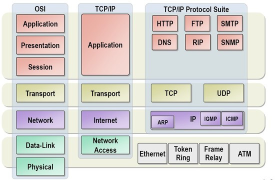
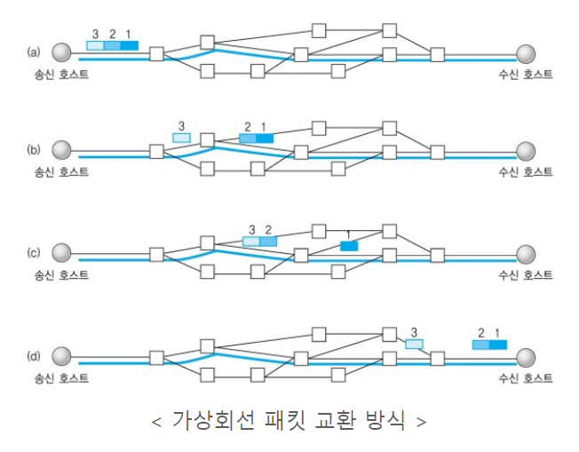
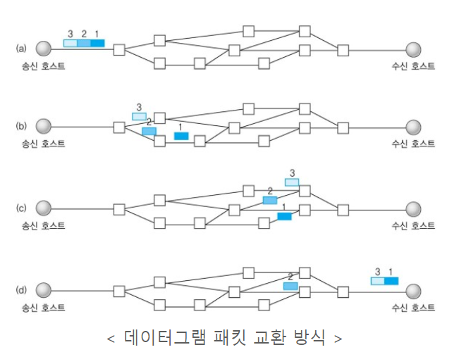
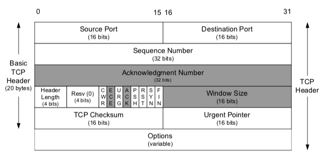
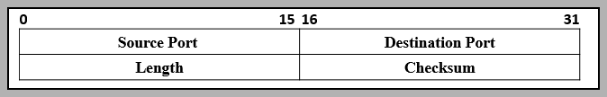
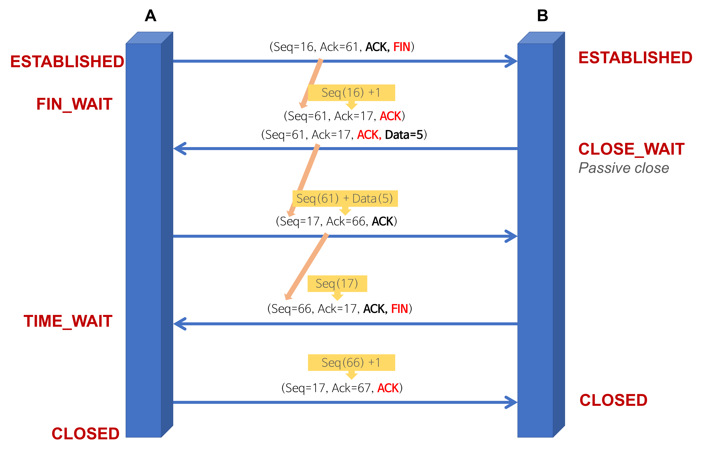
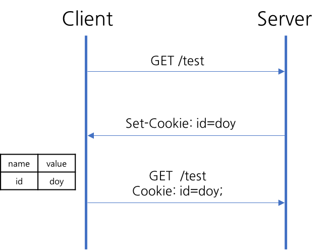
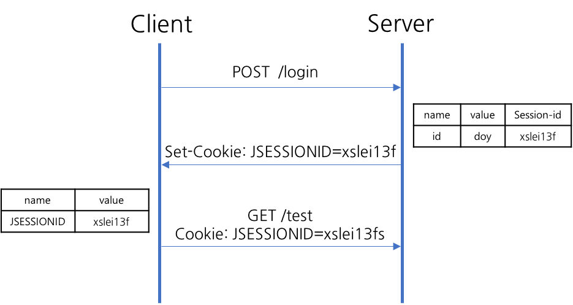
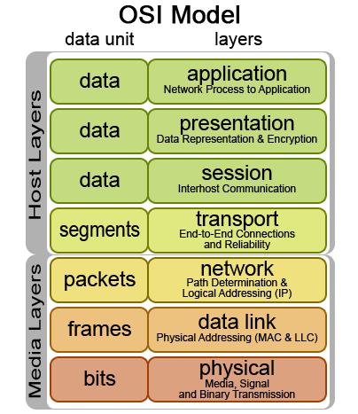
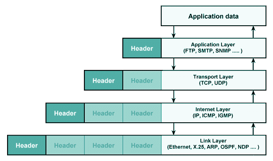

# 2. Network
**:book: Contents**
- [2. Network](#2-network)
    - [OSI 7계층](#osi-7계층)
    - [TCP IP의 개념](#tcp-ip의-개념)
    - [TCP와 UDP](#tcp와-udp)
    - [TCP와 UDP의 헤더 분석](#tcp와-udp의-헤더-분석)
    - [TCP의 3 way handshake와 4 way handshake](#tcp의-3-way-handshake와-4-way-handshake)
      - [:question:TCP 관련 질문 1](#questiontcp-관련-질문-1)
      - [:question:TCP 관련 질문 2](#questiontcp-관련-질문-2)
      - [:question:TCP 관련 질문 3](#questiontcp-관련-질문-3)
    - [HTTP와 HTTPS](#http와-https)
    - [HTTP 요청 응답 헤더](#http-요청-응답-헤더)
    - [HTTP와 HTTPS 동작 과정](#http와-https-동작-과정)
    - [CORS란](#cors란)
    - [GET 메서드와 POST 메서드](#get-메서드와-post-메서드)
    - [쿠키와 세션](#쿠키와-세션)
    - [DNS](#dns)
    - [REST와 RESTful의 개념](#rest와-restful의-개념)
    - [소켓이란](#소켓이란)
    - [Socket.io와 WebSocket의 차이](#socketio와-websocket의-차이)
    - [Frame Packet Segment Datagram](#frame-packet-segment-datagram)
      - [PDU (Protocol Data Unit)](#pdu-protocol-data-unit)
      - [데이터 캡슐화](#데이터-캡슐화)
  - [Reference](#reference)
  - [:house: Home](#house-home)


---

### OSI 7계층
* OSI(Open Systems Interconnection Reference Model)란
    
    * 국제표준화기구(ISO)에서 개발한 모델로, 컴퓨터 네트워크 프로토콜 디자인과 통신을 계층으로 나누어 설명한 것이다.
    * 이 모델은 프로토콜을 기능별로 나눈 것이다. 
    * 각 계층은 하위 계층의 기능만을 이용하고, 상위 계층에게 기능을 제공한다. 
    * '프로토콜 스택' 혹은 '스택'은 이러한 계층들로 구성되는 프로토콜 시스템이 구현된 시스템을 가리키는데, 프로토콜 스택은 하드웨어나 소프트웨어 혹은 둘의 혼합으로 구현될 수 있다. 
    * 일반적으로 하위 계층들은 하드웨어로, 상위 계층들은 소프트웨어로 구현된다.
1. 물리 계층(Physical layer)
    * 네트워크의 기본 네트워크 하드웨어 전송 기술을 이룬다. 
    * 네트워크의 높은 수준의 기능의 논리 데이터 구조를 기초로 하는 필수 계층이다.
    * 전송 단위는 Bit이다.
2. 데이터 링크 계층(Data link layer)
    * 포인트 투 포인트(Point to Point) 간 신뢰성있는 전송을 보장하기 위한 계층으로 CRC 기반의 오류 제어와 흐름 제어가 필요하다. 
    * 주소 값은 물리적으로 할당 받는데, 이는 네트워크 카드가 만들어질 때부터 맥 주소(MAC address)가 정해져 있다는 뜻이다. 
    * 데이터 링크 계층의 가장 잘 알려진 예는 이더넷이다.
    * 데이터 전송 단위는 Frame이다. 
3. 네트워크 계층(Network layer)
    * 여러개의 노드를 거칠때마다 경로를 찾아주는 역할을 하는 계층으로 다양한 길이의 데이터를 네트워크들을 통해 전달하고, 그 과정에서 전송 계층이 요구하는 서비스 품질(QoS)을 제공하기 위한 기능적, 절차적 수단을 제공한다. 
    * 네트워크 계층은 라우팅, 흐름 제어, 세그멘테이션(segmentation/desegmentation), 오류 제어, 인터네트워킹(Internetworking) 등을 수행한다. 
    * 논리적인 주소 구조(IP), 곧 네트워크 관리자가 직접 주소를 할당하는 구조를 가지며, 계층적(hierarchical)이다.
    * 데이터 전송 단위는 Datagram(Packet)이다.
4. 전송 계층(Transport layer)
    * 양 끝단(End to end)의 사용자들이 신뢰성있는 데이터를 주고 받을 수 있도록 해 주어, 상위 계층들이 데이터 전달의 유효성이나 효율성을 생각하지 않도록 해준다. 
    * 시퀀스 넘버 기반의 오류 제어 방식을 사용한다. 
    * 전송 계층은 특정 연결의 유효성을 제어하고, 일부 프로토콜은 상태 개념이 있고(stateful), 연결 기반(connection oriented)이다. (이는 전송 계층이 패킷들의 전송이 유효한지 확인하고 전송 실패한 패킷들을 다시 전송한다는 것을 뜻한다.) 
    * 가장 잘 알려진 전송 계층의 예는 TCP이다.
    * 데이터 전송 단위는 Segment이다.
5. 세션 계층(Session layer)
    * 양 끝단의 응용 프로세스가 통신을 관리하기 위한 방법을 제공한다. 
    * 동시 송수신 방식(duplex), 반이중 방식(half-duplex), 전이중 방식(Full Duplex)의 통신과 함께, 체크 포인팅과 유휴, 종료, 다시 시작 과정 등을 수행한다. 
    * 이 계층은 TCP/IP 세션을 만들고 없애는 책임을 진다.
6. 표현 계층(Presentation layer)
    * 코드 간의 번역을 담당하여 사용자 시스템에서 데이터의 형식상 차이를 다루는 부담을 응용 계층으로부터 덜어 준다. 
    * MIME 인코딩이나 암호화 등의 동작이 이 계층에서 이루어진다. 
7. 응용 계층(Application layer)
    * 응용 프로세스와 직접 관계하여 일반적인 응용 서비스를 수행한다. 
    * 일반적인 응용 서비스는 관련된 응용 프로세스들 사이의 전환을 제공한다. 

> :arrow_double_up:[Top](#2-network)    :leftwards_arrow_with_hook:[Back](https://github.com/Do-Hee/tech-interview#2-network)    :information_source:[Home](https://github.com/Do-Hee/tech-interview#tech-interview)
> - [https://ko.wikipedia.org/wiki/OSI_%EB%AA%A8%ED%98%95](https://ko.wikipedia.org/wiki/OSI_%EB%AA%A8%ED%98%95)

### TCP IP의 개념
<!-- * 네트워크를 상호 연결시켜 정보를 전송할 수 있도록 하는 기능을 가진 다수의 프로토콜이 모여있는 프로토콜 집합
* 인터넷: 데이터 링크 계층을 지원하는 네트워크는 TCP/IP 프로토콜을 이용하여 상호 연결하는 네트워크 -->

> :arrow_double_up:[Top](#2-network)    :leftwards_arrow_with_hook:[Back](https://github.com/Do-Hee/tech-interview#2-network)    :information_source:[Home](https://github.com/Do-Hee/tech-interview#tech-interview)
> - []()

### TCP와 UDP
* 네트워크 계층 중 **전송 계층에서 사용하는 프로토콜**
* TCP(Transmission Control Protocol)  
    
    * 인터넷 상에서 데이터를 메세지의 형태(**세그먼트** 라는 블록 단위)로 보내기 위해 IP와 함께 사용하는 프로토콜이다.
    * TCP와 IP를 함께 사용하는데, IP가 데이터의 배달을 처리한다면 TCP는 패킷을 추적 및 관리한다.
    * **연결형 서비스로** 가상 회선 방식을 제공한다.
        * 3-way handshaking과정을 통해 연결을 설정하고, 4-way handshaking을 통해 연결을 해제한다.
    * 흐름제어 및 혼잡제어를 제공한다.
        * 흐름제어
            * 데이터를 송신하는 곳과 수신하는 곳의 데이터 처리 속도를 조절하여 수신자의 버퍼 오버플로우를 방지하는 것
            * 송신하는 곳에서 감당이 안되게 많은 데이터를 빠르게 보내 수신하는 곳에서 문제가 일어나는 것을 막는다.
        * 혼잡제어
            * 네트워크 내의 패킷 수가 넘치게 증가하지 않도록 방지하는 것
            * 정보의 소통량이 과다하면 패킷을 조금만 전송하여 혼잡 붕괴 현상이 일어나는 것을 막는다.
    * 높은 신뢰성을 보장한다.
    * UDP보다 속도가 느리다.
    * 전이중(Full-Duplex), 점대점(Point to Point) 방식이다.
        * 전이중
            * 전송이 양방향으로 동시에 일어날 수 있다.
        * 점대점
            * 각 연결이 정확히 2개의 종단점을 가지고 있다.
        * 멀티캐스팅이나 브로드캐스팅을 지원하지 않는다.
    * 연속성보다 신뢰성있는 전송이 중요할 때에 사용된다.
* UDP(User Datagram Protocol)  
    
    * 데이터를 **데이터그램** 단위로 처리하는 프로토콜이다.
    * **비연결형 서비스로** 데이터그램 방식을 제공한다.
        * 연결을 위해 할당되는 논리적인 경로가 없다.
        * 그렇기 때문에 각각의 패킷은 다른 경로로 전송되고, 각각의 패킷은 독립적인 관계를 지니게 된다.
        * 이렇게 데이터를 서로 다른 경로로 독립적으로 처리한다.
    * 정보를 주고 받을 때 정보를 보내거나 받는다는 신호절차를 거치지 않는다.
    * UDP헤더의 CheckSum 필드를 통해 최소한의 오류만 검출한다.
    * 신뢰성이 낮다.
    * TCP보다 속도가 빠르다.
    * 신뢰성보다는 연속성이 중요한 서비스, 예를 들면 실시간 서비스(streaming)에 사용된다.
* 참고
  * UDP와 TCP는 각각 별도의 포트 주소 공간을 관리하므로 같은 포트 번호를 사용해도 무방하다. 즉, 두 프로토콜에서 동일한 포트 번호를 할당해도 서로 다른 포트로 간주한다.
  * 또한 같은 모듈(UDP or TCP) 내에서도 클라이언트 프로그램에서 동시에 여러 커넥션을 확립한 경우에는 서로 다른 포트 번호를 동적으로 할당한다. (동적할당에 사용되는 포트번호는 49,152~65,535이다.)

> :arrow_double_up:[Top](#2-network)    :leftwards_arrow_with_hook:[Back](https://github.com/Do-Hee/tech-interview#2-network)    :information_source:[Home](https://github.com/Do-Hee/tech-interview#tech-interview)
> - [http://mangkyu.tistory.com/15](http://mangkyu.tistory.com/15)
> - [http://ddooooki.tistory.com/21](http://ddooooki.tistory.com/21)
> - [http://www.inven.co.kr/webzine/news/?news=165870](http://www.inven.co.kr/webzine/news/?news=165870)

### TCP와 UDP의 헤더 분석

#### TCP Header
* TCP는 상위계층으로부터 데이터를 받아 **헤더**를 추가해 IP로 전송



|필드|내용|크기(bits)|
|----|----|----|
|Source Port, Destination Port|TCP로 연결되는 가상 회선 양단의 송수신 프로세스에 할당되는 포트 주소|16|
|Sequence Number|송신자가 지정하는 순서 번호, **전송되는 바이트 수** 기준으로 증가<br/>SYN = 1 : 초기 시퀀스 번호. ACK 번호는 이 값에 + 1|32|
|Acknowledgment(ACK) Number|수신 프로세스가 제대로 **수신한 바이트의 수** 응답 용|32|
|Header Length(Data Offset)|TCP 헤더 길이를 4바이트 단위로 표시(최소 20, 최대 60 바이트)|4|
|Resv(Reserved)|나중을 위해 0으로 채워진 예약 필드|6|
|Flag Bit|SYN, ACK, FIN 등 제어 번호(아래 표 참고)|6|
|Window Size|**수신 윈도우의 버퍼 크기** 지정(0이면 송신 중지). 상대방의 확인 없이 전송 가능한 최대 바이트 수|16|
|TCP Checksum|헤더와 데이터의 에러 확인 용도|16|
|Urgent Pointer(긴급 위치)|현재 순서 번호부터 표시된 바이트까지 긴급한 데이터임을 표시, URG 플래그 비트가 지정된 경우에만 유효|16|
|Options|추가 옵션 있을 경우 표시|0~40|

  * Flag Bit

    |종류|내용|
    |----|----|
    |URG|긴급 위치 필드 유효 여부 설정|
    |ACK|응답 유효 여부 설정. 최초의 SYN 패킷 이후 모든 패킷은 ACK 플래그 설정 필요. 데이터를 잘 받았으면 긍정 응답으로 ACK(=SYN+1) 전송|
    |PSH|수신측에 버퍼링된 데이터를 상위 계층에 즉시 전달할 때|
    |RST|연결 리셋 응답 혹은 유효하지 않은 세그먼트 응답|
    |SYN|연결 설정 요청. 양쪽이 보낸 최초 패킷에만 SYN 플래그 설정|
    |FIN|연결 종료 의사 표시|

#### UDP Header


|필드|내용|크기(bits)|
|----|----|----|
|Source Port, Destination Port|송수신 애플리케이션의 포트 번호|16|
|Length|헤더와 데이터 포함 전체 길이|16|
|Checksum|헤더와 데이터의 에러 확인 용도. UDP는 에러 복구를 위한 필드가 불필요하기 때문에 TCP 헤더에 비해 간단|16|

> :arrow_double_up:[Top](#2-network)    :leftwards_arrow_with_hook:[Back](https://github.com/Do-Hee/tech-interview#2-network)    :information_source:[Home](https://github.com/Do-Hee/tech-interview#tech-interview)
> - [TCP 와 UDP 차이를 자세히 알아보자](https://velog.io/@hidaehyunlee/TCP-%EC%99%80-UDP-%EC%9D%98-%EC%B0%A8%EC%9D%B4)
> - [TCP, UDP header](https://cysecguide.blogspot.com/2018/04/tcp-udp-header.html)
> - [TCP 와 UDP [동작원리/헤더/차이점]](https://m.blog.naver.com/PostView.nhn?blogId=minki0127&logNo=220804490550&proxyReferer=https:%2F%2Fwww.google.com%2F)
> - [https://idchowto.com/?p=18352](https://idchowto.com/?p=18352)
> - [https://m.blog.naver.com/PostView.nhn?blogId=koromoon&logNo=120162515270&proxyReferer=https%3A%2F%2Fwww.google.co.kr%2F](https://m.blog.naver.com/PostView.nhn?blogId=koromoon&logNo=120162515270&proxyReferer=https%3A%2F%2Fwww.google.co.kr%2F)

### TCP의 3 way handshake와 4 way handshake
* TCP는 장치들 사이에 논리적인 접속을 성립(establish)하기 위하여 연결을 설정하여 **신뢰성을 보장하는 연결형 서비스** 이다.
* 3-way handshake 란
  * TCP 통신을 이용하여 데이터를 전송하기 위해 네트워크 **연결을 설정(Connection Establish)** 하는 과정
  * 양쪽 모두 데이터를 전송할 준비가 되었다는 것을 보장하고, 실제로 데이터 전달이 시작하기 전에 한 쪽이 다른 쪽이 준비되었다는 것을 알 수 있도록 한다.
  * 즉, TCP/IP 프로토콜을 이용해서 통신을 하는 응용 프로그램이 데이터를 전송하기 전에 먼저 정확한 전송을 보장하기 위해 상대방 컴퓨터와 사전에 세션을 수립하는 과정을 의미한다.
      * A 프로세스(Client)가 B 프로세스(Server)에 연결을 요청
        
        1. A -> B: SYN
            * 접속 요청 프로세스 A가 연결 요청 메시지 전송 (SYN)
            * 송신자가 최초로 데이터를 전송할 때 Sequence Number를 임의의 랜덤 숫자로 지정하고, SYN 플래그 비트를 1로 설정한 세그먼트를 전송한다.
            * PORT 상태 - B: LISTEN, A: CLOSED
        2. B -> A: SYN + ACK
            * 접속 요청을 받은 프로세스 B가 요청을 수락했으며, 접속 요청 프로세스인 A도 포트를 열어 달라는 메시지 전송 (SYN + ACK)
            * 수신자는 Acknowledgement Number 필드를 (Sequence Number + 1)로 지정하고, SYN과 ACK 플래그 비트를 1로 설정한 세그먼트를 전송한다.
            * PORT 상태 - B: SYN_RCV, A: CLOSED
        3. A -> B: ACK
            * PORT 상태 - B: SYN_RCV, A: ESTABLISHED
            * 마지막으로 접속 요청 프로세스 A가 수락 확인을 보내 연결을 맺음 (ACK)
            * 이때, 전송할 데이터가 있으면 이 단계에서 데이터를 전송할 수 있다.
            * PORT 상태 - B: ESTABLISHED, A: ESTABLISHED
* 4-way handshake 란
  * TCP의 **연결을 해제(Connection Termination)** 하는 과정
      * A 프로세스(Client)가 B 프로세스(Server)에 연결 해제를 요청
        
        1. A -> B: FIN
            * 프로세스 A가 연결을 종료하겠다는 FIN 플래그를 전송
            * 프로세스 B가 FIN 플래그로 응답하기 전까지 연결을 계속 유지
        2. B -> A: ACK
            * 프로세스 B는 일단 확인 메시지를 보내고 자신의 통신이 끝날 때까지 기다린다. (이 상태가 TIME_WAIT 상태)
            * 수신자는 Acknowledgement Number 필드를 (Sequence Number + 1)로 지정하고, ACK 플래그 비트를 1로 설정한 세그먼트를 전송한다.
            * 그리고 자신이 전송할 데이터가 남아있다면 이어서 계속 전송한다.
        3. B -> A: FIN
            * 프로세스 B가 통신이 끝났으면 연결 종료 요청에 합의한다는 의미로 프로세스 A에게 FIN 플래그를 전송
        4. A -> B: ACK
            * 프로세스 A는 확인했다는 메시지를 전송
* 참고 - ***포트(PORT) 상태 정보***
  * CLOSED: 포트가 닫힌 상태
  * LISTEN: 포트가 열린 상태로 연결 요청 대기 중
  * SYN_RCV: SYNC 요청을 받고 상대방의 응답을 기다리는 중
  * ESTABLISHED: 포트 연결 상태
* 참고 - ***플래그 정보***
  * TCP Header에는 CONTROL BIT(플래그 비트, 6bit)가 존재하며, 각각의 bit는 "URG-ACK-PSH-RST-SYN-FIN"의 의미를 가진다.
    * 즉, 해당 위치의 bit가 1이면 해당 패킷이 어떠한 내용을 담고 있는 패킷인지를 나타낸다.
  * SYN(Synchronize Sequence Number) / 000010
    * 연결 설정. Sequence Number를 랜덤으로 설정하여 세션을 연결하는 데 사용하며, 초기에 Sequence Number를 전송한다.
  * ACK(Acknowledgement) / 010000
    * 응답 확인. 패킷을 받았다는 것을 의미한다.
    * Acknowledgement Number 필드가 유효한지를 나타낸다.
    * 양단 프로세스가 쉬지 않고 데이터를 전송한다고 가정하면 최초 연결 설정 과정에서 전송되는 첫 번째 세그먼트를 제외한 모든 세그먼트의 ACK 비트는 1로 지정된다고 생각할 수 있다.
  * FIN(Finish) / 000001
    * 연결 해제. 세션 연결을 종료시킬 때 사용되며, 더 이상 전송할 데이터가 없음을 의미한다.

> :arrow_double_up:[Top](#2-network)    :leftwards_arrow_with_hook:[Back](https://github.com/Do-Hee/tech-interview#2-network)    :information_source:[Home](https://github.com/Do-Hee/tech-interview#tech-interview)
> - [http://needjarvis.tistory.com/157](http://needjarvis.tistory.com/157)
> - [http://hyeonstorage.tistory.com/286](http://hyeonstorage.tistory.com/286)

#### :question:TCP 관련 질문 1
* Q. TCP의 연결 설정 과정(3단계)과 연결 종료 과정(4단계)이 단계가 차이나는 이유?
  * A. Client가 데이터 전송을 마쳤다고 하더라도 Server는 아직 보낼 데이터가 남아있을 수 있기 때문에 일단 FIN에 대한 ACK만 보내고, 데이터를 모두 전송한 후에 자신도 FIN 메시지를 보내기 때문이다.
  * [관련 Reference](http://ddooooki.tistory.com/21)

#### :question:TCP 관련 질문 2
* Q. 만약 Server에서 FIN 플래그를 전송하기 전에 전송한 패킷이 Routing 지연이나 패킷 유실로 인한 재전송 등으로 인해 FIN 패킷보다 늦게 도착하는 상황이 발생하면 어떻게 될까?
  * A. 이러한 현상에 대비하여 Client는 Server로부터 FIN 플래그를 수신하더라도 일정시간(Default: 240sec)동안 세션을 남겨 놓고 잉여 패킷을 기다리는 과정을 거친다. (TIME_WAIT 과정)
  * [관련 Reference](http://mindnet.tistory.com/entry/%EB%84%A4%ED%8A%B8%EC%9B%8C%ED%81%AC-%EC%89%BD%EA%B2%8C-%EC%9D%B4%ED%95%B4%ED%95%98%EA%B8%B0-22%ED%8E%B8-TCP-3-WayHandshake-4-WayHandshake)

#### :question:TCP 관련 질문 3
* Q. 초기 Sequence Number인 ISN을 0부터 시작하지 않고 난수를 생성해서 설정하는 이유?
  * A. Connection을 맺을 때 사용하는 포트(Port)는 유한 범위 내에서 사용하고 시간이 지남에 따라 재사용된다. 따라서 두 통신 호스트가 과거에 사용된 포트 번호 쌍을 사용하는 가능성이 존재한다. 서버 측에서는 패킷의 SYN을 보고 패킷을 구분하게 되는데 난수가 아닌 순처적인 Number가 전송된다면 이전의 Connection으로부터 오는 패킷으로 인식할 수 있다. 이런 문제가 발생할 가능성을 줄이기 위해서 난수로 ISN을 설정한다.
  * [관련 Reference](http://asfirstalways.tistory.com/356)

### HTTP와 HTTPS
- HTTP 프로토콜
    - 개념 
        - HyperText Transfer Protocol
        - 웹 상에서 클라이언트와 서버 간에 요청/응답(request/response)으로 정보를 주고 받을 수 있는 프로토콜
    - 특징 
        - 주로 HTML 문서를 주고받는 데에 쓰인다. 
        - TCP와 UDP를 사용하며, **80번 포트**를 사용한다.
        - 1) 비연결(Connectionless)
            - 클라이언트가 요청을 서버에 보내고 서버가 적절한 응답을 클라이언트에 보내면 바로 연결이 끊긴다.
        - 2) 무상태(Stateless)
            - 연결을 끊는 순간 클라이언트와 서버의 통신은 끝나며 상태 정보를 유지하지 않는다.
- HTTPS 프로토콜 
    - 개념 
        - HyperText Transfer Protocol over Secure Socket Layer
            - 또는 HTTP over TLS, HTTP over SSL, HTTP Secure
        - 웹 통신 프로토콜인 HTTP의 보안이 강화된 버전의 프로토콜
    - 특징 
        - HTTPS의 기본 TCP/IP 포트로 **443번 포트**를 사용한다.
        - HTTPS는 소켓 통신에서 일반 텍스트를 이용하는 대신에, 웹 상에서 정보를 암호화하는 SSL이나 TLS 프로토콜을 통해 세션 데이터를 암호화한다. 
            - TLS(Transport Layer Security) 프로토콜은 SSL(Secure Socket Layer) 프로토콜에서 발전한 것이다.
            - 두 프로토콜의 주요 목표는 기밀성(사생활 보호), 데이터 무결성, ID 및 디지털 인증서를 사용한 인증을 제공하는 것이다.
        - 따라서 데이터의 적절한 보호를 보장한다. 
            - 보호의 수준은 웹 브라우저에서의 구현 정확도와 서버 소프트웨어, 지원하는 암호화 알고리즘에 달려있다.
        - 금융 정보나 메일 등 중요한 정보를 주고받는 것은 HTTPS를, 아무나 봐도 상관 없는 페이지는 HTTP를 사용한다.
- HTTPS가 필요한 이유?
    - 클라이언트인 웹브라우저가 서버에 HTTP를 통해 웹 페이지나 이미지 정보를 요청하면 서버는 이 요청에 응답하여 요구하는 정보를 제공하게 된다.
    - 웹 페이지(HTML)는 텍스트이고, HTTP를 통해 이런 텍스트 정보를 교환하는 것이다.
    - 이때 주고받는 텍스트 정보에 주민등록번호나 비밀번호와 같이 민감한 정보가 포함된 상태에서 네트워크 상에서 중간에 제3자가 정보를 가로챈다면 보안상 큰 문제가 발생한다.
    - 즉, 중간에서 정보를 볼 수 없도록 주고받는 정보를 암호화하는 방법인 HTTPS를 사용하는 것이다.
- HTTPS의 원리 
    - **[공개키 알고리즘 방식](https://github.com/WeareSoft/tech-interview/blob/master/contents/security.md#대칭키와-비대칭키-차이)**
    - 암호화, 복호화시킬 수 있는 서로 다른 키(공개키, 개인키)를 이용한 암호화 방법 
        - 공개키: 모두에게 공개. 공캐키 저장소에 등록 
        - 개인키(비공개키): 개인에게만 공개. 클라이언트-서버 구조에서는 서버가 가지고 있는 비공개키 
    - 클라이언트 -> 서버 
        - 사용자의 데이터를 **공개키로 암호화** (공개키를 얻은 인증된 사용자)
        - 서버로 전송 (데이터를 가로채도 개인키가 없으므로 **복호화할 수 없음**)
        - 서버의 **개인키를 통해 복호화**하여 요청 처리 
- HTTPS의 장단점
    - 장점 
        - 네트워크 상에서 열람, 수정이 불가능하므로 안전하다.
    - 단점 
        - 암호화를 하는 과정이 웹 서버에 부하를 준다.
        - HTTPS는 설치 및 인증서를 유지하는데 추가 비용이 발생한다.
        - HTTP에 비해 느리다. 
        - 인터넷 연결이 끊긴 경우 재인증 시간이 소요된다.
            - HTTP는 비연결형으로 웹 페이지를 보는 중 인터넷 연결이 끊겼다가 다시 연결되어도 페이지를 계속 볼 수 있다.
            - 그러나 HTTPS의 경우에는 소켓(데이터를 주고 받는 경로) 자체에서 인증을 하기 때문에 인터넷 연결이 끊기면 소켓도 끊어져서 다시 HTTPS 인증이 필요하다.
            
> :arrow_double_up:[Top](#2-network)    :leftwards_arrow_with_hook:[Back](https://github.com/Do-Hee/tech-interview#2-network)    :information_source:[Home](https://github.com/Do-Hee/tech-interview#tech-interview)
> - [https://ko.wikipedia.org/wiki/HTTPS](https://ko.wikipedia.org/wiki/HTTPS)
> - [https://jeong-pro.tistory.com/89](https://jeong-pro.tistory.com/89)
> - [https://m.blog.naver.com/reviewer__/221294104297](https://m.blog.naver.com/reviewer__/221294104297)
> - [https://www.ibm.com/support/knowledgecenter/ko/SSFKSJ_7.1.0/com.ibm.mq.doc/sy10630_.htm](https://www.ibm.com/support/knowledgecenter/ko/SSFKSJ_7.1.0/com.ibm.mq.doc/sy10630_.htm)


### HTTP 요청 응답 헤더
- HTTP 헤더 내 일반 헤더(General Header) 항목
    - 요청 및 응답 메시지 모두에서 사용 가능한 일반 목적의(기본적인) 헤더 항목
    - 주요 항목들
        - **Date**: HTTP 메시지를 생성한 일시 (RFC 1123에서 규정)
            - `Date: Sat, 2 Oct 2018 02:00:12 GMT`
        - **Connection**: 클라이언트와 서버 간 연결에 대한 옵션 설정(다소 모호한 복잡성 있음)
            - `Connection: close` => 현재 HTTP 메시지 직후에 TCP 접속을 끊는다는 것을 알림
            - `Connection: Keep-Alive` => 현재 TCP 커넥션을 유지
        - **Cache-Control** 
        - **Pragma**
        - **Trailer**
-  HTTP 헤더 내 엔터티/개체 헤더 (Entity Header) 항목
    - 요청 및 응답 메시지 모두에서 사용 가능한 Entity(콘텐츠, 본문, 리소스 등)에 대한 설명 헤더 
    - 주요 항목들
        - **Content-Type**: 해당 개체에 포함되는 미디어 타입 정보
            - 컨텐츠의 타입(MIME 미디어 타입) 및 문자 인코딩 방식(EUC-KR,UTF-8 등)을 지정
            - 타입 및 서브타입(type/subtype)으로 구성 
            - `Content-Type: text/html; charset-latin-1` => 해당 개체가 html으로 표현된 텍스트 문서이고, iso-latin-1 문자 인코딩 방식으로 표현됨
        - **Content-Language**: 해당 개체와 가장 잘 어울리는 사용자 언어(자연언어)
        - **Content-Encoding**: 해당 개체 데이터의 압축 방식
            - `Content-Encoding: gzip, deflate`
            - 만일 압축이 시행되었다면, Content-Encoding 및 Content-Length 2개 항목을 토대로 압축 해제 가능 
        - **Content-Length**: 전달되는 해당 개체의 바이트 길이 또는 크기(10진수)
            - 응답 메시지 Body의 길이를 지정하거나, 특정 지정된 개체의 길이를 지정함
        - **Content-Location**: 해당 개체가 실제 어디에 위치하는가를 알려줌
        - **Content-Disposition**: 응답 Body를 브라우저가 어떻게 표시해야 할지 알려주는 헤더
            - inline인 경우 웹페이지 화면에 표시되고, attachment인 경우 다운로드
            - `Content-Disposition: inline`
            - `Content-Disposition: attachment; filename='filename.csv'`
            - 다운로드되길 원하는 파일은 attachment로 값을 설정하고, filename 옵션으로 파일명까지 지정해줄 수 있다.
            - 파일용 서버인 경우 이 태그를 자주 사용
        - **Content-Security-Policy**: 다른 외부 파일들을 불러오는 경우, 차단할 소스와 불러올 소스를 명시
            - *XSS 공격*에 대한 방어 가능 (허용한 외부 소스만 지정 가능)
            - `Content-Security-Policy: default-src https:` => https를 통해서만 파일을 가져옴
            - `Content-Security-Policy: default-src 'self'` => 자신의 도메인의 파일들만 가져옴
            - `Content-Security-Policy: default-src 'none'` => 파일을 가져올 수 없음
        - **Location**: 리소스가 리다이렉트(redirect)된 때에 이동된 주소, 또는 새로 생성된 리소스 주소
            - 300번대 응답이나 201 Created 응답일 때 어느 페이지로 이동할지를 알려주는 헤더
            - 새로 생성된 경우에 HTTP 상태 코드 `201 Created`가 반환됨
            - `HTTP/1.1 302 Found  Location: /`
                - 이런 응답이 왔다면 브라우저는 / 주소로 redirect한다.
        - **Last-Modified**: 리소스를 마지막으로 갱신한 일시
- HTTP 헤더 내 요청 헤더 (Request Header) 항목
    - 요청 헤더는 HTTP 요청 메시지 내에서만 나타나며 가장 방대하다.
    - 주요 항목들
        - **Host**: 요청하는 호스트에 대한 호스트명 및 포트번호 (***필수***)
            - Host 필드에 도메인명 및 호스트명 모두를 포함한 전체 URI(FQDN) 지정 필요
            - 이에 따라 동일 IP 주소를 갖는 단일 서버에 여러 사이트가 구축 가능
        - **User-Agent**: 클라이언트 소프트웨어(브라우저, OS) 명칭 및 버전 정보
        - **From**: 클라이언트 사용자 메일 주소 
            - 주로 검색엔진 웹 로봇의 연락처 메일 주소를 나타냄
            - 때로는, 이 연락처 메일 주소를 User-Agent 항목에 두는 경우도 있음
        - **Cookie**: 서버에 의해 Set-Cookie로 클라이언트에게 설정된 쿠키 정보
        - **Referer**: 바로 직전에 머물었던 웹 링크 주소
        - **If-Modified-Since**: 제시한 일시 이후로만 변경된 리소스를 취득 요청
        - **Authorization**: 인증 토큰(JWT/Bearer 토큰)을 서버로 보낼 때 사용하는 헤더
            - 토큰의 종류(Basic, Bearer 등) + 실제 토큰 문자를 전송
        - **Origin**
            - 서버로 POST 요청을 보낼 때, 요청이 어느 주소에서 시작되었는지 나타냄
            - 여기서 요청을 보낸 주소와 받는 주소가 다르면 *CORS 에러*가 발생
            - 응답 헤더의 **Access-Control-Allow-Origin**와 관련 
    - 다음 4개는 주로 HTTP 메세지 Body의 속성 또는 내용 협상용 항목들
        - **Accept**: 클라이언트 자신이 원하는 미디어 타입 및 우선순위를 알림
            - `Accept: */*` => 어떤 미디어 타입도 가능
            - `Accept: image/*` => 모든 이미지 유형
        - **Accept-Charset**: 클라이언트 자신이 원하는 문자 집합
        - **Accept-Encoding**: 클라이언트 자신이 원하는 문자 인코딩 방식
        - **Accept-Language**: 클라이언트 자신이 원하는 가능한 언어
        - 각각이 HTTP Entity Header 항목 중에 `Content-Type, Content-Type charset-xxx, Content-Encoding, Content-Language`과 일대일로 대응됨
- HTTP 헤더 내 응답 헤더 (Response Header) 항목
    - 특정 유형의 HTTP 요청이나 특정 HTTP 헤더를 수신했을 때, 이에 응답한다.
    - 주요 항목들
        - **Server**: 서버 소프트웨어 정보
        - **Accept-Range**
        - **Set-Cookie**: 서버측에서 클라이언트에게 세션 쿠키 정보를 설정 (RFC 2965에서 규정)
        - **Expires**: 리소스가 지정된 일시까지 캐시로써 유효함
        - **Age**: 캐시 응답. max-age 시간 내에서 얼마나 흘렀는지 알려줌(초 단위)
        - **ETag**: HTTP 컨텐츠가 바뀌었는지를 검사할 수 있는 태그
        - **Proxy-authenticate**
        - **Allow**: 해당 엔터티에 대해 서버 측에서 지원 가능한 HTTP 메소드의 리스트를 나타냄
            - 때론, HTTP 요청 메세지의 HTTP 메소드 OPTIONS에 대한 응답용 항목
                - OPTIONS: 웹서버측 제공 HTTP 메소드에 대한 질의
            - `Allow: GET,HEAD` => 웹 서버측이 제공 가능한 HTTP 메서드는 GET,HEAD 뿐임을 알림 (405 Method Not Allowed 에러와 함께)
        - **Access-Control-Allow-Origin**: 요청을 보내는 프론트 주소와 받는 백엔드 주소가 다르면 *CORS 에러*가 발생
            * 서버에서 이 헤더에 프론트 주소를 적어주어야 에러가 나지 않는다.
            * `Access-Control-Allow-Origin: www.zerocho.com`
                * 프로토콜, 서브도메인, 도메인, 포트 중 하나만 달라도 CORS 에러가 난다.
            * `Access-Control-Allow-Origin: *`
                * 만약 주소를 일일이 지정하기 싫다면 *으로 모든 주소에 CORS 요청을 허용되지만 그만큼 보안이 취약해진다.
            * 유사한 헤더로 `Access-Control-Request-Method, Access-Control-Request-Headers, Access-Control-Allow-Methods, Access-Control-Allow-Headers` 등이 있다. 

> :arrow_double_up:[Top](#2-network)    :leftwards_arrow_with_hook:[Back](https://github.com/Do-Hee/tech-interview#2-network)    :information_source:[Home](https://github.com/Do-Hee/tech-interview#tech-interview)
> - [http://www.ktword.co.kr/abbr_view.php?nav=&m_temp1=5905&id=902](http://www.ktword.co.kr/abbr_view.php?nav=&m_temp1=5905&id=902)
> - [https://gmlwjd9405.github.io/2019/01/28/http-header-types.html](https://gmlwjd9405.github.io/2019/01/28/http-header-types.html)
> - [https://developer.mozilla.org/en-US/docs/Web/HTTP/Headers](https://developer.mozilla.org/en-US/docs/Web/HTTP/Headers)

### HTTP와 HTTPS 동작 과정
#### HTTP 동작 과정
* 서버 접속 -> 클라이언트 -> 요청 -> 서버 -> 응답 -> 클라이언트 -> 연결 종료
1. **사용자가 웹 브라우저에 URL 주소 입력**
2. **DNS 서버에 웹 서버의 호스트 이름을 IP 주소로 변경 요청**
3. **웹 서버와 TCP 연결 시도**
    * 3way-handshaking
4. **클라이언트가 서버에게 요청**
    * HTTP Request Message = Request Header + 빈 줄 + Request Body
    * Request Header
      * 요청 메소드 + 요청 URI + HTTP 프로토콜 버전
        * ```GET /background.png HTTP/1.0``` ```POST / HTTP 1.1```
        * Header 정보(key-value 구조)
    * 빈 줄
      * 요청에 대한 모든 메타 정보가 전송되었음을 알리는 용도
    * Request Body
      * GET, HEAD, DELETE, OPTIONS처럼 리소스를 가져오는 요청은 바디 미포함
      * 데이터 업데이트 요청과 관련된 내용 (HTML 폼 콘텐츠 등)
5. **서버가 클라이언트에게 데이터 응답**
    * HTTP Response Message = Response Header + 빈 줄 + Response Body
    * Response Header
      * HTTP 프로토콜 버전 + 응답 코드 + 응답 메시지
        * ex. ```HTTP/1.1 404 Not Found.```
      * Header 정보(key-value 구조)
    * 빈 줄
      * 요청에 대한 모든 메타 정보가 전송되었음을 알리는 용도
    * Response Body
      * 응답 리소스 데이터
        * 201, 204 상태 코드는 바디 미포함
6. **서버 클라이언트 간 연결 종료**
    * 4way-handshaking
7. **웹 브라우저가 웹 문서 출력**

#### HTTPS(SSL) 동작 과정
* 공개키 암호화 방식과 대칭키 암호화 방식의 장점을 활용해 하이브리드 사용
  * 데이터를 대칭키 방식으로 암복호화하고, 공개키 방식으로 대칭키 전달
1. **클라이언트가 서버 접속하여 Handshaking 과정에서 서로 탐색**
    
    1.1. **Client Hello**
      * 클라이언트가 서버에게 전송할 데이터
        * 클라이언트 측에서 생성한 **랜덤 데이터**
        * 클-서 암호화 방식 통일을 위해 **클라이언트가 사용할 수 있는 암호화 방식**
        * 이전에 이미 Handshaking 기록이 있다면 자원 절약을 위해 기존 세션을 재활용하기 위한 **세션 아이디**

    1.2. **Server Hello**
      * Client Hello에 대한 응답으로 전송할 데이터
        * 서버 측에서 생성한 **랜덤 데이터**
        * **서버가 선택한 클라이언트의 암호화 방식**
        * **SSL 인증서**

    1.3. **Client 인증 확인**
      * 서버로부터 받은 인증서가 CA에 의해 발급되었는지 본인이 가지고 있는 목록에서 확인하고, 목록에 있다면 CA 공개키로 인증서 복호화
      * 클-서 각각의 랜덤 데이터를 조합하여 pre master secret 값 생성(데이터 송수신 시 대칭키 암호화에 사용할 키)
      * pre master secret 값을 공개키 방식으로 서버 전달(공개키는 서버로부터 받은 인증서에 포함)
      * 일련의 과정을 거쳐 session key 생성

    1.4. **Server 인증 확인**
      * 서버는 비공개키로 복호화하여 pre master secret 값 취득(대칭키 공유 완료)
      * 일련의 과정을 거쳐 session key 생성

    1.5. **Handshaking 종료**
2. **데이터 전송**
    * 서버와 클라이언트는 session key를 활용해 데이터를 암복호화하여 데이터 송수신
3. **연결 종료 및 session key 폐기**

> :arrow_double_up:[Top](#2-network)    :leftwards_arrow_with_hook:[Back](https://github.com/WeareSoft/tech-interview#2-network)    :information_source:[Home](https://github.com/WeareSoft/tech-interview#tech-interview)
> - [[Network] HTTP의 동작 및 HTTP Message 형식](https://gmlwjd9405.github.io/2019/04/17/what-is-http-protocol.html)
> - [HTTP 동작 과정](https://jess-m.tistory.com/17)
> - [HTTP 메시지](https://developer.mozilla.org/ko/docs/Web/HTTP/Messages)
> - [HTTPS와 SSL 인증서](https://opentutorials.org/course/228/4894)

### CORS란 
- CORS(Cross Origin Resource Sharing)란 
    - 웹 서버에게 보안 cross-domain 데이터 전송을 활성화하는 cross-domain 접근 제어권을 부여한다.
- 배경
    - 처음 전송되는 리소스의 도메인과 다른 도메인으로부터 리소스가 요청될 경우 해당 리소스는 cross-origin HTTP 요청에 의해 요청된다.
    - 보안 상의 이유로, 브라우저들은 스크립트 내에서 초기화되는 cross-origin HTTP 요청을 제한한다.
        - 예를 들면, XMLHttpRequest는 same-origin 정책을 따르기에 XMLHttpRequest을 사용하는 웹 애플리케이션은 자신과 동일한 도메인으로 HTTP 요청을 보내는 것만 가능했다.
        - 웹 애플리케이션을 개선시키기 위해, 개발자들은 브라우저 벤더사들에게 XMLHttpRequest가 cross-domain 요청을 할 수 있도록 요청했고 이에 따라 CORS가 생겼다.
- 과정
    - CORS 요청 시에는 미리 OPTIONS 주소로 서버가 CORS를 허용하는지 물어본다.
    - 이때 Access-Control-Request-Method로 실제로 보내고자 하는 메서드를 알리고,
    - Access-Control-Request-Headers로 실제로 보내고자 하는 헤더들을 알린다.
    - Allow 항목들은 Request에 대응되는 것으로, 서버가 허용하는 메서드와 헤더를 응답하는데 사용된다.
    - Request랑 Allow가 일치하면 CORS 요청이 이루어진다.

> :arrow_double_up:[Top](#2-network)    :leftwards_arrow_with_hook:[Back](https://github.com/Do-Hee/tech-interview#2-network)    :information_source:[Home](https://github.com/Do-Hee/tech-interview#tech-interview)
> - [https://zamezzz.tistory.com/137](https://zamezzz.tistory.com/137)
> - [https://developer.mozilla.org/ko/docs/Web/HTTP/Access_control_CORS](https://developer.mozilla.org/ko/docs/Web/HTTP/Access_control_CORS)

### GET 메서드와 POST 메서드
* HTTP 프로토콜을 이용해서 서버에 데이터(요청 정보)를 전달할 때 사용하는 방식
* GET 메서드 방식
  * 개념
    * 정보를 조회하기 위한 메서드
    * 서버에서 어떤 데이터를 가져와서 보여주기 위한 용도의 메서드
    * **가져오는 것(Select)**
  * 사용 방법
    * URL의 끝에 '?'가 붙고, 요청 정보가 (key=value)형태의 쌍을 이루어 ?뒤에 이어서 붙어 서버로 전송한다.
    * 요청 정보가 여러 개일 경우에는 '&'로 구분한다.
    * Ex) `www.urladdress.xyz?name1=value1&name2=value2`
  * 특징
    * URL에 요청 정보를 붙여서 전송한다.
    * URL에 요청 정보가 이어붙기 때문에 길이 제한이 있어서 대용량의 데이터를 전송하기 어렵다.
      * 한 번 요청 시 전송 데이터(주솟값 + 파라미터)의 양은 255자로 제한된다.(HTTP/1.1은 2048자)
    * 요청 정보를 사용자가 쉽게 눈으로 확인할 수 있다.
      * POST 방식보다 보안상 취약하다.
    * HTTP 패킷의 Body는 비어 있는 상태로 전송한다.
      * 즉, Body의 데이터 타입을 표현하는 'Content-Type' 필드도 HTTP Request Header에 들어가지 않는다.
    * POST 방식보다 빠르다.
      * GET 방식은 캐싱을 사용할 수 있어, GET 요청과 그에 대한 응답이 브라우저에 의해 캐쉬된다.
* POST 메서드 방식
  * 개념
    * 서버의 값이나 상태를 바꾸기 위한 용도의 메서드
    * **수행하는 것(Insert, Update, Delete)**
  * 사용 방법
    * 요청 정보를 HTTP 패킷의 Body 안에 숨겨서 서버로 전송한다.
    <!-- * Form 태그을 이용해서 submit 하는 형태 -->
    * Request Header의 Content-Type에 해당 데이터 타입이 표현되며, 전송하고자 하는 데이터 타입을 적어주어야 한다.
      * Default: application/octet-stream
      * 단순 txt의 경우: text/plain
      * 파일의 경우: multipart/form-date
  * 특징
    * Body 안에 숨겨서 요청 정보를 전송하기 때문에 대용량의 데이터를 전송하기에 적합하다.
    * 클라이언트 쪽에서 데이터를 인코딩하여 서버로 전송하고, 이를 받은 서버 쪽이 해당 데이터를 디코딩한다.
    * GET 방식보다 보안상 안전하다.
* Q. 조회하기 위한 용도 POST가 아닌 GET 방식을 사용하는 이유?
  1. 설계 원칙에 따라 GET 방식은 서버에게 여러 번 요청을 하더라도 동일한 응답이 돌아와야 한다. (Idempotent, 멱등)
      * GET 방식은 **가져오는 것(Select)** 으로, 서버의 데이터나 상태를 변경시키지 않아야 한다.
          * Ex) 게시판의 리스트, 게시글 보기 기능
          * 예외) 방문자의 로그 남기기, 글을 읽은 횟수 증가 기능
      * POST 방식은 **수행하는 것** 으로, 서버의 값이나 상태를 바꾸기 위한 용도이다.
          * Ex) 게시판에 글쓰기 기능
  2. 웹에서 모든 리소스는 Link할 수 있는 URL을 가지고 있어야 한다.
      * 어떤 웹페이지를 보고 있을 때 다른 사람한테 그 주소를 주기 위해서 주소창의 URL을 복사해서 줄 수 있어야 한다.
      * 즉, 어떤 웹페이지를 조회할 때 원하는 페이지로 바로 이동하거나 이동시키기 위해서는 해당 링크의 정보가 필요하다.
      * 이때 POST 방식을 사용할 경우에 값(링크의 정보)이 Body에 있기 때문에 URL만 전달할 수 없으므로 GET 방식을 사용해야한다. 그러나 글을 저장하는 경우에는 URL을 제공할 필요가 없기 때문에 POST 방식을 사용한다.

<!-- * 클라이언트에서 서버로 데이터를 전송하려면 GET이나 POST 방식밖에 없다. -->

> :arrow_double_up:[Top](#2-network)    :leftwards_arrow_with_hook:[Back](https://github.com/Do-Hee/tech-interview#2-network)    :information_source:[Home](https://github.com/Do-Hee/tech-interview#tech-interview)
> - [https://blog.outsider.ne.kr/312](https://blog.outsider.ne.kr/312)
> - [https://hongsii.github.io/2017/08/02/what-is-the-difference-get-and-post/](https://hongsii.github.io/2017/08/02/what-is-the-difference-get-and-post/)
> - [https://www.w3schools.com/tags/ref_httpmethods.asp](https://www.w3schools.com/tags/ref_httpmethods.asp)

### 쿠키와 세션
* HTTP 프로토콜의 특징
  * 비연결 지향(Connectionless)
      * 클라이언트가 request를 서버에 보내고, 서버가 클라이언트에 요청에 맞는 response를 보내면 바로 연결을 끊는다.
  * 상태정보 유지 안 함(Stateless)
      * 연결을 끊는 순간 클라이언트와 서버의 통신은 끝나며 상태 정보를 유지하지 않는다.
* 쿠키와 세션의 필요성
    * HTTP 프로토콜은 위와 같은 특징으로 모든 요청 간 의존관계가 없다.
    * 즉, 현재 접속한 사용자가 이전에 접속했던 사용자와 같은 사용자인지 아닌지 알 수 있는 방법이 없다.
    * 계속해서 연결을 유지하지 않기 때문에 리소스 낭비가 줄어드는 것이 큰 장점이지만, 통신할 때마다 새로 연결하기 때문에 클라이언트는 매 요청마다 인증을 해야 한다는 단점이 있다.
    * 이전 요청과 현재 요청이 같은 사용자의 요청인지 알기 위해서는 상태를 유지해야 한다.
    * HTTP 프로토콜에서 상태를 유지하기 위한 기술로 쿠키와 세션이 있다.
* 쿠키(Cookie)란?
  * 개념
      * 클라이언트 로컬에 저장되는 키와 값이 들어있는 파일이다.
      * 이름, 값, 유효 시간, 경로 등을 포함하고 있다.
      * 클라이언트의 상태 정보를 브라우저에 저장하여 참조한다.
  * 구성 요소
      * 쿠키의 이름(name)
      * 쿠키의 값(value)
      * 쿠키의 만료시간(Expires)
      * 쿠키를 전송할 도메인 이름(Domain)
      * 쿠키를 전송할 경로(Path)
      * 보안 연결 여부(Secure)
      * HttpOnly 여부(HttpOnly)
  * 동작 방식  
      
      1. 웹브라우저가 서버에 요청
      2. 상태를 유지하고 싶은 값을 쿠키(cookie)로 생성
      3. 서버가 응답할 때 HTTP 헤더(Set-Cookie)에 쿠키를 포함해서 전송
          ```java
          Set−Cookie: id=doy
          ```
      4. 전달받은 쿠키는 웹브라우저에서 관리하고 있다가, 다음 요청 때 쿠키를 HTTP 헤더에 넣어서 전송
          ```java
          cookie: id=doy
          ```
      5. 서버에서는 쿠키 정보를 읽어 이전 상태 정보를 확인한 후 응답
  * 쿠키 사용 예
      * 아이디, 비밀번호 저장
      * 쇼핑몰 장바구니
* 세션(Session)이란?
  * 개념
      * 일정 시간 동안 같은 브라우저로부터 들어오는 요청을 하나의 상태로 보고 그 상태를 유지하는 기술이다.
      * 즉, 웹 브라우저를 통해 서버에 접속한 이후부터 브라우저를 종료할 때까지 유지되는 상태이다.
  * 동작 방식  
      
      1. 웹브라우저가 서버에 요청
      2. 서버가 해당 웹브라우저(클라이언트)에 유일한 ID(Session ID)를 부여함
      3. 서버가 응답할 때 HTTP 헤더(Set-Cookie)에 Session ID를 포함해서 전송  
      쿠키에 Session ID를 JSESSIONID 라는 이름으로 저장
          ```java
          Set−Cookie: JSESSIONID=xslei13f
          ```
      4. 웹브라우저는 이후 웹브라우저를 닫기까지 다음 요청 때 부여된 Session ID가 담겨있는 쿠키를 HTTP 헤더에 넣어서 전송
          ```java
          Cookie: JSESSIONID=xslei13f
          ```
      5. 서버는 세션 ID를 확인하고, 해당 세션에 관련된 정보를 확인한 후 응답
  * 세션 사용 예
    * 로그인
> 세션도 쿠키를 사용하여 값을 주고받으며 클라이언트의 상태 정보를 유지한다.  
> 즉, 상태 정보를 유지하는 수단은 **쿠키** 이다.
* 쿠키와 세션의 차이점
  * 저장 위치
      * 쿠키 : 클라이언트
      * 세션 : 서버
  * 보안
      * 쿠키 : 클라이언트에 저장되므로 보안에 취약하다.
      * 세션 : 쿠키를 이용해 Session ID만 저장하고 이 값으로 구분해서 서버에서 처리하므로 비교적 보안성이 좋다.
  * 라이프사이클
      * 쿠키 : 만료시간에 따라 브라우저를 종료해도 계속해서 남아 있을 수 있다.
      * 세션 : 만료시간을 정할 수 있지만 브라우저가 종료되면 만료시간에 상관없이 삭제된다.
  * 속도
      * 쿠키 : 클라이언트에 저장되어서 서버에 요청 시 빠르다.
      * 세션 : 실제 저장된 정보가 서버에 있으므로 서버의 처리가 필요해 쿠키보다 느리다.

> :arrow_double_up:[Top](#2-network)    :leftwards_arrow_with_hook:[Back](https://github.com/Do-Hee/tech-interview#2-network)    :information_source:[Home](https://github.com/Do-Hee/tech-interview#tech-interview)
> - [https://doooyeon.github.io/2018/09/10/cookie-and-session.html](https://doooyeon.github.io/2018/09/10/cookie-and-session.html)

### DNS

> :arrow_double_up:[Top](#2-network)    :leftwards_arrow_with_hook:[Back](https://github.com/Do-Hee/tech-interview#2-network)    :information_source:[Home](https://github.com/Do-Hee/tech-interview#tech-interview)
> - []()

### REST와 RESTful의 개념
* REST란
  * REST의 정의
    * "Representational State Transfer(대표적인 상태 전달)"의 약자
    * 월드 와이드 웹(www)과 같은 분산 하이퍼미디어 시스템을 위한 소프트웨어 개발 아키텍처의 한 형식
      * REST는 기본적으로 웹의 기존 기술과 HTTP 프로토콜을 그대로 활용하기 때문에 웹의 장점을 최대한 활용할 수 있는 아키텍처 스타일이다.
      * REST는 네트워크 상에서 Client와 Server 사이의 통신 방식 중 하나이다.
  * REST의 구체적인 개념
    * **HTTP URI(Uniform Resource Identifier)를 통해 자원(Resource)을 명시하고, HTTP Method(Post, Get, Put, Delete)를 통해 해당 자원에 대한 CRUD Operation을 적용하는 것을 의미한다.**
      * 즉, REST는 자원 기반의 구조(ROA, Resource Oriented Architecture) 설계의 중심에 Resource가 있고 HTTP Method를 통해 Resource를 처리하도록 설계된 아키텍쳐를 의미한다.
      * 웹 사이트의 이미지, 텍스트, DB 내용 등의 모든 자원에 고유한 ID인 HTTP URI를 부여한다.
  * REST 장단점
    * 장점
      * 여러 가지 서비스 디자인에서 생길 수 있는 문제를 최소화해준다.
      * Hypermedia API의 기본을 충실히 지키면서 범용성을 보장한다.
      * HTTP 프로토콜의 표준을 최대한 활용하여 여러 추가적인 장점을 함께 가져갈 수 있게 해준다.
    * 단점
      * 브라우저를 통해 테스트할 일이 많은 서비스라면 쉽게 고칠 수 있는 URL보다 Header 값이 왠지 더 어렵게 느껴진다.
      * 구형 브라우저가 아직 제대로 지원해주지 못하는 부분이 존재한다.
        * PUT, DELETE를 사용하지 못하는 점
        * pushState를 지원하지 않는 점
  * REST가 필요한 이유
    * '애플리케이션 분리 및 통합'
    * '다양한 클라이언트의 등장'
    * 즉, 최근의 서버 프로그램은 다양한 브라우저와 안드로이폰, 아이폰과 같은 모바일 디바이스에서도 통신을 할 수 있어야 한다.
  * REST 구성 요소
    1. 자원(Resource): URI
        * 모든 자원에 고유한 ID가 존재하고, 이 자원은 Server에 존재한다.
        * 자원을 구별하는 ID는 '/groups/:group_id'와 같은 HTTP **URI** 다.
        * Client는 URI를 이용해서 자원을 지정하고 해당 자원의 상태(정보)에 대한 조작을 Server에 요청한다.
    2. 행위(Verb): HTTP Method
        * HTTP 프로토콜의 Method를 사용한다.
        * HTTP 프로토콜은 **GET, POST, PUT, DELETE, HEAD** 와 같은 메서드를 제공한다.
    3. 표현(Representation of Resource)
        * Client가 자원의 상태(정보)에 대한 조작을 요청하면 Server는 이에 적절한 응답(Representation)을 보낸다.
        * REST에서 하나의 자원은 **JSON, XML, TEXT, RSS** 등 여러 형태의 Representation으로 나타내어 질 수 있다.
        * JSON 혹은 XML를 통해 데이터를 주고 받는 것이 일반적이다.
  * REST 특징
    1. Server-Client(서버-클라이언트 구조)
    2. Stateless(무상태)
    3. Cacheable(캐시 처리 가능)
    4. Layered System(계층화)
    5. Code-On-Demand(optional)
    6. Uniform Interface(인터페이스 일관성)
* REST API
  * REST API의 정의
    * REST 기반으로 서비스 API를 구현한 것
    * 최근 OpenAPI(누구나 사용할 수 있도록 공개된 API: 구글 맵, 공공 데이터 등), 마이크로 서비스(하나의 큰 애플리케이션을 여러 개의 작은 애플리케이션으로 쪼개어 변경과 조합이 가능하도록 만든 아키텍처) 등을 제공하는 업체 대부분은 REST API를 제공한다.
  * REST API의 특징
    * 사내 시스템들도 REST 기반으로 시스템을 분산해 확장성과 재사용성을 높여 유지보수 및 운용을 편리하게 할 수 있다.
    * REST는 HTTP 표준을 기반으로 구현하므로, HTTP를 지원하는 프로그램 언어로 클라이언트, 서버를 구현할 수 있다.
    * 즉, REST API를 제작하면 델파이 클라이언트 뿐 아니라, 자바, C#, 웹 등을 이용해 클라이언트를 제작할 수 있다.
  * REST API 설계 **기본 규칙**
    1. URI는 정보의 자원을 표현해야 한다.
        * resource는 동사보다는 명사를 사용한다.
        * resource는 영어 소문자 복수형을 사용하여 표현한다.
        * Ex) `GET /Member/1` -> `GET /members/1`
    2. 자원에 대한 행위는 HTTP Method(GET, PUT, POST, DELETE 등)로 표현한다.
        * URI에 HTTP Method가 들어가면 안된다.
        * Ex) `GET /members/delete/1` -> `DELETE /members/1`
        * URI에 행위에 대한 동사 표현이 들어가면 안된다.
        * Ex) `GET /members/show/1` -> `GET /members/1`
        * Ex) `GET /members/insert/2` -> `POST /members/2`
  * REST API 설계 규칙
    1. 슬래시 구분자(/ )는 계층 관계를 나타내는데 사용한다.
        * Ex) `http://restapi.example.com/houses/apartments`
    2. URI 마지막 문자로 슬래시(/ )를 포함하지 않는다.
        * URI에 포함되는 모든 글자는 리소스의 유일한 식별자로 사용되어야 하며 URI가 다르다는 것은 리소스가 다르다는 것이고, 역으로 리소스가 다르면 URI도 달라져야 한다.
        * REST API는 분명한 URI를 만들어 통신을 해야 하기 때문에 혼동을 주지 않도록 URI 경로의 마지막에는 슬래시(/)를 사용하지 않는다.
        * Ex) `http://restapi.example.com/houses/apartments/ (X)`
    3. 하이픈(- )은 URI 가독성을 높이는데 사용
        * 불가피하게 긴 URI경로를 사용하게 된다면 하이픈을 사용해 가독성을 높인다.
    4. 밑줄(_ )은 URI에 사용하지 않는다.
        * 밑줄은 보기 어렵거나 밑줄 때문에 문자가 가려지기도 하므로 가독성을 위해 밑줄은 사용하지 않는다.
    5. URI 경로에는 소문자가 적합하다.
        * URI 경로에 대문자 사용은 피하도록 한다.
        * RFC 3986(URI 문법 형식)은 URI 스키마와 호스트를 제외하고는 대소문자를 구별하도록 규정하기 때문
    6. 파일확장자는 URI에 포함하지 않는다.
        * REST API에서는 메시지 바디 내용의 포맷을 나타내기 위한 파일 확장자를 URI 안에 포함시키지 않는다.
        * Accept header를 사용한다.
        * Ex) `http://restapi.example.com/members/soccer/345/photo.jpg (X)`
        * Ex) `GET / members/soccer/345/photo HTTP/1.1 Host: restapi.example.com Accept: image/jpg (O)`
    7. 리소스 간에는 연관 관계가 있는 경우
        * /리소스명/리소스 ID/관계가 있는 다른 리소스명
        * Ex) `GET : /users/{userid}/devices (일반적으로 소유 ‘has’의 관계를 표현할 때)`
    8. :id는 하나의 특정 resource를 나타내는 고유값
        * Ex) student를 생성하는 route: POST /students
        * Ex) id=12인 student를 삭제하는 route: DELETE /students/12
* RESTful
  * RESTful의 개념
    * RESTful은 일반적으로 REST라는 아키텍처를 구현하는 웹 서비스를 나타내기 위해 사용되는 용어이다.
      * 즉, REST 원리를 따르는 시스템은 RESTful이란 용어로 지칭된다.
    * RESTful은 REST를 REST답게 쓰기 위한 방법으로, 누군가가 공식적으로 발표한 것이 아니다.
  * RESTful의 목적
    * 이해하기 쉽고 사용하기 쉬운 REST API를 만드는 것
    * RESTful API를 구현하는 근본적인 목적이 퍼포먼스 향상에 있는게 아니라, 일관적인 컨벤션을 통한 API의 이해도 및 호환성을 높이는게 주 동기이니, 퍼포먼스가 중요한 상황에서는 굳이 RESTful API를 구현하실 필요는 없습니다.
  * RESTful 하지 못한 경우
    * Ex1) CRUD 기능을 모두 POST로만 처리하는 API
    * Ex2) route에 resource, id 외의 정보가 들어가는 경우(/students/updateName)

> :arrow_double_up:[Top](#2-network)    :leftwards_arrow_with_hook:[Back](https://github.com/Do-Hee/tech-interview#2-network)    :information_source:[Home](https://github.com/Do-Hee/tech-interview#tech-interview)
> - [https://gmlwjd9405.github.io/2018/09/21/rest-and-restful.html](https://gmlwjd9405.github.io/2018/09/21/rest-and-restful.html)
> - [https://www.a-mean-blog.com/ko/blog/%ED%86%A0%EB%A7%89%EA%B8%80/_/REST%EC%99%80-RESTful-API](https://www.a-mean-blog.com/ko/blog/%ED%86%A0%EB%A7%89%EA%B8%80/_/REST%EC%99%80-RESTful-API)
> - [http://mygumi.tistory.com/55](http://mygumi.tistory.com/55)
> - [https://brainbackdoor.tistory.com/53](https://brainbackdoor.tistory.com/53)
> - [http://tech.devgear.co.kr/delphi_news/433404](http://tech.devgear.co.kr/delphi_news/433404)
> - [https://meetup.toast.com/posts/92](https://meetup.toast.com/posts/92)
> - [https://spoqa.github.io/2012/02/27/rest-introduction.html](https://spoqa.github.io/2012/02/27/rest-introduction.html)

### 소켓이란
<!-- * 소켓(Socket)은 TCP/IP를 이용하는 API로 소프트웨어로 작성된 통신의 접속점이다. -->
> :arrow_double_up:[Top](#2-network)    :leftwards_arrow_with_hook:[Back](https://github.com/Do-Hee/tech-interview#2-network)    :information_source:[Home](https://github.com/Do-Hee/tech-interview#tech-interview)
> - []()

### Socket.io와 WebSocket의 차이
* WebSocket
    * 개념
        * 웹 페이지의 한계에서 벗어나 실시간으로 상호작용하는 웹 서비스를 만드는 표준 기술
    * 배경 
        * HTTP 프로토콜은 클라이언트에서 서버로의 단방향 통신을 위해 만들어진 방법이다.
        * 실시간 웹을 구현하기 위해서는 양방향 통신이 가능해야 하는데, WebSocket 이전에는 Polling, Streaming 방식의 AJAX 코드를 이용하여 이를 구현하였다.
        * 하지만 이 방법들을 이용하면 각 브라우저마다 구현 방법이 달라 개발이 어렵다는 문제점이 있었다.
        * 이를 위해 HTML5 표준의 일부로 WebSocket이 만들어지게 되었다. 
    * 일반 TCP Socket과의 차이점
        * 일반 HTTP Request를 통해 handshaking 과정을 거쳐 최초 접속이 이루어진다.
    * 특징 
        * 소켓을 이용하여 자유롭게 데이터를 주고 받을 수 있다. 
        * 기존의 요청-응답 관계 방식보다 더 쉽게 데이터를 교환할 수 있다.
        * 다른 HTTP Request와 마찬가지로 80포트를 통해 웹 서버에 연결한다. 
        * http:// 대신 ws:// 로 시작하며 Streaming과 유사한 방식으로 푸쉬를 지원한다.
        * 클라이언트인 브라우저와 마찬가지로 웹 서버도 WebSocket 기능을 지원해야 한다. (WebSocket을 지원하는 여러 서버 구현체(Jetty, GlassFish, Node.js, Netty, Grizzly 등)가 있다.)
        * 클라이언트인 브라우저 중에서는 Chrome, Safari, Firefox, Opera에서 WebSocket을 사용할 수 있으며, 각종 모바일 브라우저에서도 WebSocket을 사용할 수 있다.
        * WebSocket 프로토콜은 아직 확정된 상태가 아니기 때문에 브라우저별로 지원하는 WebSocket 버전이 다르다. (예전 브라우저는 지원하지 않는다.)
        * 즉, WebSocket은 다가올 미래의 기술이지 아직 인터넷 기업에서 시범적으로라도 써 볼 수 있는 기술이 아니다. 
    * 장점
        * HTTP Request를 그대로 사용하기 때문에 기존의 80, 443포트로 접속을 하므로 추가로 방화벽을 열지 않고도 양방향 통신이 가능하다. 
        * HTTP 규격인 CORS 적용이나 인증 등의 과정을 기존과 동일하게 사용할 수 있다. 
* Socket.io
    * 개념
        * 다양한 방식의 실시간 웹 기술을 손쉽게 사용할 수 있는 모듈 (웹 클라이언트로의 푸쉬를 지원하는 모듈)
        * WebSocket, FlashSocket, AJAX Long Polling, AJAX Multi part Streaming, IFrame, JSONP Polling 등 다양한 방법을 하나의 API로 추상화한 것이다. 
        * 즉, Socket.io는 JavaScript를 이용하여 브라우저 종류에 상관없이 실시간 웹을 구현할 수 있도록 한 기술이다. 
    * 특징
        * Socket.io는 현재 바로 사용할 수 있는 기술이다. 
        * WebSocket 프로토콜은 IETF에서 관장하는 표준 프로토콜이라서 WebSocket을 지원하는 여러 서버 구현체(Jetty, GlassFish, Node.js, Netty, Grizzly 등)가 있지만 Socket.io는 Node.js 하나 밖에 없다.
    * 장점
        * 개발자는 Socket.io로 개발을 하고 클라이언트로 푸쉬 메시지를 보내기만 하면, WebSocket을 지원하지 않는 브라우저의 경우는 브라우저 모델과 버전에 따라서 AJAX Long Polling, MultiPart Streaming, Iframe을 이용한 푸쉬, JSONP Polling, Flash Socket 등 다양한 방법으로 내부적으로 푸쉬 메시지를 보내준다.
        * 즉, WebSocket을 지원하지 않는 어느 브라우져라도 푸쉬 메시지를 일관된 모듈로 보낼 수 있다. 

> :arrow_double_up:[Top](#2-network)    :leftwards_arrow_with_hook:[Back](https://github.com/Do-Hee/tech-interview#2-network)    :information_source:[Home](https://github.com/Do-Hee/tech-interview#tech-interview)
> - [https://d2.naver.com/helloworld/1336](https://d2.naver.com/helloworld/1336)
> - [http://bcho.tistory.com/896](http://bcho.tistory.com/896)
> - [http://adrenal.tistory.com/20](http://adrenal.tistory.com/20)
> - [http://blog.jeonghwan.net/socket-io를-이용한-실시간-웹-구현](http://blog.jeonghwan.net/socket-io%EB%A5%BC-%EC%9D%B4%EC%9A%A9%ED%95%9C-%EC%8B%A4%EC%8B%9C%EA%B0%84-%EC%9B%B9-%EA%B5%AC%ED%98%84/)
> - [http://woowabros.github.io/woowabros/2017/09/12/realtime-service.html](http://woowabros.github.io/woowabros/2017/09/12/realtime-service.html)


### Frame Packet Segment Datagram

#### PDU (Protocol Data Unit)


프로토콜 데이터 단위. 데이터 통신에서 상위 계층이 전달한 데이터에 붙이는 제어정보를 뜻한다. 각 계층의 데이터의 단위이다.
- 물리 계층: Bit
- 데이터링크 계층: Frame
- 네트워크 계층: Packets
- 전송 계층: Segment
- 세션, 표현, 어플리케이션 계층: Message(Data)

#### 데이터 캡슐화


PDU는 SDU(Service Data Unit) 와 PCI(Protocol Control Information)로 구성되어 있다. SDU는 전송하려는 데이터고, PCI는 제어 정보다. PCI에는 송신자와 수신자 주소, 오류 검출 코드, 프로토콜 제어 정보 등이 있다. 데이터에 제어 정보를 덧붙이는 것을 캡슐화(Encapsulation)라 한다.

다시 말해, 캡슐화는 어떤 네트워크를 통과하기 위해 전송하려는 데이터를 다른 무언가로 감싸서 보내고 해당 네트워크를 통과하면 감싼 부분을 다시 벗겨내어 전송하는 기능을 말한다.

 

 
> :arrow_double_up:[Top](#2-network)    :leftwards_arrow_with_hook:[Back](https://github.com/Do-Hee/tech-interview#2-network)    :information_source:[Home](https://github.com/Do-Hee/tech-interview#tech-interview)
> - []()

---
## Reference
> - [데이터가 전달되는 원리" OSI 7계층 모델과 TCP/IP 모델](https://velog.io/@hidaehyunlee/%EB%8D%B0%EC%9D%B4%ED%84%B0%EA%B0%80-%EC%A0%84%EB%8B%AC%EB%90%98%EB%8A%94-%EC%9B%90%EB%A6%AC-OSI-7%EA%B3%84%EC%B8%B5-%EB%AA%A8%EB%8D%B8%EA%B3%BC-TCPIP-%EB%AA%A8%EB%8D%B8)
> - [Network Fundamentals CCNA Exploration Companion Guide](https://www.ibserveis.com/pax/1-protocols_ok.pdf)
> - [OSI 7계층](https://brownbears.tistory.com/189)
> 


## :house: [Home](https://github.com/Do-Hee/tech-interview)

