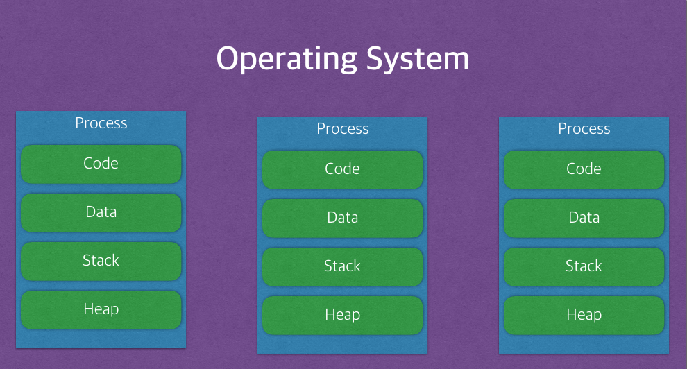
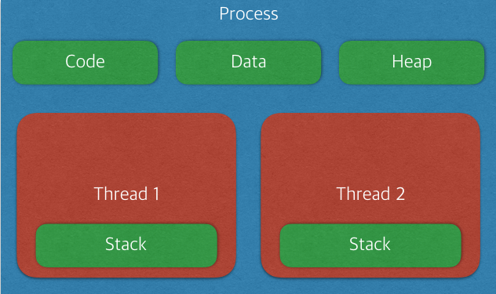
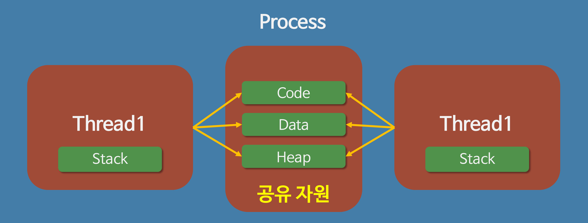

# 3. Operating System
**:book: Contents**
* [프로세스와 스레드의 차이(Process vs Thread)](#프로세스와-스레드의-차이)
* [멀티 프로세스 대신 멀티 스레드를 사용하는 이유](#멀티-프로세스-대신-멀티-스레드를-사용하는-이유)
* [Thread-safe](#thread-safe)
* [동기화 객체의 종류](#동기화-객체의-종류)
* [뮤텍스와 세마포어의 차이](#뮤텍스와-세마포어의-차이)
* [스케줄러](#스케줄러)
* [동기와 비동기](#동기와-비동기)
* [프로세스 동기화](#프로세스-동기화)
* [메모리 관리 전략](#메모리-관리-전략)
* [가상 메모리](#가상-메모리)
* [캐시의 지역성](#캐시의-지역성)
* [교착상태(데드락, Deadlock)의 개념과 조건](#교착상태의-개념과-조건)
* [사용자 수준 스레드와 커널 수준 스레드](#사용자-수준-스레드,-커널-수준-스레드)
* [외부 단편화와 내부 단편화](#외부-단편화와-내부-단편화)
* [Context Switching](#context-switching)
* [Swapping](#swapping)

---

### 프로세스와 스레드의 차이
* 프로그램(Program) 이란
  * 사전적 의미: 어떤 작업을 위해 실행할 수 있는 파일
* 프로세스(Process) 란
  * 사전적 의미: 컴퓨터에서 연속적으로 실행되고 있는 컴퓨터 프로그램
    * 메모리에 올라와 **실행되고 있는 프로그램의 인스턴스(독립적인 개체)**
    * 운영체제로부터 시스템 자원을 할당받는 작업의 단위
    * 즉, 동적인 개념으로는 실행된 프로그램을 의미한다.
  * 할당받는 시스템 자원의 예
    * CPU 시간
    * 운영되기 위해 필요한 주소 공간
    * Code, Data, Stack, Heap의 구조로 되어 있는 독립된 메모리 영역
  * 특징
    * 
    * 프로세스는 각각 독립된 메모리 영역(Code, Data, Stack, Heap의 구조)을 할당받는다.
    * 기본적으로 프로세스당 최소 1개의 스레드(메인 스레드)를 가지고 있다.
    * 각 프로세스는 별도의 주소 공간에서 실행되며, 한 프로세스는 다른 프로세스의 변수나 자료구조에 접근할 수 없다.
    * 한 프로세스가 다른 프로세스의 자원에 접근하려면 프로세스 간의 통신(IPC, inter-process communication)을 사용해야 한다. (Ex. 파이프, 파일, 소켓 등을 이용한 통신 방법 이용)
* 스레드(Thread) 란
  * 사전적 의미: 프로세스 내에서 실행되는 여러 흐름의 단위
    * **프로세스의 특정한 수행 경로**
    * 프로세스가 할당받은 자원을 이용하는 실행의 단위
  * 특징
    * 
    * 스레드는 프로세스 내에서 각각 Stack만 따로 할당받고 Code, Data, Heap 영역은 공유한다.
    * 스레드는 한 프로세스 내에서 동작되는 여러 실행의 흐름으로, 프로세스 내의 주소 공간이나 자원들(힙 공간 등)을 같은 프로세스 내에 스레드끼리 공유하면서 실행된다.
    * 같은 프로세스 안에 있는 여러 스레드들은 같은 힙 공간을 공유한다. 반면에 프로세스는 다른 프로세스의 메모리에 직접 접근할 수 없다.
    * 각각의 스레드는 별도의 레지스터와 스택을 갖고 있지만, 힙 메모리는 서로 읽고 쓸 수 있다.
    * 한 스레드가 프로세스 자원을 변경하면, 다른 이웃 스레드(sibling thread)도 그 변경 결과를 즉시 볼 수 있다.
* 자바 스레드(Java Thread) 란
  * 일반 스레드와 거의 차이가 없으며, JVM가 운영체제의 역할을 한다.
  * 자바에는 프로세스가 존재하지 않고 스레드만 존재하며, 자바 스레드는 JVM에 의해 스케줄되는 실행 단위 코드 블록이다.
  * 자바에서 스레드 스케줄링은 전적으로 JVM에 의해 이루어진다.
  * 아래와 같은 스레드와 관련된 많은 정보들도 JVM이 관리한다.
    * 스레드가 몇 개 존재하는지
    * 스레드로 실행되는 프로그램 코드의 메모리 위치는 어디인지
    * 스레드의 상태는 무엇인지
    * 스레드 우선순위는 얼마인지
  * 즉, 개발자는 자바 스레드로 작동할 스레드 코드를 작성하고, 스레드 코드가 생명을 가지고 실행을 시작하도록 JVM에 요청하는 일 뿐이다.

> :arrow_double_up:[Top](#3-operating-system)    :leftwards_arrow_with_hook:[Back](https://github.com/Do-Hee/tech-interview#3-operating-system)    :information_source:[Home](https://github.com/Do-Hee/tech-interview#tech-interview)
> - [https://gmlwjd9405.github.io/2018/09/14/process-vs-thread.html](https://gmlwjd9405.github.io/2018/09/14/process-vs-thread.html)
> - [https://brunch.co.kr/@kd4/3](https://brunch.co.kr/@kd4/3)
> - [https://magi82.github.io/process-thread/](https://magi82.github.io/process-thread/)
> - [https://jaybdev.net/2017/06/05/Java-3/](https://jaybdev.net/2017/06/05/Java-3/)
> - [http://includestdio.tistory.com/6](http://includestdio.tistory.com/6)
> - [https://lalwr.blogspot.com/2016/02/process-thread.html](https://lalwr.blogspot.com/2016/02/process-thread.html)

### 멀티 프로세스 대신 멀티 스레드를 사용하는 이유
* 쉽게 설명하면, 프로그램을 여러 개 키는 것보다 하나의 프로그램 안에서 여러 작업을 해결하는 것이다.
  * 

1. 자원의 효율성 증대
    * 멀티 프로세스로 실행되는 작업을 멀티 스레드로 실행할 경우, **프로세스를 생성하여 자원을 할당하는 시스템 콜이 줄어들어** 자원을 효율적으로 관리할 수 있다.
        * 프로세스 간의 Context Switching시 단순히 CPU 레지스터 교체 뿐만 아니라 RAM과 CPU 사이의 캐시 메모리에 대한 데이터까지 초기화되므로 오버헤드가 크기 때문
    * 스레드는 프로세스 내의 메모리를 공유하기 때문에 독립적인 프로세스와 달리 스레드 간 데이터를 주고 받는 것이 간단해지고 시스템 자원 소모가 줄어들게 된다.
2. 처리 비용 감소 및 응답 시간 단축
    * 또한 프로세스 간의 통신(IPC)보다 스레드 간의 통신의 비용이 적으므로 작업들 간의 통신의 부담이 줄어든다.
        * 스레드는 Stack 영역을 제외한 모든 메모리를 공유하기 때문
    * 프로세스 간의 전환 속도보다 스레드 간의 전환 속도가 빠르다.
        * Context Switching시 스레드는 Stack 영역만 처리하기 때문

* ***주의할 점!***
  * **동기화 문제**
  * 스레드 간의 자원 공유는 전역 변수(데이터 세그먼트)를 이용하므로 함께 상용할 때 충돌이 발생할 수 있다.

> :arrow_double_up:[Top](#3-operating-system)    :leftwards_arrow_with_hook:[Back](https://github.com/Do-Hee/tech-interview#3-operating-system)    :information_source:[Home](https://github.com/Do-Hee/tech-interview#tech-interview)
> - [http://you9010.tistory.com/136](http://you9010.tistory.com/136)

### Thread-safe
> :arrow_double_up:[Top](#3-operating-system)    :leftwards_arrow_with_hook:[Back](https://github.com/Do-Hee/tech-interview#3-operating-system)    :information_source:[Home](https://github.com/Do-Hee/tech-interview#tech-interview)
> - 

### 동기화 객체의 종류
* 쓰레드 동기화 방법
    1. 실행 순서의 동기화
        * 쓰레드의 실행순서를 정의하고, 이 순서에 반드시 따르도록 하는 것
    2. 메모리 접근에 대한 동기화
        * 메모리 접근에 있어서 동시접근을 막는 것
        * 실행의 순서가 중요한 상황이 아니고, 한 순간에 하나의 쓰레드만 접근하면 되는 상황을 의미
* 동기화 기법의 종류
    1. 유저 모드 동기화
        * 커널의 힘을 빌리지 않는(커널 코드가 실행되지 않는) 동기화 기법
        * 성능상 이점, 기능상의 제한
        * **Ex) 크리티컬 섹션 기반의 동기화, 인터락 함수 기반의 동기화**
    2. 커널 모드 동기화
        * 커널에서 제공하는 동기화 기능을 활용하는 방법
        * 커널 모드로의 변경이 필요하고 이는 성능 저하로 이어짐, 다양한 기능 활용 가능
        * **Ex) 뮤텍스 기반의 동기화, 세마포어 기반의 동기화, 이름있는 뮤텍스 기반의 프로세스 동기화, 이벤트 기반의 동기화**

> :arrow_double_up:[Top](#3-operating-system)    :leftwards_arrow_with_hook:[Back](https://github.com/Do-Hee/tech-interview#3-operating-system)    :information_source:[Home](https://github.com/Do-Hee/tech-interview#tech-interview)
> - [http://christin2.tistory.com/entry/Chapter-13-%EC%93%B0%EB%A0%88%EB%93%9C-%EB%8F%99%EA%B8%B0%ED%99%94-%EA%B8%B0%EB%B2%95-1](http://christin2.tistory.com/entry/Chapter-13-%EC%93%B0%EB%A0%88%EB%93%9C-%EB%8F%99%EA%B8%B0%ED%99%94-%EA%B8%B0%EB%B2%95-1)
> - [https://m.blog.naver.com/PostView.nhn?blogId=smuoon4680&logNo=50127179815&proxyReferer=https%3A%2F%2Fwww.google.co.kr%2F](https://m.blog.naver.com/PostView.nhn?blogId=smuoon4680&logNo=50127179815&proxyReferer=https%3A%2F%2Fwww.google.co.kr%2F)

### 뮤텍스와 세마포어의 차이
* 뮤텍스(Mutex)
    * 공유된 자원의 데이터를 **여러 쓰레드가** 접근하는 것을 막는 것
    * 상호배제라고도 하며, Critical Section을 가진 쓰레드의 Running time이 서로 겹치지 않도록 각각 단독으로 실행하게 하는 기술이다.
    * 다중 프로세스들의 공유 리소스에 대한 접근을 조율하기 위해 synchronized 또는 lock을 사용한다.
        * 즉, 뮤텍스 객체를 두 쓰레드가 동시에 사용할 수 없다.
* 세마포어(Semaphore)
    * 공유된 자원의 데이터를 **여러 프로세스가** 접근하는 것을 막는 것
    * 리소스 상태를 나타내는 간단한 카운터로 생각할 수 있다.
        * 운영체제 또는 커널의 한 지정된 저장장치 내의 값이다.
        * 일반적으로 비교적 긴 시간을 확보하는 리소스에 대해 이용한다.
        * 유닉스 시스템 프로그래밍에서 세마포어는 운영체제의 리소스를 경쟁적으로 사용하는 다중 프로세스에서 행동을 조정하거나 또는 동기화 시키는 기술이다.
    * 공유 리소스에 접근할 수 있는 프로세스의 최대 허용치만큼 동시에 사용자가 접근하여 사용할 수 있다.
    * 각 프로세스는 세마포어 값은 확인하고 변경할 수 있다.
        * 1) 사용 중이지 않는 자원의 경우 그 프로세스가 즉시 자원을 사용할 수 있다.
        * 2) 이미 다른 프로세스에 의해 사용 중이라는 사실을 알게 되면 재시도하기 전에 일정 시간을 기다려야 한다.
        * 세마포어를 사용하는 프로세스는 그 값을 확인하고, 자원을 사용하는 동안에는 그 값을 변경함으로써 다른 세마포어 사용자들이 기다리도록 해야한다.
    * 세마포어는 이진수 (0 또는 1)를 사용하거나, 또는 추가적인 값을 가질 수도 있다.
* 차이
    1. 가장 큰 차이점은 관리하는 **동기화 대상의 개수**
        * Mutex는 동기화 대상이 오직 하나뿐일 때, Semaphore는 동기화 대상이 하나 이상일 때 사용한다.
    2. Semaphore는 Mutex가 될 수 있지만 Mutex는 Semaphore가 될 수 없다.
        * Mutex는 상태가 0, 1 두 개 뿐인 binary Semaphore
    3. Semaphore는 소유할 수 없는 반면, Mutex는 소유가 가능하며 소유주가 이에 대한 책임을 가진다.
        * Mutex 의 경우 상태가 두개 뿐인 lock 이므로 lock 을 가질 수 있다.
    4. Mutex의 경우 Mutex를 소유하고 있는 쓰레드가 이 Mutex를 해제할 수 있다. 하지만 Semaphore의 경우 이러한 Semaphore를 소유하지 않는 쓰레드가 Semaphore를 해제할 수 있다.
    5. Semaphore는 시스템 범위에 걸쳐있고 파일시스템상의 파일 형태로 존재하는 반면 Mutex는 프로세스 범위를 가지며 프로세스가 종료될 때 자동으로 Clean up 된다.

> :arrow_double_up:[Top](#3-operating-system)    :leftwards_arrow_with_hook:[Back](https://github.com/Do-Hee/tech-interview#3-operating-system)    :information_source:[Home](https://github.com/Do-Hee/tech-interview#tech-interview)
> - [http://jwprogramming.tistory.com/13](http://jwprogramming.tistory.com/13)

### 스케줄러
> :arrow_double_up:[Top](#3-operating-system)    :leftwards_arrow_with_hook:[Back](https://github.com/Do-Hee/tech-interview#3-operating-system)    :information_source:[Home](https://github.com/Do-Hee/tech-interview#tech-interview)
> - 

### 동기와 비동기
> :arrow_double_up:[Top](#3-operating-system)    :leftwards_arrow_with_hook:[Back](https://github.com/Do-Hee/tech-interview#3-operating-system)    :information_source:[Home](https://github.com/Do-Hee/tech-interview#tech-interview)
> - 

### 프로세스 동기화
> :arrow_double_up:[Top](#3-operating-system)    :leftwards_arrow_with_hook:[Back](https://github.com/Do-Hee/tech-interview#3-operating-system)    :information_source:[Home](https://github.com/Do-Hee/tech-interview#tech-interview)
> - 

### 메모리 관리 전략
> :arrow_double_up:[Top](#3-operating-system)    :leftwards_arrow_with_hook:[Back](https://github.com/Do-Hee/tech-interview#3-operating-system)    :information_source:[Home](https://github.com/Do-Hee/tech-interview#tech-interview)
> - 

### 가상 메모리
> :arrow_double_up:[Top](#3-operating-system)    :leftwards_arrow_with_hook:[Back](https://github.com/Do-Hee/tech-interview#3-operating-system)    :information_source:[Home](https://github.com/Do-Hee/tech-interview#tech-interview)
> - 

### 캐시의 지역성
> :arrow_double_up:[Top](#3-operating-system)    :leftwards_arrow_with_hook:[Back](https://github.com/Do-Hee/tech-interview#3-operating-system)    :information_source:[Home](https://github.com/Do-Hee/tech-interview#tech-interview)
> - 

### 교착상태의 개념과 조건
* 교착상태(데드락, Deadlock) 란
  * 첫 번째 스레드는 두 번째 스레드가 들고 있는 객체의 락이 풀리기를 기다리고 있고, 두 번째 스레드 역시 첫 번째 스레드가 들고 있는 객체의 락이 풀리기를 기다리는 상황을 일컷는다.
  * 모든 스레드가 락이 풀리기를 기다리고 있기 때문에, 무한 대기 상태에 빠지게 된다. 이런 스레드를 교착상태에 빠졌다고 한다.
* 교착상태의 4가지 조건
  1. 상호 배제(mutual exclusion)
      * 한 번에 한 프로세스만 공유 자원을 사용할 수 있다.
      * 좀 더 정확하게는, 공유 자원에 대한 접근 권한이 제한된다. 자원의 양이 제한되어 있더라도 교착상태는 발생할 수 있다.
  2. 들고 기다리기(hold and wait) = **점유대기**
      * 공유 자원에 대한 접근 권한을 갖고 있는 프로세스가, 그 접근 권한을 양보하지 않은 상태에서 다른 자원에 대한 접근 권한을 요구할 수 있다.
  3. 선취(preemption) 불가능 = **비선점**
      * 한 프로세스가 다른 프로세스의 자원 접근 권한을 강제로 취소할 수 없다.
  4. 대기 상태의 사이클(circular wait) = **순환대기**
      * 두 개 이상의 프로세스가 자원 접근을 기다리는데, 그 관계에 사이클이 존재한다.
* 교착상태 방지
  * 4가지 조건들 가운데 하나를 제거하면 된다.
  * 공유 자원 중 많은 경우가 한 번에 한 프로세스만 사용할 수 있기 때문에(예를 들어, 프린트) 1번 조건은 제거하기 어렵다.
  * 대부분의 교착상태 방지 알고리즘은 4번 조건, 즉 대기 상태의 사이클이 발생하는 일을 막는 데 초점이 맞춰져 있다.

> :arrow_double_up:[Top](#3-operating-system)    :leftwards_arrow_with_hook:[Back](https://github.com/Do-Hee/tech-interview#3-operating-system)    :information_source:[Home](https://github.com/Do-Hee/tech-interview#tech-interview)
> - [코딩 인터뷰 완전 분석, 프로그래밍인사이트](https://www.kyobobook.co.kr/product/detailViewKor.laf?mallGb=KOR&ejkGb=KOR&barcode=9788966263080&OV_REFFER=http://click.linkprice.com/click.php?m=kbbook&a=A100532541&l=9999&l_cd1=0&u_id=jm0gctc7ca029ofs02yqe&l_cd2=0&tu=https%3A%2F%2Fwww.kyobobook.co.kr%2Fproduct%2FdetailViewKor.laf%3FmallGb%3DKOR%26ejkGb%3DKOR%26barcode%3D9788966263080)

### 사용자 수준 스레드와 커널 수준 스레드
> :arrow_double_up:[Top](#3-operating-system)    :leftwards_arrow_with_hook:[Back](https://github.com/Do-Hee/tech-interview#3-operating-system)    :information_source:[Home](https://github.com/Do-Hee/tech-interview#tech-interview)
> - 

### 외부 단편화와 내부 단편화
> :arrow_double_up:[Top](#3-operating-system)    :leftwards_arrow_with_hook:[Back](https://github.com/Do-Hee/tech-interview#3-operating-system)    :information_source:[Home](https://github.com/Do-Hee/tech-interview#tech-interview)
> - 

### Context Switching
> :arrow_double_up:[Top](#3-operating-system)    :leftwards_arrow_with_hook:[Back](https://github.com/Do-Hee/tech-interview#3-operating-system)    :information_source:[Home](https://github.com/Do-Hee/tech-interview#tech-interview)

* Context Switching이란?
    * 현재 진행하고 있는 Task(Process, Thread)의 상태를 저장하고 다음 진행할 Task의 상태 값을 읽어 적용하는 과정을 말합니다.
* Context Switching 과정
    * Task의 대부분 정보는 Register에 저장되고 PCB(Process Control Block)로 관리되고 있습니다.
    * 현재 실행하고 있는 Task의 PCB 정보를 저장하게 됩니다. (Process Stack, Ready Queue)
    * 다음 실행할 Task의 PCB 정보를 읽어 Register에 적재하고 CPU가 이전에 진행했던 과정을 연속적으로 수행을 할 수 있습니다.
* Context Switching Cost (Process vs Thread)
    * Context Switching 비용은 Process가 Thread보다 많이 듭니다.
    * Thread는 Stack 영역을 제외한 모든 메모리를 공유하기 때문에 Stack 영역만 변경을 진행하면 되기 때문에 비용이 저렴 합니다.

> - [Context Switching이란?](https://nesoy.github.io/articles/2018-11/Context-Switching)

### Swapping
> :arrow_double_up:[Top](#3-operating-system)    :leftwards_arrow_with_hook:[Back](https://github.com/Do-Hee/tech-interview#3-operating-system)    :information_source:[Home](https://github.com/Do-Hee/tech-interview#tech-interview)
> - 

---

## Reference
> - 

## :house: [Home](https://github.com/Do-Hee/tech-interview)
