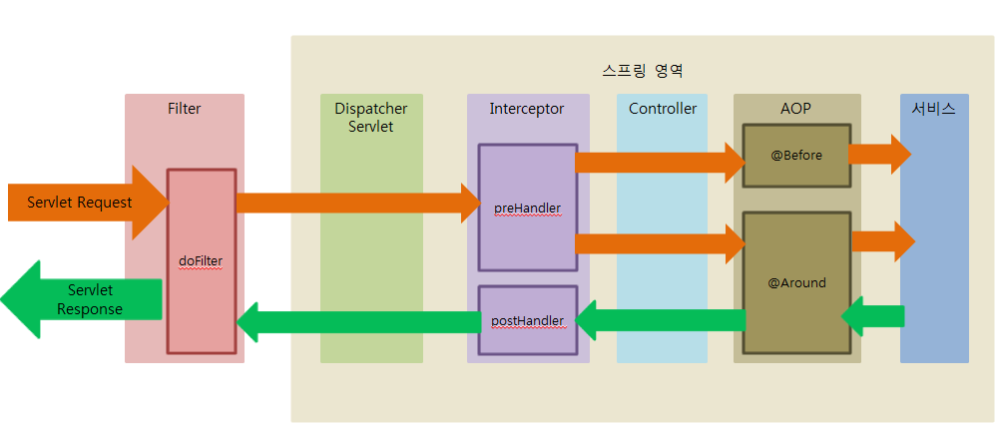

# 9. Spring
**:book: Contents**
* [스프링 프레임워크란](#스프링-프레임워크란)
* [Spring, Spring MVC, Spring Boot의 차이](#spring-spring-mvc-spring-boot의-차이)
* [Bean이란](#bean이란)
* [Container란](#container란)
* [IOC(Inversion of Control, 제어의 역전)란](#ioc란)
* [MVC 패턴이란](#mvc-패턴이란)
* [DI(Dependency Injection, 의존성 주입)란](#di란)
* [AOP(Aspect Oriented Programming)란](#aop란)
* [POJO](#pojo)
* [DAO와 DTO의 차이](#dao와-dto의-차이)
* [Spring JDBC를 이용한 데이터 접근](#spring-jdbc를-이용한-데이터-접근)
* [Filter와 Interceptor 차이](#filter와-interceptor-차이)

---

### 스프링 프레임워크란
* 자바 엔터프라이즈 개발을 편하게 해주는 경량급 오픈소스 애플리케이션 프레임워크
* **Lightweight Java Applicaion Framework**
    * 목표: **POJO 기반의** Enterprise Application 개발을 쉽고 편하게 할 수 있도록 한다.
    * Java Application을 개발하는데 필요한 하부구조(Infrastructure)를 포괄적으로 제공한다.
    * Spring이 하부구조를 처리하기 때문에 개발자는 Application 개발에 집중할 수 있다.
* 간단히 스프링(Spring)이라고도 불린다. 
* 동적인 웹 사이트를 개발하기 위한 여러 가지 서비스를 제공한다.
* 대한민국 공공기관의 웹 서비스 개발 시 사용을 권장하고 있는 전자 정부 표준 프레임워크의 기반 기술

> :arrow_double_up:[Top](#9-spring)    :leftwards_arrow_with_hook:[Back](https://github.com/WeareSoft/tech-interview#9-spring)    :information_source:[Home](https://github.com/WeareSoft/tech-interview#tech-interview)
> - [https://gmlwjd9405.github.io/2018/10/26/spring-framework.html](https://gmlwjd9405.github.io/2018/10/26/spring-framework.html)

### Spring Spring MVC Spring Boot의 차이
* Spring
    * 
* Spring MVC
* Spring Boot


> :arrow_double_up:[Top](#9-spring)    :leftwards_arrow_with_hook:[Back](https://github.com/WeareSoft/tech-interview#9-spring)    :information_source:[Home](https://github.com/WeareSoft/tech-interview#tech-interview)
> - [http://blog.naver.com/PostView.nhn?blogId=sthwin&logNo=221271008423&parentCategoryNo=&categoryNo=50&viewDate=&isShowPopularPosts=true&from=search](http://blog.naver.com/PostView.nhn?blogId=sthwin&logNo=221271008423&parentCategoryNo=&categoryNo=50&viewDate=&isShowPopularPosts=true&from=search)

### Bean이란
* 컨테이너 안에 들어있는 객체
* 컨테이너에 담겨있으며, 필요할 때 컨테이너에서 가져와서 사용
* @Bean 을 사용하거나 xml 설정을 통해 일반 객체를 Bean으로 등록할 수 있고, Bean으로 등록된 객체는 쉽게 주입하여 사용 가능

#### Bean 생명주기
- 객체 생성 -> 의존 설정 -> 초기화 -> 사용 -> 소멸
- 스프링 컨테이너에 의해 생명주기 관리
- 스프링 컨테이너 초기화 시 빈 객체 생성, 의존 객체 주입 및 초기화
- 스프링 컨테이너 종료 시 빈 객체 소멸

#### Bean 초기화 방법 3가지
1. 빈 초기화 메소드에 ```@PostConstruct``` 사용
  - 빈 정의 xml에 ```<context:annotation-config></context:annotation-config>``` 추가
2. ```InitializingBean``` 인터페이스의 ```afterPropertiesSet()``` 메소드 오버라이드
3. 커스텀 init() 메소드 정의
  - 빈 정의 xml에 ```init-method``` 속성으로 메소드 이름 지정
  - 또는 빈 초기화 메소드에 ```@Bean(init-method="init")``` 지정

#### Bean 소멸 방법 3가지
1. 빈 소멸 메소드에 ```@PreDestroy``` 사용
  - 빈 정의 xml에 ```<context:annotation-config></context:annotation-config>``` 추가
2. ```DisposableBean``` 인터페이스의 ```destroy()``` 메소드 오버라이드
3. 커스텀 destroy() 메소드 정의
  - 빈 정의 xml에 ```destroy-method``` 속성으로 메소드 이름 지정

##### 권장하는 방법
- 1번 방법 (권장)
  - 사용 방법이 간결하며 코드에서 초기화 메소드가 존재함을 쉽게 파악 가능하여 xml 설정 방법보다 직관적
- 2번 방법 (지양)
  - 빈 코드에 스프링 인터페이스가 노출되어 권장하지 않으며 간결하지 않은 방법
- 3번 방법
  - 빈 코드에 스프링 인터페이스는 노출되지 않지만, 코드만으로 초기화 메소드 호출 여부를 알 수 없는 단점

#### Bean Scope
* **singleton (default)**
  * 애플리케이션에서 Bean 등록 시 singleton scope로 등록
  * Spring IoC 컨테이너 당 한 개의 인스턴스만 생성
  * 컨테이너가 Bean 가져다 주입할 때 항상 같은 객체 사용
  * 메모리나 성능 최적화에 유리
* **prototype**
  * 컨테이너에서 Bean 가져다 쓸 때 항상 다른 인스턴스 사용
  * 모든 요청에서 새로운 객체 생성
  * gc에 의해 Bean 제거
* request
  * Bean 등록 시 하나의 HTTP request 생명주기 안에 단 하나의 Bean만 존재
  * 각각의 HTTP 요청은 고유 Bean 객체 보유
  * Spring MVC Web Application에서 사용
* session
  * 하나의 HTTP Session 생명주기 안에 단 하나의 Bean만 존재
  * Spring MVC Web Application에서 사용
* global session
  * 하나의 global HTTP Session 생명주기 안에 한 개의 Bean 지정
  * Spring MVC Web Application에서 사용
* application
  * ServletContext 생명주기 안에 한 개의 Bean 지정
  * Spring MVC Web Application에서 사용

> :arrow_double_up:[Top](#9-spring)    :leftwards_arrow_with_hook:[Back](https://github.com/WeareSoft/tech-interview#9-spring)    :information_source:[Home](https://github.com/WeareSoft/tech-interview#tech-interview)
> - [[Spring] IOC(Inversion Of Control): 제어 역전](https://velog.io/@max9106/Spring-IOC%EB%AF%B8%EC%99%84)
> - [[Spring] Spring Bean의 개념과 Bean Scope 종류](https://gmlwjd9405.github.io/2018/11/10/spring-beans.html)
> - [Spring 빈/컨테이너 생명주기 (Lifecycle)](https://flowarc.tistory.com/entry/Spring-%EB%B9%88%EC%BB%A8%ED%85%8C%EC%9D%B4%EB%84%88-%EC%83%9D%EB%AA%85%EC%A3%BC%EA%B8%B0-Lifecycle)
> - [SpringMVC :: 스프링 컨테이너의 생명주기, 빈의 생명주기 (Life cycle), InitialzingBean, DisposableBean, @PreDestroy, @PostConstruct](https://hongku.tistory.com/106)
> - [[Spring] 빈(bean)생명주기 메소드](https://cornswrold.tistory.com/100)

### Container란
- 컨테이너(Container)는 보통 인스턴스의 생명주기를 관리하며, 생성된 인스턴스들에게 추가적인 기능을 제공하도록하는 것이라 할 수 있다. 다시말해, 컨테이너란 당신이 작성한 코드의 처리과정을 위임받은 독립적인 존재라고 생각하면 된다. 컨테이너는 적절한 설정만 되어있다면 누구의 도움없이도 프로그래머가 작성한 코드를 스스로 참조한 뒤 알아서 객체의 생성과 소멸을 컨트롤해준다.

- Spring 프레임워크는 다른 프레임워크들과 달리 컨테이너 기능을 제공하고 있다. 이와 같은 컨테이너 기능을 제공하는 것이 가능하도록 하는 것이 IoC 패턴이다.

> :arrow_double_up:[Top](#9-spring)    :leftwards_arrow_with_hook:[Back](https://github.com/WeareSoft/tech-interview#9-spring)    :information_source:[Home](https://github.com/WeareSoft/tech-interview#tech-interview)
> - [http://limmmee.tistory.com/13](http://limmmee.tistory.com/13)
> - [http://wiki.javajigi.net/pages/viewpage.action?pageId=281](http://wiki.javajigi.net/pages/viewpage.action?pageId=281)  

### IoC란
- IoC(Inversion of Control, 제어의 역전)란
    - 객체의 생성에서부터 생명주기의 관리까지 모든 객체에 대한 제어권이 바뀐 것을 의미, 또는 제어 권한을 자신이 아닌 다른 대상에게 위임하는 것이다.
    - 이 방식은 대부분의 프레임워크에서 사용하는 방법으로, 개발자는 필요한 부분을 개발해서 끼워 넣기의 형태로 개발하고 실행하게 된다. 프레임워크가 이러한 구조를 가지기 때문에 개발자는 프레임워크에 필요한 부품을 개발하고 조립하는 방식의 개발을 하게 된다.
    - 이렇게 조립된 코드의 최종 호출은 개발자에 의해서 제어되는 것이 아니라 프레임워크의 내부에서 결정된 대로 이뤄지게 되는데, 이러한 현상을 "제어의 역전"이라고 표현한다.
- Spring에서의 IoC
    - Spring 프레임워크에서 지원하는 Ioc Container는 우리들이 흔히 개발하고 사용해왔던 일반 POJO(Plain Old Java Object)의 생명주기를 관리하며, 생성된 인스턴스들에게 추가적인 기능들을 제공한다.
- 라이브러리와 프레임워크의 차이
    - IoC의 개념이 적용되었나의 차이
    - 라이브러리를 사용하는 애플리케이션 코드는 애플리케이션 흐름을 직접 제어한다. 단지 동작히는 중에 필요한 기능이 있을 때 능동적으로 라이브러리를 시용할 뿐이다.
    - 반면에 프레임워크는 거꾸로 애플리케이션 코드가 프레임워크에 의해 사용된다. 보통 프레임워크 위에 개발한 클래스를 등록해두고, 프레임워크가 흐름을 주도히는 중에 개발자가 만든 애플리케이션 코드를 시용하도록 만드는 방식이다.

> :arrow_double_up:[Top](#9-spring)    :leftwards_arrow_with_hook:[Back](https://github.com/WeareSoft/tech-interview#9-spring)    :information_source:[Home](https://github.com/WeareSoft/tech-interview#tech-interview)
> - [http://wiki.javajigi.net/pages/viewpage.action?pageId=3664](http://wiki.javajigi.net/pages/viewpage.action?pageId=3664)
> - [http://limmmee.tistory.com/13](http://limmmee.tistory.com/13)
> - [http://wiki.javajigi.net/pages/viewpage.action?pageId=281](http://wiki.javajigi.net/pages/viewpage.action?pageId=281)

### MVC 패턴이란
> :arrow_double_up:[Top](#9-spring)    :leftwards_arrow_with_hook:[Back](https://github.com/WeareSoft/tech-interview#9-spring)    :information_source:[Home](https://github.com/WeareSoft/tech-interview#tech-interview)
> - []()

### DI란
- DI?
    - Dependency Injection, 의존성 주입
    - Dependency Injection은 Spring 프레임워크에서 지원하는 IoC의 형태이다. 
    - DI는 클래스 사이의 의존관계를 빈 설정 정보를 바탕으로 컨테이너가 자동적으로 연결해주는 것을 말한다. 개발자들은 제어를 담당할 필요없이 빈 설정 파일에 의존관계가 필요하다는 정보만 추가해주면 된다.
        - 컨테이너가 실행 흐름의 주체가 되어 애플리케이션 코드에 의존관계를 주입해주는 것.
- 의존성(Dependency)
    - 현재 객체가 다른 객체와 상호작용(참조)하고 있다면 다른 객체들을 현재 객체의 의존이라 한다.
- 의존성이 위험한 이유
    - 하나의 모듈이 바뀌면 의존한 다른 모듈까지 변경되야 한다.
    - 테스트 가능한 어플을 만들 때 의존성이 있으면 유닛테스트 작성이 어렵다.
    - 유닛테스트의 목적 자체가 다른 모듈로부터 독립적으로 테스트하는 것을 요구한다.
- DI의 특징
    - ‘new’를 사용해 모듈 내에서 다른 모듈을 초기화하지 않으려면 객체 생성은 다른 곳에서 하고, 생성된 객체를 참조하면 된다.
    - 의존성 주입은 Inversion of Control 개념을 바탕으로 한다. 클래스가 외부로부터 의존성을 가져야한다.
- DI가 필요한 이유(DI의 장점)
    - 클래스를 재사용 할 가능성을 높이고, 다른 클래스와 독립적으로 클래스를 테스트 할 수 있다.
    - 비즈니스 로직의 특정 구현이 아닌 클래스를 생성하는데 매우 효과적
- DI의 세가지 방법
    - Contructor Injection : 생성자 삽입
    - Method(Setter) Injection : 메소드 매개 변수 삽입
    - Field Injection : 멤버 변수 삽입

> :arrow_double_up:[Top](#9-spring)    :leftwards_arrow_with_hook:[Back](https://github.com/WeareSoft/tech-interview#9-spring)    :information_source:[Home](https://github.com/WeareSoft/tech-interview#tech-interview)
> - [http://www.nextree.co.kr/p11247/](http://www.nextree.co.kr/p11247/)
> - [http://wiki.javajigi.net/pages/viewpage.action?pageId=281](http://wiki.javajigi.net/pages/viewpage.action?pageId=281)
> - [http://tony-programming.tistory.com/entry/Dependency-의존성-이란](http://tony-programming.tistory.com/entry/Dependency-의존성-이란) 

### AOP란
* AOP(Aspect Oriented Programming)란
  - Aspect Oriented Programming, 관점 지향 프로그래밍
  - 어떤 로직을 기준으로 핵심 관점과 부가 관점을 나누고, 관점을 기준으로 모듈화하는 것
  - 핵심 관점은 주로 핵심 비즈니스 로직
  - 부가 관점은 핵심 로직을 실행하기 위한 데이터베이스 연결, 로깅, 파일 입출력 등
  
* AOP 목적
  - 소스 코드에서 여러 번 반복해서 쓰는 코드(= 흩어진 관심사, Concern)를 Aspect로 모듈화하여 핵심 로직에서 분리 및 재사용
  - 개발자가 핵심 로직에 집중할 수 있게 하기 위함
  - 주로 부가 기능을 모듈화
  
* AOP 주요 용어
  - **Aspect**
    - 흩어진 관심사를 모듈화 한 것
    - Advice + PointCut
  - **Target**
    - Aspect를 적용하는 곳(클래스, 메소드 등)
  - **Advice**
    - 실질적으로 수행해야 하는 기능을 담은 구현체
  - **JoinPoint**
    - Advice가 적용될 위치
    - 끼어들 수 있는 지점
    - ex. 메소드 진입 시, 생성자 호출 시, 필드에서 값 꺼낼 때 등
  - **PointCut**
    - JoinPoint의 상세 스펙 정의
    - 더욱 구체적으로 Advice가 실행될 지점 지정
  - **Weaving**
    - PointCut에 의해 결정된 Target의 JoinPoint에 Advice를 삽입하는 과정
  
* AOP 적용 방법
  1. 컴파일 시 적용
      - AspectJ가 사용하는 방법
      - 자바 파일을 클래스 파일로 만들 때 Advice 소스가 추가되어 조작된 바이트 코드 생성하는 방법
  2. 로드 시 적용
      - AspectJ가 사용하는 방법
      - 컴파일 후 컴파일 된 클래스를 로딩하는 시점에 Advice 소스를 끼워넣는 방법
  3. 런타임 시 적용
      - **Spring AOP**가 사용하는 방법
      - 스프링은 런타임 시 Bean 생성
      - A라는 Bean 만들 때 A라는 타입의 프록시 Bean도 생성하고, 프록시 Bean이 A의 메소드 호출 직전에 Advice 소스를 호출한 후 A의 메소드 호출

* Spring AOP 특징
  - [프록시 패턴](https://velog.io/@max9106/Spring-%ED%94%84%EB%A1%9D%EC%8B%9C-AOP-xwk5zy57ee) 기반의 AOP 구현체
    - Target 객체에 대한 프록시를 만들어 제공
    - Target을 감싸는 프록시는 런타임 시 생성
    - 접근 제어 및 부가 기능 추가를 위해 프록시 객체 사용
  - 프록시가 Target 객체의 호출을 가로채 Advice 수행 전/후 핵심 로직 호출
  - 스프링 Bean에만 AOP 적용 가능
    - 메소드 조인 포인트만 지원하여 메소드가 호출되는 런타임 시점에만 Advice 적용 가능
  - 모든 AOP기능을 제공하지는 않으며 스프링 IoC와 연동하여 엔터프라이즈 애플리케이션의 각종 문제(중복 코드, 프록시 클래스 작성의 번거로움, 객체 간 관계 복잡도 증가)에 대한 해결책 지원 목적

> :arrow_double_up:[Top](#9-spring)    :leftwards_arrow_with_hook:[Back](https://github.com/WeareSoft/tech-interview#9-spring)    :information_source:[Home](https://github.com/WeareSoft/tech-interview#tech-interview)
> - [[Spring] 스프링 AOP (Spring AOP) 총정리 : 개념, 프록시 기반 AOP, @AOP](https://engkimbs.tistory.com/746)
> - [[Spring] AOP란?](https://velog.io/@max9106/Spring-AOP%EB%9E%80-93k5zjsm95)
> - [Spring AOP, Aspect 개념 특징, AOP 용어 정리](https://shlee0882.tistory.com/206)

### POJO
번역하면 '평범한 구식 자바 객체'. 즉 프레임워크 인터페이스나 클래스를 구현하거나 확장하지 않는 단순한 클래스.
- EJB와 엔터프라이즈 서비스
    - EJB(Enterprise JavaBean)
    - 기업업무처리의 IT시스템에 대한 의존도가 높아지면서 시스템이 다뤄야 하는 **비즈니스 로직 자체가 점차 복잡**해지고, 많은 사용자의 처리요구를 빠르게 안정적이면서 확장 가능한 형태로 유지하기위해 필요한 **로우레벨의 기술적인(트랜젝션 처리, 상태관리, 멀티쓰레딩, 리소스풀링, 보안등) 처리**가 요구됐다.
    - EJB의 비전은 **'EJB는 애플리케이션 개발을 쉽게 만들어준다. 애플리케이션 개발자는 로우레벨의 기술들에 관심을 가질 필요도 없다.'** 였지만, 결론적으론 불필요할만큼 **과도한 엔지니어링으로 실패한 대표적인 케이스**가 되었다.
        - 가장 최악의 문제점은 EJB 스펙을 따르는 비즈니스 오브젝트들은 객체지향적인 **특징과 장점을 포기해야했다는 것**이다. EJB 빈은 상속과 다형성등의 혜택을 제대로 누릴 수 없었다.
    - 마틴 파울러는 **EJB와 같은 잘못 설계된 과도한 기술을 피하고, 객체지향 원리에 따라 만들어진 자바 언어의 기본에 충실하게 비즈니스 로직을 구현하는 일명 POJO 방식으로 돌아서야 한다**고 지적했다.
- 특징
    - Java에서 제공하는 API 외에 종속되지 않음
    - 특정 규약, 환경에 종속되지 않음
- 환경에 종속되지 않는 것의 장점
    - 코드의 간결함 (비즈니스 로직과 특정 환경/low 레벨 종속적인 코드를 분리하므로 단순)
    - 비즈니스 로직과 특정 환경이 분리되므로 단순함
    - 자동화 테스트에 유리 (환경 종속적인 코드는 자동화 테스트가 어렵지만, POJO는 테스트가 매우 유연)
    - 객체지향 설계의 자유로운 사용

> :arrow_double_up:[Top](#9-spring)    :leftwards_arrow_with_hook:[Back](https://github.com/WeareSoft/tech-interview#9-spring)    :information_source:[Home](https://github.com/WeareSoft/tech-interview#tech-interview)
> - [http://limmmee.tistory.com/8?category=654011](http://limmmee.tistory.com/8?category=654011)

### DAO와 DTO의 차이
- **DAO(Data Access Object)**
    - DB의 데이터를 조회하거나 조작하는 기능을 전담하도록 만든 객체를 말한다.
    - DB에 접근을 하기위한 로직과 비즈니스 로직을 분리하기 위해서 사용 한다.
- **DTO(Data Transfer Object)**
    - 계층간 데이터 교환을 위한 자바빈즈를 말한다.
        - 여기서 말하는 계층은 Controller, View, Business Layer, Persistent Layer 이다.
    - 일반적인 DTO는 로직을 갖고 있지 않는 순수한 데이터 객체이며, 속성과 그 속성에 접근하기 위한 getter, setter 메소드만 가진 클래스이다.
    - VO(Value Object) 라고도 불린다.
        - DTO와 동일한 개념이지만 read only 속성을 가진다.

> :arrow_double_up:[Top](#9-spring)    :leftwards_arrow_with_hook:[Back](https://github.com/WeareSoft/tech-interview#9-spring)    :information_source:[Home](https://github.com/WeareSoft/tech-interview#tech-interview)
> - [https://jungwoon.github.io/common%20sense/2017/11/16/DAO-VO-DTO/](https://jungwoon.github.io/common%20sense/2017/11/16/DAO-VO-DTO/)

### Spring JDBC를 이용한 데이터 접근
> :arrow_double_up:[Top](#9-spring)    :leftwards_arrow_with_hook:[Back](https://github.com/WeareSoft/tech-interview#9-spring)    :information_source:[Home](https://github.com/WeareSoft/tech-interview#tech-interview)
> - []()

### Filter와 Interceptor 차이

#### Filter, Interceptor
* 애플리케이션에서 자주 사용되는 기능(공통 부분)을 분리하여 관리할 수 있도록 Spring이 제공하는 기능

#### Filter, Interceptor 흐름


1. 서버 실행 시 Servlet이 올라오는 동안 init 후 doFilter 실행
2. Dispatcher Servlet을 지나쳐 Interceptor의 preHandler 실행
3. 컨트롤러를 거쳐 내부 로직 수행 후, Interceptor의 postHandler 실행
4. doFilter 실행
5. Servlet 종료 시 destroy

#### Filter 특징
* Dispatcher Servlet 이전에 수행되고, 응답 처리에 대해서도 변경 및 조작 수행 가능
  * WAS 내의 ApplicationContext에서 등록된 필터가 실행
* WAS 구동 시 FilterMap이라는 배열에 등록되고, 실행 시 Filter chain을 구성하여 순차적으로 실행
* Spring Context 외부에 존재하여 Spring과 무관한 자원에 대해 동작
* 일반적으로 web.xml에 설정
* 예외 발생 시 Web Application에서 예외 처리
* ex. 인코딩 변환, XSS 방어 등
* 실행 메소드
  * init() : 필터 인스턴스 초기화
  * doFilter() : 실제 처리 로직
  * destroy() : 필터 인스턴스 종료

#### Interceptor 특징
* Dispatcher Servlet 이후 Controller 호출 전, 후에 끼어들어 기능 수행
* Spring Context 내부에서 Controller의 요청과 응답에 관여하며 모든 Bean에 접근 가능
* 일반적으로 servlet-context.xml에 설정
* 예외 발생 시 @ControllerAdvice에서 @ExceptionHandler를 사용해 예외 처리
* ex. 로그인 체크, 권한 체크, 로그 확인 등
* 실행 메소드
  * preHandler() : Controller 실행 전
  * postHandler() : Controller 실행 후
  * afterCompletion() : view Rendering 후

##### Filter, Interceptor 차이점 요약
* Filter는 WAS단에 설정되어 Spring과 무관한 자원에 대해 동작하고, Interceptor는 Spring Context 내부에 설정되어 컨트롤러 접근 전, 후에 가로채서 기능 동작
* Filter는 doFilter() 메소드만 있지만, Interceptor는 pre와 post로 명확하게 분리
* Interceptor의 경우 AOP 흉내 가능
  * handlerMethod(@RequestMapping을 사용해 매핑 된 @Controller의 메소드)를 파라미터로 제공하여 메소드 시그니처 등 추가 정보를 파악해 로직 실행 여부 판단 가능


> :arrow_double_up:[Top](#9-spring)    :leftwards_arrow_with_hook:[Back](https://github.com/WeareSoft/tech-interview#9-spring)    :information_source:[Home](https://github.com/WeareSoft/tech-interview#tech-interview)
> - [[Spring] Filter, Interceptor, AOP 차이 및 정리](https://goddaehee.tistory.com/154)
> - [[Spring] Filter, Interceptor, AOP 차이](https://velog.io/@sa833591/Spring-Filter-Interceptor-AOP-%EC%B0%A8%EC%9D%B4-yvmv4k96)
> - [Spring Filter와 Interceptor](https://jaehun2841.github.io/2018/08/25/2018-08-18-spring-filter-interceptor/#spring-request-flow)
> - [(Spring)Filter와 Interceptor의 차이](https://supawer0728.github.io/2018/04/04/spring-filter-interceptor/)

---

## Reference
> - []()


## :house: [Home](https://github.com/WeareSoft/tech-interview)
